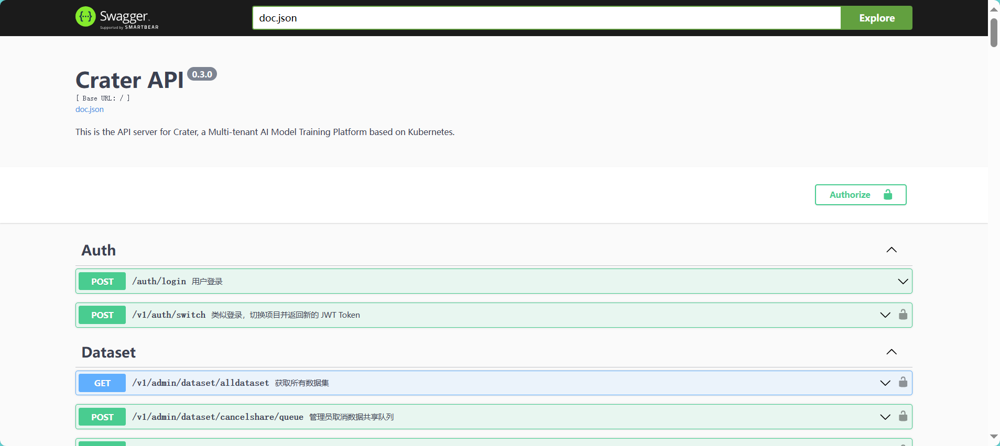

[English](README.md) | [简体中文](README.zh-CN.md)

# Crater Backend

Crater 是一个基于 Kubernetes 的异构集群管理系统，支持英伟达 GPU 等多种异构硬件。

Crater Backend 是 Crater 的子系统，包含作业提交、作业生命周期管理、深度学习环境管理等功能。

<table>
  <tr>
    <td align="center" width="45%">
      <br>
      <em>Jupyter Lab</em>
    </td>
    <td align="center" width="45%">
      <br>
      <em>Ray 任务</em>
    </td>
  </tr>
  <tr>
    <td align="center" width="45%">
      <br>
      <em>监控</em>
    </td>
    <td align="center" width="45%">
      <br>
      <em>模型</em>
    </td>
  </tr>
</table>

本文档为 Crater Backend 的开发指南，如果您希望安装或使用完整的 Crater 项目，您可以访问 [Crater 官方文档](https://raids-lab.github.io/crater/en/docs/admin/) 以了解更多。

## 🚀 在本地运行 Crater Backend

### 安装必要软件

建议安装以下软件及其推荐版本。

- **gvm**: 非必需，推荐版本 `v1.0.22`: [gvm - GitHub](https://github.com/moovweb/gvm)
- **Kubectl**: 必需，推荐版本 `v1.33`: [Kubectl 安装指南](https://kubernetes.io/docs/tasks/tools/)

gvm 用于方便快捷地安装多个 Go 版本，并在它们之间灵活切换。使用 gvm 能够让您快速安装 Crater 所使用的 Go，并在 Go 版本升级时快速切换。

您可以使用以下命令安装 gvm：

```bash
# Linux/macOS
bash < <(curl -s -S -L https://raw.githubusercontent.com/moovweb/gvm/master/binscripts/gvm-installer)
```

在 gvm 安装成功后，您可以在后端目录（即 `go.mod` 所在的目录）中使用如下命令快速安装对应的 Go 版本。

```bash
# Linux/macOS
gvm applymod
```

当然，您也可以不使用 gvm，而是直接安装 Go。

- **Go**: 推荐版本 `v1.25.4`: [Go 安装指南](https://go.dev/doc/install)

这种情况下，您可能还需要设置环境变量，以保证通过 `go install` 安装的程序可以直接运行。

```bash
# Linux/macOS

# 将 GOROOT 设置为你的 Go 安装目录
export GOROOT=/usr/local/go  # 将此路径更改为你实际的 Go 安装位置

# 将 Go 添加到 PATH
export PATH=$PATH:$GOROOT/bin
```

你可以将这些内容添加到你的 shell 配置文件中，例如 `.zshrc`。

无论您以何种方式安装 Go，您可能还需要配置 Go 代理，可以通过运行单条命令来设置，而无需添加到 shell 配置中。

```bash
go env -w GOPROXY=https://goproxy.cn,direct
```

### 准备配置文件

**注意：** 建议通过主仓库的统一配置文件管理系统来管理这些配置文件，详见主仓库 README。

#### `kubeconfig`

要运行项目，你至少需要有一个 Kubernetes 集群，并安装 Kubectl。

对于测试或者学习环境，你可以通过 Kind、MiniKube 等开源项目，快速地获取一个集群。

`kubeconfig` 是 Kubernetes 客户端和工具用来访问和管理 Kubernetes 集群的配置文件。它包含集群连接详细信息、用户凭据和上下文信息。

Crater Backend 将优先尝试读取 `KUBECONFIG` 环境变量对应的 `kubeconfig`，如果不存在，则读取当前目录下的 `kubeconfig` 文件。

```makefile
# Makefile
KUBECONFIG_PATH := $(if $(KUBECONFIG),$(KUBECONFIG),${PWD}/kubeconfig)
```

#### `./etc/debug-config.yaml`

`etc/debug-config.yaml` 文件包含 Crater 后端服务的应用程序配置。此配置文件定义了各种设置，包括：

- **服务配置**: 服务器端口、指标端点和性能分析设置
- **数据库连接**: PostgreSQL 连接参数和凭据
- **工作区设置**: Kubernetes 命名空间、存储 PVC 和入口配置
- **外部集成**: Raids Lab 系统认证（非 Raids Lab 环境不需要）、镜像仓库、SMTP 邮件通知服务等
- **功能标志**: 调度器和作业类型启用设置

你可以在 [`etc/example-config.yaml`](https://github.com/raids-lab/crater-backend/blob/main/etc/example-config.yaml) 中找到示例文件和对应的说明。

#### `.debug.env`

当您运行 `make run` 命令时，我们将帮您创建 `.debug.env` 文件，该文件会被 git 忽略，可以存储个性化的配置。

目前内部只有一条配置，用于指定服务使用的端口号。如果你的团队在同一节点上进行开发，可以通过它协调，以避免端口冲突。

```env
CRATER_BE_PORT=:8088  # 后端端口
```

在开发模式下，我们通过 Crater Frontend 的 Vite Server 进行服务的代理，因此您并不需要关心 CORS 等问题。

### 运行 Crater Backend

完成上述设置后，你可以使用 `make` 命令运行项目。如果尚未安装 `make`，建议安装它。

```bash
make run
```

如果服务器正在运行并可在你配置的端口访问，你可以打开 Swagger UI 进行验证：

```bash
http://localhost:<你的后端端口>/swagger/index.html#/
```



你可以运行 `make help` 命令，查看相关的完整命令：

```bash
➜  crater-backend git:(main) ✗ make help 

Usage:
  make <target>

General
  help                Display this help.
  show-kubeconfig     Display current KUBECONFIG path
  prepare             Prepare development environment with updated configs

Development
  vet                 Run go vet.
  imports             Run goimports on all go files.
  import-check        Check if goimports is needed.
  lint                Lint go files.
  curd                Generate Gorm CURD code.
  migrate             Migrate database.
  docs                Generate docs docs.
  run                 Run a controller from your host.
  pre-commit-check    Run pre-commit hook manually.

Build
  build               Build manager binary.
  build-migrate       Build migration binary.

Development Tools
  golangci-lint       Install golangci-lint
  goimports           Install goimports
  swaggo              Install swaggo

Git Hooks
  pre-commit          Install git pre-commit hook.
```

## 🛠️ 数据库开发指南

项目使用 **GORM** 作为 ORM 框架，通过 **gormigrate** 进行数据库版本迁移管理，并使用 **GORM Gen** 自动生成类型安全的 CRUD 代码。

### 核心概念

- **模型定义** (`dao/model/*.go`): 定义数据库表对应的 Go 结构体
- **迁移脚本** (`cmd/gorm-gen/models/migrate.go`): 记录数据库结构变更历史，支持版本化迁移和回滚
- **查询代码生成** (`make curd`): 根据模型定义自动生成类型安全的数据库操作代码

### 数据库变更开发流程

当您需要修改数据库结构时（如添加字段、创建新表等），请遵循以下流程：

1. **修改模型定义**：在 `dao/model/*.go` 中修改相应的结构体定义，添加或修改字段及其 GORM 标签。

2. **编写迁移脚本**：在 `cmd/gorm-gen/models/migrate.go` 的迁移列表中添加新的迁移项。迁移 ID 使用时间戳格式 `YYYYMMDDHHmm`（年月日时分），例如 `202512091200`，确保唯一性并保证按时间顺序执行。每个迁移项需要包含 `Migrate`（升级）和 `Rollback`（回滚）函数。

3. **执行数据库迁移**：运行 `make migrate` 将变更应用到数据库。此命令会检查已执行的迁移记录，按顺序执行所有未执行的迁移，并更新迁移记录表。迁移是幂等的，重复执行不会出错。如果数据库是全新的，迁移脚本会先执行 `InitSchema` 创建所有表并初始化默认数据（如默认账户和管理员用户）。

4. **生成 CRUD 代码**：运行 `make curd` 根据最新的模型定义生成或更新 `dao/query/*.gen.go` 文件，提供类型安全的查询方法。

5. **编写业务代码**：在业务逻辑中使用生成的 `query` 方法操作数据库。

### 常用命令

| 命令 | 说明 |
|------|------|
| `make migrate` | 执行数据库迁移，将模型变更应用到数据库 |
| `make curd` | 生成数据库 CRUD 操作代码 |
| `make build-migrate` | 构建迁移二进制文件（用于生产环境） |

### 重要提示

1. **迁移顺序**：迁移按 ID 顺序执行，确保时间戳递增
2. **团队协作**：拉取代码后，如果看到 `migrate.go` 有更新，记得运行 `make migrate`
3. **回滚谨慎**：生产环境回滚前务必先备份数据
4. **首次部署**：如果是全新的数据库，`make migrate` 会自动创建所有表并初始化默认数据

### 生产环境部署

如果您是通过 Helm 安装的 Crater，部署新版本后将自动进行数据库迁移，相关的逻辑可以在 InitContainer 中找到。

### 相关文档

生成脚本和详细文档可以在以下位置找到：[`cmd/gorm-gen/README.md`](./cmd/gorm-gen/README.md)

## 🐞 使用 VSCode 调试（如果需要）

你可以通过按 F5（启动调试）使用 VSCode 在调试模式下启动后端。你可以设置断点并交互式地单步执行代码。

### 快速开始

项目已在根目录 `.vscode/launch.json` 中提供了预配置的调试启动配置。你只需要：

1. 在 VSCode 中打开项目根目录（`crater`，包含 `backend` 和 `frontend` 的根目录）
2. 设置断点（在代码行号左侧点击）
3. 按 `F5` 开始调试，选择 "Backend Debug Server" 配置

> 此调试配置是从原后端仓库（`backend/.vscode/launch.json`）迁移到项目根目录的。如果你需要使用原来的调试配置，可以直接用 VSCode 打开 `backend` 目录，使用 `backend/.vscode/launch.json` 中的配置。

### 调试配置说明

项目根目录的 `.vscode/launch.json` 包含以下配置：

```json
{
    "version": "0.2.0",
    "configurations": [
        {
            "name": "Backend Debug Server",
            "type": "go",
            "request": "launch",
            "mode": "auto",
            "program": "${workspaceFolder}/backend/cmd/crater/main.go",
            "cwd": "${workspaceFolder}/backend",
            "env": {
                "KUBECONFIG": "${workspaceFolder}/backend/kubeconfig",
                "NO_PROXY": "k8s.cluster.master"
            }
        }
    ]
}
```

其中：
- **`cwd`**: 设置为 `${workspaceFolder}/backend`，这确保程序能正确找到相对路径的配置文件（如 `./etc/debug-config.yaml`）
- **`program`**: 主程序入口文件，指向 `backend/cmd/crater/main.go`
- **配置文件自动查找**：程序在 debug 模式下会自动查找 `./etc/debug-config.yaml`（相对于 `cwd`），**无需**通过 `args` 传递 `--config-file` 参数
- **`KUBECONFIG`**: 使用后端仓库中的 `kubeconfig` 配置文件连接集群

## Storage Server（已并入 Backend 模块）

存储服务已并入 backend 的 Go 模块，入口为 `cmd/storage-server/main.go`。

常用命令：

```bash
make run-storage
make build-storage
```

运行时环境变量：

- `CRATER_STORAGE_PORT`（优先，回退 `PORT`，默认 `7320`）
- `CRATER_STORAGE_ROOT`（优先，回退 `ROOTDIR`，默认 `/crater`）

本地调试建议把这些变量写到 `backend/.debug.env`，然后执行 `make run-storage`。
