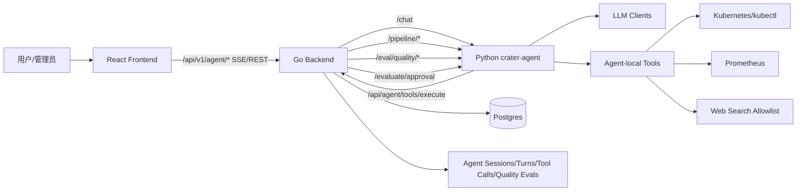
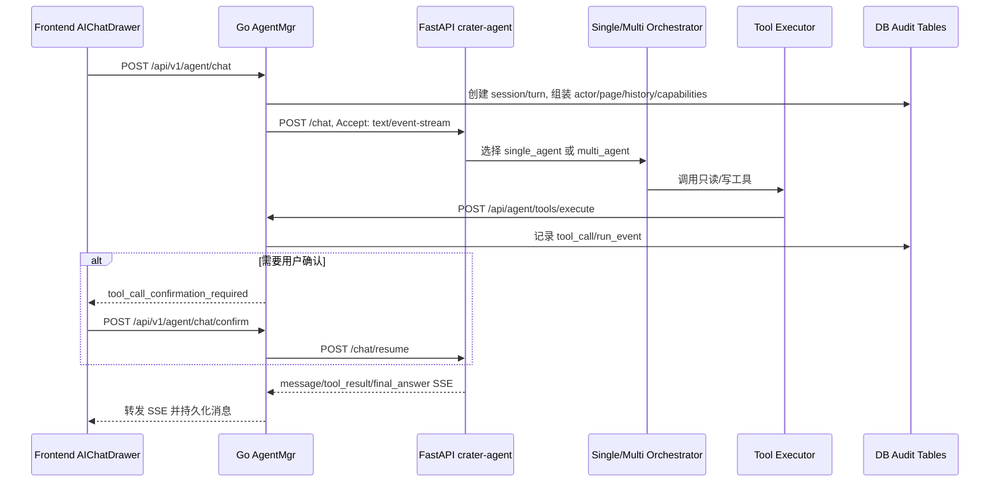

# Crater Agent 运维智能体交接说明

本文档交接 `feature/crater-agent` 分支中的运维智能体生产代码。当前系统包含 AI 运维助手、巡检与健康分析、审计追踪、审批评估、确认/恢复、前后端 agent 接入、Python agent 服务、多智能体 MOPS 编排和生产工具代理。

## 1. 系统边界

`crater-agent/` 是独立 Python FastAPI 服务，负责 LLM 推理、ReAct/MOPS 编排、agent-local 平台诊断工具、巡检流水线和质量评估。Go backend 是权限、数据、审计和写操作边界；frontend 只连接 Go API。



核心原则是“模型负责编排，后端负责裁决”。读/写工具经过角色、权限、策略和确认态检查；高风险写操作由 Go 生成确认表单，用户确认后执行并恢复流程。

## 2. 一次请求链路



`single_agent` 使用 `crater_agent/agent` 下的 LangGraph ReAct 图，适合问答、诊断和明确工具调用。`multi_agent` 使用 `crater_agent/orchestrators/multi.py`，由 coordinator 统筹 planner、explorer、executor、verifier、guide/general，适合复杂运维和多工具 MOPS 编排。

## 3. Python 服务结构

```text
crater-agent/
  config/
    llm-clients.json          # LLM client/role 路由
    platform-runtime.yaml     # agent-local K8s/Prometheus/Harbor/Storage 配置
    platform_conventions.yaml # 平台命名和运维约定
  crater_agent/
    app.py                    # FastAPI 入口: /chat /health /config-summary /evaluate/approval
    app_quality.py            # feedback/manual 质量评估触发
    internal_tools_router.py  # Go 调 Python-local 写工具
    agent/                    # 单 Agent ReAct graph/prompt/state/压缩
    agents/                   # 多 Agent 角色实现
    orchestrators/            # single/multi 编排、路由和运行态
    tools/                    # 工具定义、策略、Go 代理、本地执行器
    pipeline/                 # GPU 巡检、存储巡检、管理员运维报告
    quality/                  # 会话加载、质量评估、结果回写
    runtime/                  # 平台运行配置发现和合并
```

迭代按职责落点：新增工具先改 `tools/definitions.py` 和后端 `backend/internal/handler/agent/tools_*.go`，再补前端展示；新增多智能体角色放 `agents/` 并在 `orchestrators/multi.py` 接入；新增定时巡检放 `pipeline/`，由 Go cron/patrol 调用。

## 4. 环境与启动

Python 要求 3.11+。从 `crater-agent` 目录启动，`.env` 和相对配置路径都按该目录解析；`pyproject.toml` 已声明 FastAPI、uvicorn、LangGraph、LangChain、Pydantic、httpx、CAMEL、ddgs 等依赖。

```bash
cd crater-agent
python3.11 -m venv .venv
.venv/bin/python -m pip install -e .
.venv/bin/python -m uvicorn crater_agent.app:app --host 0.0.0.0 --port 8000
```

`crater_agent.config.Settings` 会读取当前目录下的 `.env`。业务配置变量统一用 `CRATER_AGENT_` 前缀；LLM 密钥变量可不加前缀，因为它们由 `config/llm-clients.json` 的 `api_key_env` 引用。`.env` 不提交版本库，本地和部署环境都由 Secret 或环境变量注入。

```dotenv
# LLM clients; name must match config/llm-clients.json -> api_key_env
DASHSCOPE_API_KEY_NEW=replace-with-real-key

# Agent service
CRATER_AGENT_DEFAULT_ORCHESTRATION_MODE=single_agent
CRATER_AGENT_LLM_CLIENTS_CONFIG_PATH=./config/llm-clients.json
CRATER_AGENT_PLATFORM_RUNTIME_CONFIG_PATH=./config/platform-runtime.yaml
CRATER_AGENT_BACKEND_DEBUG_CONFIG_PATH=../backend/etc/debug-config.yaml
CRATER_AGENT_HOST=0.0.0.0
CRATER_AGENT_PORT=8000

# Go backend integration
CRATER_AGENT_CRATER_BACKEND_URL=http://localhost:8080
CRATER_AGENT_CRATER_BACKEND_INTERNAL_TOKEN=dev-agent-internal-token
CRATER_AGENT_AGENT_INTERNAL_TOKEN=dev-agent-internal-token
```

健康检查：

```bash
curl http://127.0.0.1:8000/health
curl http://127.0.0.1:8000/config-summary
```

Go backend 需要把 Python 服务地址和共享 token 配到 `backend/etc/debug-config.yaml` 或部署配置中：

```yaml
agent:
  serviceURL: http://localhost:8000
  internalToken: dev-agent-internal-token
  ops:
    webSearch:
      enabled: true
      allowedDomains: [kubernetes.io, prometheus.io, grafana.com, docs.nvidia.com]
      timeoutSeconds: 10
    kubernetes:
      kubeconfigPath: ""
      context: ""
      namespace: crater-workspace
      kubectlBin: kubectl
      timeoutSeconds: 30
  approvalHook:
    enabled: true
    totalTimeoutSeconds: 60
    maxPerMinute: 10
    maxConcurrent: 3
```

两个 token 方向不同：`CRATER_AGENT_CRATER_BACKEND_INTERNAL_TOKEN` 用于 Python 调 Go 内部工具；`CRATER_AGENT_AGENT_INTERNAL_TOKEN` 用于 Go 调 Python 内部接口。开发环境可相同，生产环境用 Secret 注入。`platform-runtime.yaml` 只放 agent-local 工具需要的 kubeconfig、Prometheus、Harbor、存储前缀和 allowlist。

Frontend 启动仍按主项目流程：

```bash
cd frontend
pnpm install
pnpm dev
```

## 5. Backend 改动说明

Backend 新增 `AgentMgr` 路由和服务层，主要入口在 `backend/internal/handler/agent/`、`backend/internal/service/agent_*`、`backend/dao/model/agent.go` 和 `backend/hack/sql/*agent*.sql`。它负责会话/轮次/消息持久化、SSE 代理、工具执行、权限校验、确认/恢复、操作日志、质量评估和审计。

工具层分三类：只读诊断工具查询作业、日志、事件、配额、健康概览、Prometheus 与存储；确认型写工具创建/停止/重提作业、镜像构建和集群变更；巡检工具由 `/pipeline/*` 触发并写入报告。审批单增强在 `agent_approval.go`，简单规则未覆盖时调用 `/evaluate/approval`。

## 6. Frontend 改动说明

Frontend 主要入口是 `frontend/src/components/aiops/AIChatDrawer.tsx` 和 `frontend/src/services/api/agent.ts`。它支持规则/LLM/Agent 模式、SSE 流式渲染、单/多 Agent、历史会话、工具时间线、确认表单、恢复执行、失败重试和用户反馈。

管理员与用户页面在 `frontend/src/routes/admin/aiops/`、`frontend/src/routes/portal/aiops/`；管理员审计在 `frontend/src/routes/admin/more/agent-audit/` 与 `frontend/src/components/agent-audit/`；运维报告展示在 `OpsReportTab`；审批单页面展示 agent 评估；cronjob 卡片可手动触发巡检。前端只依赖 Go API，状态来自 backend。

## 7. 维护注意事项

提示词在 `crater_agent/agent/prompts.py` 和各角色 agent 中维护；工具白名单、确认策略、角色权限在 `crater_agent/tools/definitions.py` 和 Go `tools_dispatch.go` 中维护；平台运行参数在 `config/platform-runtime.yaml` 与 backend `agent.ops` 中维护；质量评估走 `quality/` 和 backend `quality-evals` 链路。

改动后运行：

```bash
cd crater-agent && .venv/bin/python -c "import crater_agent.app; print('ok')"
go test ./internal/handler/agent ./internal/service
go test -run '^$' ./cmd/crater
cd frontend && pnpm lint && pnpm build
```
