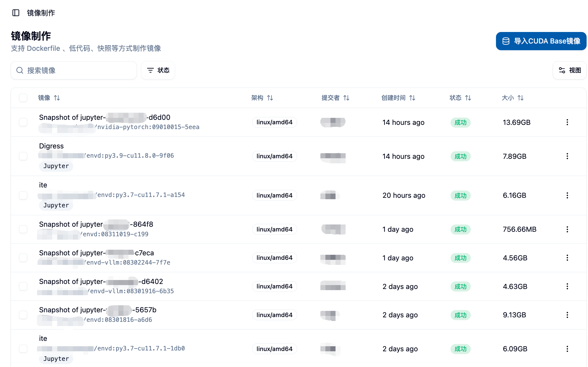

## 機能概要 📋

管理者権限を持つミラーリング作成機能は、プラットフォーム管理者にすべてのユーザーのミラーリング作成タスクを包括的に管理および監視する能力を提供します。一般ユーザーのミラーリング作成機能と比較して、管理者バージョンには以下の特徴があります：

- **🌐 全体ビュー**：プラットフォーム上のすべてのユーザーのミラーリング作成タスクを表示および管理できます
- **🚀 CUDAベースミラー管理**：独自のCUDAベースミラーのライブラリ管理機能
- **🔐 高度な権限コントロール**：すべてのミラーリング作成タスクに対して削除および管理権限を持っています
- **📊 システム監視**：プラットフォーム全体のミラーリング作成状態およびリソース使用状況を監視できます

## 🚪 管理者ミラーリング作成ページへのアクセス

管理者はサイドバーの「管理」カテゴリの「ミラーリング管理」メニュー内の「ミラーリング作成」を選択することで、管理者用ミラーリング作成ページにアクセスできます。

このページでは以下の情報が表示されます：
- すべてのユーザーのミラーリング作成タスク一覧 📋
- 各タスクの作成者情報 👤
- ミラー構築状態および進行状況 📈
- ミラーのサイズや構築時間などの詳細情報 📊

## ⚙️ 管理者専用機能

### 1. 🚀 CUDAベースミラーリング管理

管理者は独自のCUDAベースミラーリング管理機能を持ち、プラットフォームユーザーのために基本的なCUDAミラーを追加および管理できます。

ページ上部の「CUDAベースミラーをインポート」ボタンをクリックすることで、CUDAベースミラーリング管理画面を開くことができます。

この画面では以下を行えます：

#### 👀 既存のCUDAベースミラーの確認
- すべての設定されたCUDAベースミラーを表示します
- ミラーの表示名、バージョンタグ、完全なアドレスを含みます
- 各ミラーには対応する識別情報があります

#### ➕ 新しいCUDAベースミラーの追加
新しいCUDAベースミラーを追加するには、以下の情報を入力します：

**🏷️ ミラー表示タグ**
- ユーザーインターフェースで表示するフレンドリな名前
- 例：`CUDA 12.8.1`

**🔖 ミラーバージョンタグ**
- コードでミラーを識別するために使用されるユニークなタグ
- 例：`cu12.8.1`
- 他の既存タグと重複してはいけません
- 文字、数字、ピリオド、アンダースコア、ハイフンのみ使用可能
- 1〜128文字の長さ制限があります
- ピリオドまたはハイフンで始まる/終わるものは使用できません

**🔗 ミラーの完全なリンク**
- 完全なミラーアドレス
- 例：`harbor.raids-lab.cn/nvidia/cuda:12.8.1-cudnn-devel-ubuntu22.04`
- 標準的なDockerミラーのアドレス形式でなければなりません

#### 🗑️ CUDAベースミラーの削除
- 再利用しないCUDAベースミラーについては、削除ボタンをクリックして削除できます
- 削除の前に確認ダイアログが表示され、誤操作を防ぎます ⚠️

### 2. 🌐 全体のミラーリング作成タスク管理

#### 👥 すべてのユーザーの作成タスクの確認
管理者はプラットフォーム上のすべてのユーザーのミラーリング作成タスクを確認できます。以下が含まれます：
- ミラーディスクリプションおよびリンク 📋
- サポートされるアーキテクチャ情報 🏗️
- 作成者情報 👤
- 作成日時 📅
- 作成状態 📊
- ミラーのサイズ 📦

#### 📦 バッチ操作機能
管理者は複数のミラーリング作成タスクに対してバッチ操作を行えます：

**🗑️ バッチ削除**
- 複数のミラーリング作成タスクを選択
- 作成タスクおよび対応するミラーリンクを一括して削除できます
- 操作前に詳細な確認メッセージが表示されます

**✅ バッチ検証**
- 複数のミラーリンクを選択して有効性を検証できます
- ミラーが利用可能でアクセス可能か確認できます
- 検証が完了した後、無効なミラーを削除できます

#### ⚙️ 単一タスク操作
各ミラーリング作成タスクに対して管理者は以下の操作を実行できます：

**👀 詳細表示**
- ミラー名をクリックまたは詳細メニューを使用して、完全なミラーリング作成情報を表示
- ビルドログ、Dockerfileの内容、ビルド設定などが含まれます

**📋 タスクのクローン**
- 既存のミラーリング作成タスクに基づいて新しいビルドタスクを作成
- 以下のビルド方法をサポートします：
  - Python + CUDA カスタムビルド 🐍
  - 既存のミラーに基づくビルド 📦
  - Dockerfileに基づくビルド 🐳
  - Envdに基づくビルド ⚡

**🗑️ タスクの削除**
- 不要なミラーリング作成タスクを削除
- 削除操作は同時に該当するミラーリンクも削除します

## 📊 ミラーリング作成状態の監視

### 📂 状態分類
管理者は状態フィルタリングを使って異なる状態のミラーリング作成タスクを確認できます：
- **⏳ 待機中**：タスクが提出され、構築を待っています
- **🔄 構築中**：ミラーリングの構築が進行中
- **✅ 成功**：ミラーリングの構築が完了し、利用可能です
- **❌ 失敗**：ミラーリングの構築中にエラーが発生しました

### 📋 構築ログの確認
任意のミラーリング作成タスクに対して、管理者は詳細な構築ログを確認できます：
- 実時間の構築出力 📺
- エラーメッセージの診断 🔍
- 構築ステップの追跡 📈

## 🔐 権限とセキュリティ管理

### 👥 ユーザー間管理
- 管理者は任意のユーザーのミラーリング作成タスクを削除できます
- すべてのユーザーのミラービルド詳細を確認できます
- プラットフォームレベルのミラーマネジメント権限を持っています

### 📊 システムリソース監視
- プラットフォーム全体のミラーのストレージ使用状況を監視できます
- Harborミラーリポジトリのプロジェクト設定を管理できます
- ユーザーのミラーリング作成権限およびクォータを管理できます

## 💡 最適な実践

### 🚀 CUDAベースミラーリング管理の提案
1. **📋 バージョンの標準化**：統一されたCUDAバージョンの命名規則を確立
2. **🔄 定期的な更新**：新しいバージョンのCUDAミラーを迅速に追加
3. **🧹 清掃メカニズム**：使用されていない古いバージョンのミラーを定期的に削除
4. **🧪 テストと検証**：新しいミラーを追加する前に機能テストを行う

### ⚙️ タスク管理の提案
1. **🧹 定期的なクリーンアップ**：失敗または期限切れのミラーリング作成タスクをクリーンアップ
2. **📊 リソースの監視**：ストレージ使用状況に注意
3. **👥 ユーザーの指導**：ユーザーがミラーリング作成中に遭遇する問題を解決する
4. **📋 ログ分析**：構築ログを活用して一般的な問題を診断

## ⚠️ 注意事項

<Callout type="warning">
1. CUDAベースミラーを削除する前に、そのミラーを使用中のユーザーがいないことを確認してください
2. バッチ削除操作は取り消せませんので、慎重に行ってください
3. 管理者権限は強く、操作ログを定期的に確認することをお勧めします
4. ユーザーがアップロードしたカスタムミラーについては、セキュリティスキャンを推奨します
</Callout>