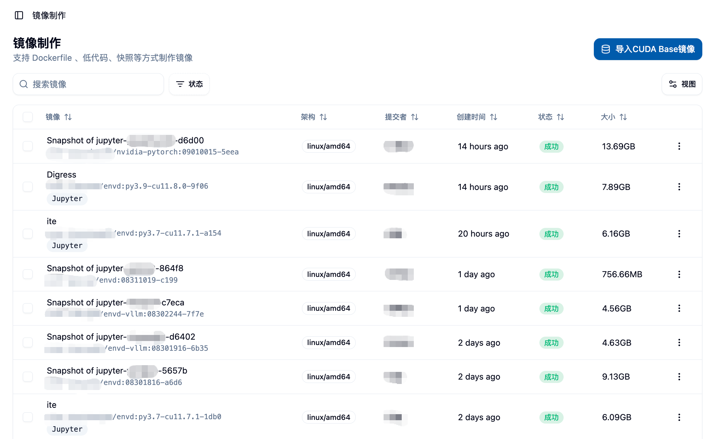
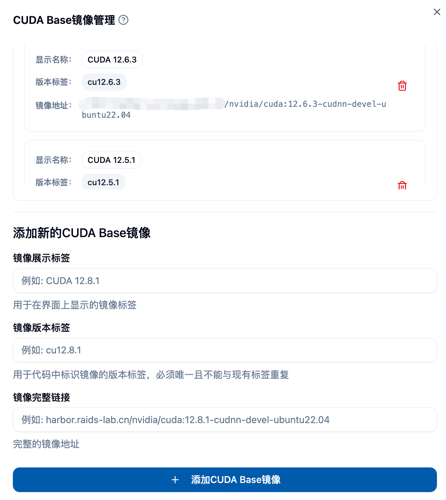
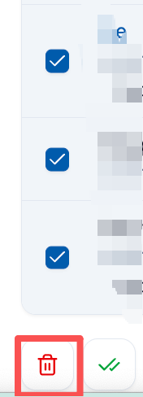
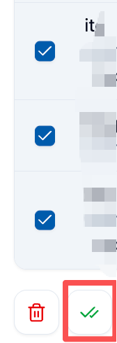
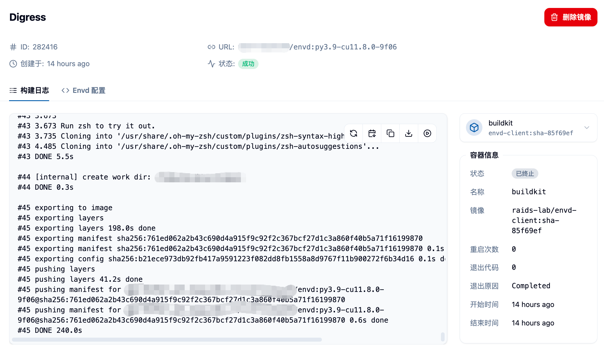

## 기능 개요 📋

관리자 권한 하의 이미지 생성 기능은 플랫폼 관리자에게 모든 사용자의 이미지 생성 작업에 대한 포괄적인 관리 및 모니터링 기능을 제공합니다. 일반 사용자와의 이미지 생성 기능과 비교할 때, 관리자 버전은 다음과 같은 특징을 가지고 있습니다:

- **🌐 전역 뷰** : 플랫폼 내 모든 사용자의 이미지 생성 작업을 확인하고 관리할 수 있습니다.
- **🚀 CUDA 기반 이미지 관리** : 독점적인 CUDA 기반 이미지 라이브러리 관리 기능
- **🔐 고급 권한 제어** : 모든 이미지 생성 작업에 대한 삭제 및 관리 권한을 갖습니다.
- **📊 시스템 모니터링** : 플랫폼 전체의 이미지 생성 상태 및 자원 사용 상황을 모니터링할 수 있습니다.

## 🚪 관리자 이미지 생성 페이지 이동

관리자는 사이드바의 "관리" 카테고리에서 "이미지 관리" 메뉴 아래의 "이미지 생성"을 클릭하여 관리자 이미지 생성 페이지에 접속할 수 있습니다.

이 페이지에서 다음과 같은 정보를 확인할 수 있습니다:
- 모든 사용자의 이미지 생성 작업 목록 📋
- 각 작업의 생성자 정보 👤
- 이미지 빌드 상태 및 진행 상황 📈
- 이미지 크기 및 빌드 시간 등의 상세 정보 📊

## ⚙️ 관리자 전용 기능

### 1. 🚀 CUDA 기반 이미지 관리

관리자는 플랫폼 사용자에게 CUDA 기반 이미지를 추가하고 관리할 수 있는 독점적인 기능을 제공받습니다.

페이지 상단의 "CUDA 기반 이미지 임포트" 버튼을 클릭하여 CUDA 기반 이미지 관리 인터페이스를 열 수 있습니다.

이 인터페이스에서 다음과 같은 작업을 수행할 수 있습니다:

#### 👀 기존 CUDA 기반 이미지 보기
- 구성된 모든 CUDA 기반 이미지를 표시합니다.
- 이미지의 표시 이름, 버전 태그 및 전체 주소가 포함됩니다.
- 각 이미지에는 대응하는 식별 정보가 포함됩니다.

#### ➕ 새로운 CUDA 기반 이미지 추가
다음 정보를 입력하여 새로운 CUDA 기반 이미지를 추가할 수 있습니다:

**🏷️ 이미지 표시 태그**
- 사용자 인터페이스에서 표시되는 친절한 이름입니다.
- 예: `CUDA 12.8.1`

**🔖 이미지 버전 태그**
- 코드에서 이미지를 식별하는 유일한 태그입니다.
- 예: `cu12.8.1`
- 기존 태그와 중복될 수 없습니다.
- 알파벳, 숫자, 점, 밑줄, 하이픈만 허용됩니다.
- 길이 제한은 1~128자입니다.
- 점 또는 하이픈으로 시작하거나 끝날 수 없습니다.

**🔗 이미지 전체 링크**
- 전체 이미지 주소입니다.
- 예: `harbor.raids-lab.cn/nvidia/cuda:12.8.1-cudnn-devel-ubuntu22.04`
- 표준 Docker 이미지 주소 형식을 따라야 합니다.

#### 🗑️ CUDA 기반 이미지 삭제
- 더 이상 필요하지 않은 CUDA 기반 이미지를 삭제하기 위해 삭제 버튼을 클릭할 수 있습니다.
- 삭제 전에 확인 메시지가 표시되어 실수를 방지합니다 ⚠️

### 2. 🌐 전역 이미지 생성 작업 관리

#### 👥 모든 사용자의 작업 보기
관리자는 플랫폼 내 모든 사용자의 이미지 생성 작업을 확인할 수 있습니다. 다음 정보가 포함됩니다:
- 이미지 설명 및 링크 📋
- 지원되는 아키텍처 정보 🏗️
- 생성자 정보 👤
- 생성 시간 📅
- 빌드 상태 📊
- 이미지 크기 📦

#### 📦 대량 작업 기능
관리자는 여러 이미지 생성 작업에 대해 대량 작업을 수행할 수 있습니다:

**🗑️ 대량 삭제**
- 여러 이미지 생성 작업을 선택할 수 있습니다.
- 이미지 생성 작업 및 해당 이미지 링크를 대량으로 삭제할 수 있습니다.
- 작업 전에 자세한 확인 정보가 표시됩니다.

**✅ 대량 검증**
- 여러 이미지 링크를 선택하여 유효성 검사를 수행할 수 있습니다.
- 이미지가 사용 가능하고 접근 가능한지 확인할 수 있습니다.
- 검증 완료 후 사용 불가능한 이미지를 삭제할 수 있습니다.

#### ⚙️ 단일 작업 관리
각 이미지 생성 작업에 대해 관리자는 다음 작업을 수행할 수 있습니다:

**👀 상세 정보 보기**
- 이미지 이름을 클릭하거나 상세 메뉴를 사용하여 전체 이미지 생성 정보를 확인할 수 있습니다.
- 빌드 로그, Dockerfile 내용, 빌드 설정 등이 포함됩니다.

**📋 작업 복제**
- 기존의 이미지 생성 작업을 기반으로 새로운 빌드 작업을 생성할 수 있습니다.
- 다양한 빌드 방식을 지원합니다:
  - Python + CUDA 커스텀 빌드 🐍
  - 기존 이미지 기반 빌드 📦
  - Dockerfile 기반 빌드 🐳
  - Envd 기반 빌드 ⚡

**🗑️ 작업 삭제**
- 불필요한 이미지 생성 작업을 삭제할 수 있습니다.
- 삭제 작업은 해당 이미지 링크도 함께 삭제합니다.

## 📊 이미지 생성 상태 모니터링

### 📂 상태 분류
관리자는 상태 필터링을 통해 다양한 상태의 이미지 생성 작업을 볼 수 있습니다:
- **⏳ 대기 중** : 작업이 제출되었으나 빌드 시작을 기다리고 있습니다.
- **🔄 빌드 중** : 이미지 빌드가 진행 중입니다.
- **✅ 성공** : 이미지 빌드가 완료되었으며 사용 가능합니다.
- **❌ 실패** : 이미지 빌드 과정에서 오류가 발생했습니다.

### 📋 빌드 로그 확인
관리자는 모든 이미지 생성 작업에 대해 상세한 빌드 로그를 확인할 수 있습니다:
- 실시간 빌드 출력 📺
- 오류 메시지 진단 🔍
- 빌드 단계 추적 📈

## 🔐 권한 및 보안 관리

### 👥 사용자 간 관리
- 관리자는 모든 사용자의 이미지 생성 작업을 삭제할 수 있습니다.
- 모든 사용자의 이미지 빌드 세부 정보를 볼 수 있습니다.
- 플랫폼 수준의 이미지 관리 권한을 가지고 있습니다.

### 📊 시스템 자원 모니터링
- 전체 플랫폼의 이미지 저장 공간 사용 상황을 모니터링할 수 있습니다.
- Harbor 이미지 저장소의 프로젝트 설정을 관리할 수 있습니다.
- 사용자의 이미지 생성 권한 및 할당량을 제어할 수 있습니다.

## 💡 최적의 실천 방법

### 🚀 CUDA 기반 이미지 관리 제안
1. **📋 버전 표준화** : 통일된 CUDA 버전 명명 규칙을 수립하세요.
2. **🔄 정기 업데이트** : 새로운 버전의 CUDA 이미지를 신속히 추가하세요.
3. **🧹 정리 메커니즘** : 더 이상 사용되지 않는 오래된 버전의 이미지를 정기적으로 정리하세요.
4. **🧪 테스트 검증** : 새로운 이미지를 추가하기 전에 기능 테스트를 수행하세요.

### ⚙️ 작업 관리 제안
1. **🧹 정기 정리** : 실패하거나 만료된 이미지 생성 작업을 정리하세요.
2. **📊 자원 모니터링** : 저장 공간 사용량을 주의 깊게 관찰하세요.
3. **👥 사용자 지도** : 사용자가 이미지 생성 과정에서 겪는 문제를 도와주세요.
4. **📋 로그 분석** : 빌드 로그를 통해 일반적인 문제를 진단하세요.

## ⚠️ 주의 사항

<Callout type="warning">
1. CUDA 기반 이미지를 삭제하기 전에, 해당 이미지를 사용하는 사용자가 있는지 확인하세요.
2. 대량 삭제 작업은 되돌릴 수 없습니다. 신중하게 작업하세요.
3. 관리자 권한은 매우 크므로, 주기적으로 작업 로그를 확인하는 것을 권장합니다.
4. 사용자가 업로드한 커스텀 이미지에 대해 보안 스캔을 권장합니다.
</Callout>