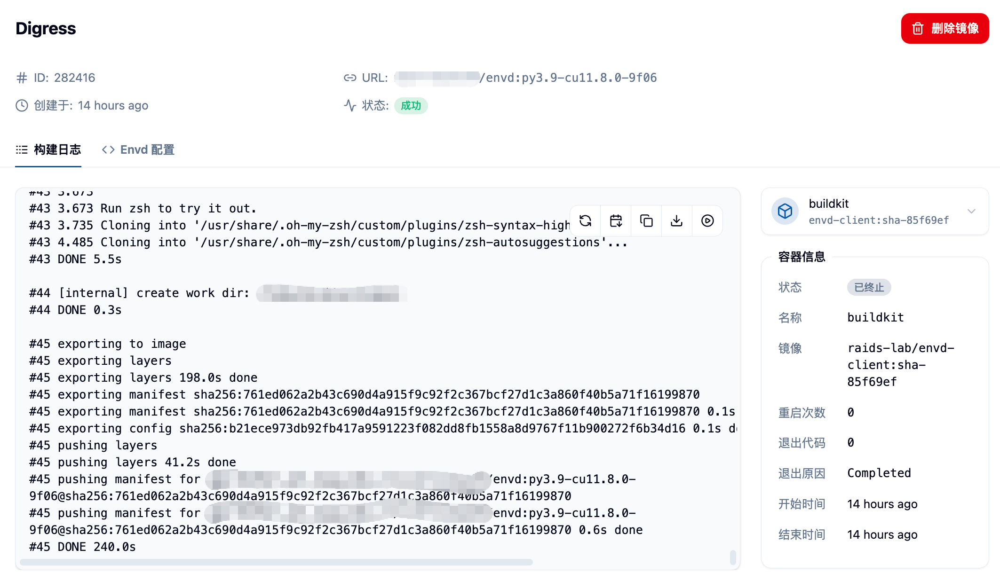

## 功能概述 📋

管理员权限下的镜像制作功能为平台管理员提供了对所有用户镜像制作任务的全面管理和监控能力。相比普通用户的镜像制作功能，管理员版本具有以下特点：

- **🌐 全局视图**：可以查看和管理平台上所有用户的镜像制作任务
- **🚀 CUDA Base 镜像管理**：独有的 CUDA 基础镜像库管理功能
- **🔐 高级权限控制**：对所有镜像制作任务拥有删除和管理权限
- **📊 系统监控**：能够监控平台整体的镜像制作状态和资源使用情况

## 🚪 进入管理员镜像制作页面

管理员可以通过侧边栏"管理"分类中的"镜像管理"菜单下的"镜像制作"，来进入到管理员镜像制作页面。

在页面上，您可以看到：
- 所有用户的镜像制作任务列表 📋
- 每个任务的创建者信息 👤
- 镜像构建状态和进度 📈
- 镜像大小和构建时间等详细信息 📊

## ⚙️ 管理员专有功能

### 1. 🚀 CUDA Base 镜像管理

管理员具有独有的 CUDA Base 镜像管理功能，可以为平台用户添加和管理基础的 CUDA 镜像。

点击页面上方的"导入 CUDA Base 镜像"按钮，可以打开 CUDA Base 镜像管理界面。

在此界面中，您可以：

#### 👀 查看现有 CUDA Base 镜像
- 显示所有已配置的 CUDA Base 镜像
- 包含镜像的显示名称、版本标签和完整地址
- 每个镜像都有对应的标识信息

#### ➕ 添加新的 CUDA Base 镜像
填写以下信息来添加新的 CUDA Base 镜像：

**🏷️ 镜像展示标签**
- 用于在用户界面上显示的友好名称
- 例如：`CUDA 12.8.1`

**🔖 镜像版本标签**
- 用于代码中标识镜像的唯一标签
- 例如：`cu12.8.1`
- 必须唯一，不能与现有标签重复
- 只能包含字母、数字、点、下划线、连字符
- 长度限制为 1-128 字符
- 不能以点或连字符开头/结尾

**🔗 镜像完整链接**
- 完整的镜像地址
- 例如：`harbor.raids-lab.cn/nvidia/cuda:12.8.1-cudnn-devel-ubuntu22.04`
- 必须符合标准的 Docker 镜像地址格式

#### 🗑️ 删除 CUDA Base 镜像
- 对于不再需要的 CUDA Base 镜像，可以点击删除按钮进行移除
- 删除前会有确认提示，防止误操作 ⚠️

### 2. 🌐 全局镜像制作任务管理

#### 👥 查看所有用户的制作任务
管理员可以查看平台上所有用户的镜像制作任务，包括：
- 镜像描述和链接 📋
- 支持的架构信息 🏗️
- 创建者信息 👤
- 创建时间 📅
- 构建状态 📊
- 镜像大小 📦

#### 📦 批量操作功能
管理员可以对多个镜像制作任务进行批量操作：

**🗑️ 批量删除**
- 选择多个镜像制作任务
- 可以批量删除镜像创建任务和对应的镜像链接
- 操作前会显示详细的确认信息

**✅ 批量检测**
- 选择多个镜像链接进行有效性检测
- 可以验证镜像是否可用和可访问
- 检测完成后可以选择删除无效的镜像

#### ⚙️ 单个任务操作
对于每个镜像制作任务，管理员可以执行以下操作：

**👀 查看详情**
- 点击镜像名称或使用详情菜单查看完整的镜像制作信息
- 包括构建日志、Dockerfile 内容、构建配置等

**📋 克隆任务**
- 基于现有的镜像制作任务创建新的构建任务
- 支持不同构建方式的克隆：
  - Python + CUDA 自定义构建 🐍
  - 基于现有镜像构建 📦
  - 基于 Dockerfile 构建 🐳
  - 基于 Envd 构建 ⚡

**🗑️ 删除任务**
- 删除不需要的镜像制作任务
- 删除操作会同时删除对应的镜像链接

## 📊 镜像制作状态监控

### 📂 状态分类
管理员可以通过状态筛选查看不同状态的镜像制作任务：
- **⏳ 等待中**：任务已提交，等待开始构建
- **🔄 构建中**：正在进行镜像构建
- **✅ 成功**：镜像构建完成且可用
- **❌ 失败**：镜像构建过程中出现错误

### 📋 构建日志查看
对于任何镜像制作任务，管理员都可以查看详细的构建日志：
- 实时构建输出 📺
- 错误信息诊断 🔍
- 构建步骤追踪 📈

## 🔐 权限和安全管理

### 👥 跨用户管理
- 管理员可以删除任何用户的镜像制作任务
- 可以查看所有用户的镜像构建详情
- 具有平台级别的镜像管理权限

### 📊 系统资源监控
- 监控整个平台的镜像存储使用情况
- 管理 Harbor 镜像仓库的项目配置
- 控制用户的镜像制作权限和配额

## 💡 最佳实践

### 🚀 CUDA Base 镜像管理建议
1. **📋 版本标准化**：建立统一的 CUDA 版本命名规范
2. **🔄 定期更新**：及时添加新版本的 CUDA 镜像
3. **🧹 清理机制**：定期清理不再使用的旧版本镜像
4. **🧪 测试验证**：添加新镜像前先进行功能测试

### ⚙️ 任务管理建议
1. **🧹 定期清理**：清理失败或过期的镜像制作任务
2. **📊 资源监控**：关注存储空间使用情况
3. **👥 用户指导**：帮助用户解决镜像制作过程中的问题
4. **📋 日志分析**：通过构建日志诊断常见问题

## ⚠️ 注意事项

<Callout type="warning">
1. 删除 CUDA Base 镜像前，请确保没有用户正在使用该镜像进行构建
2. 批量删除操作无法撤销，请谨慎操作
3. 管理员权限较大，建议定期检查操作日志
4. 对于用户上传的自定义镜像，建议进行安全扫描
</Callout>
