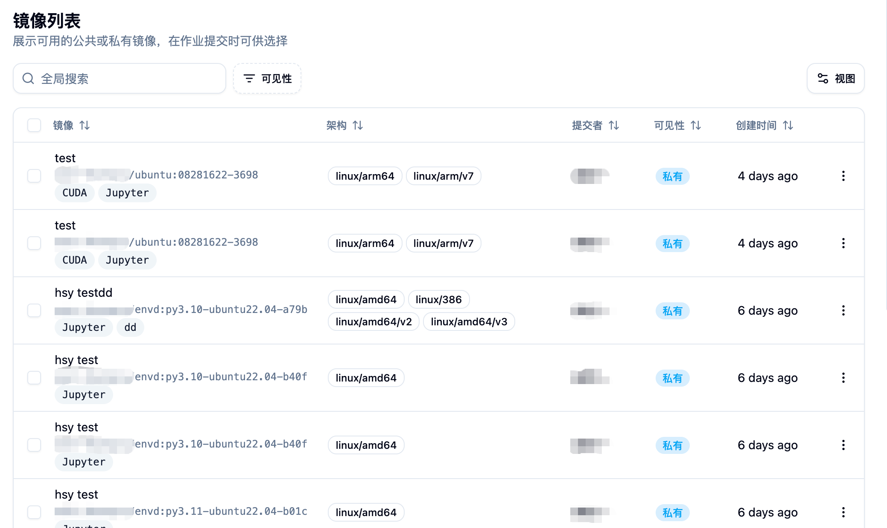
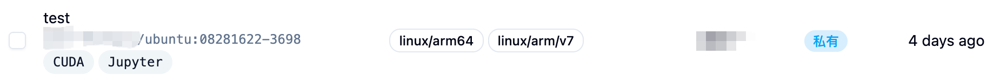
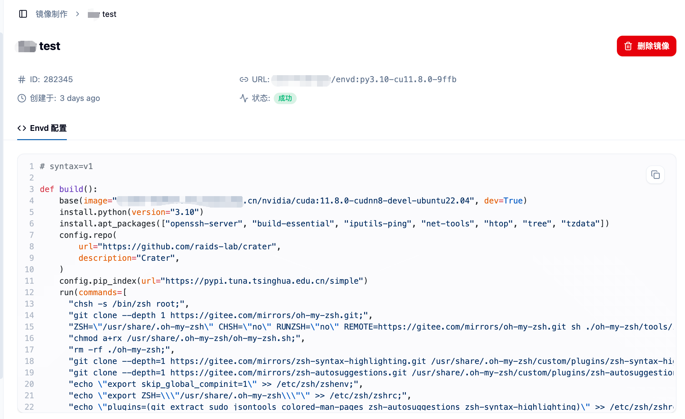
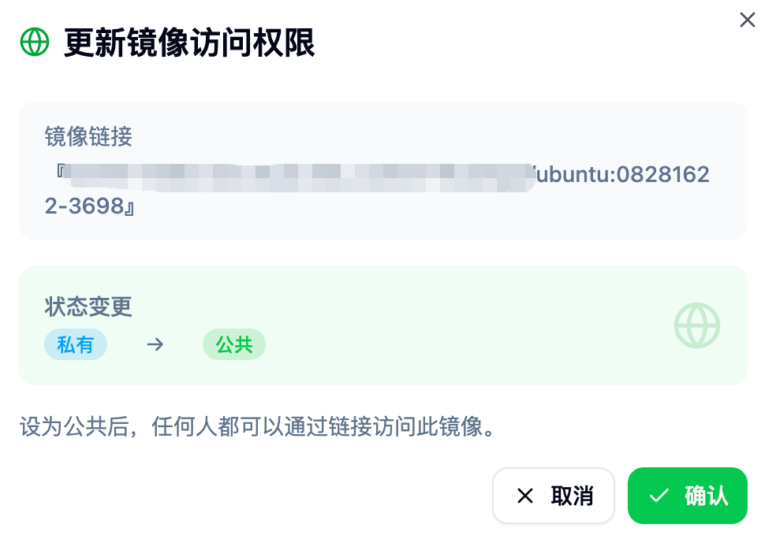
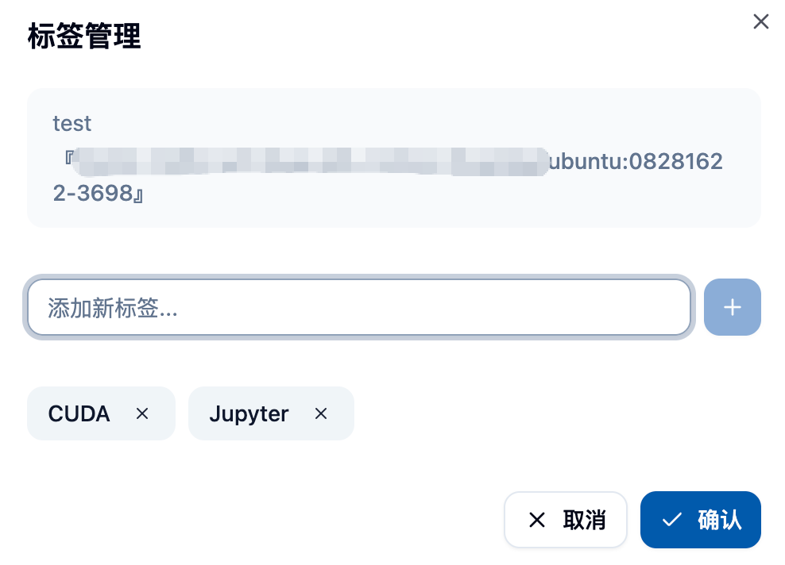
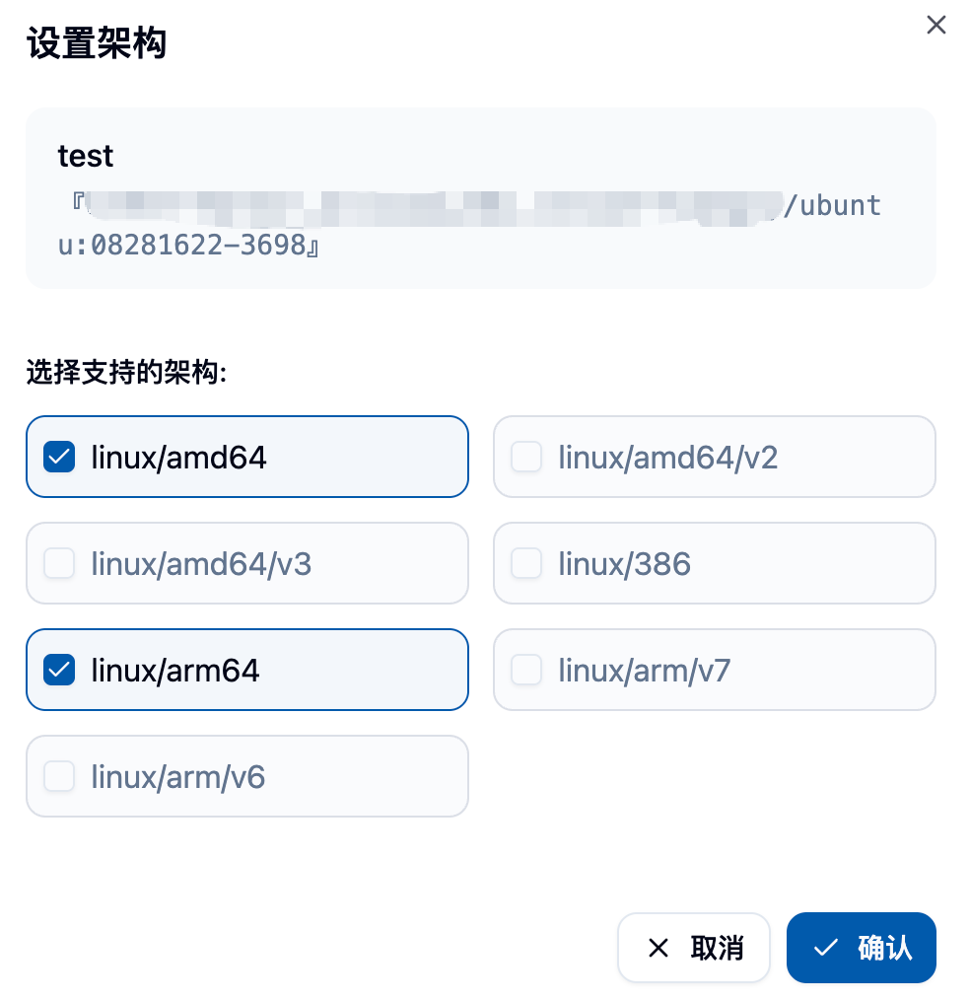
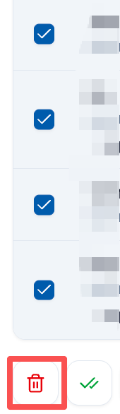
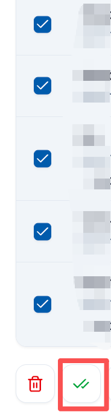
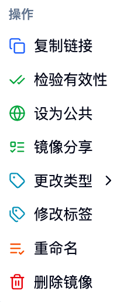
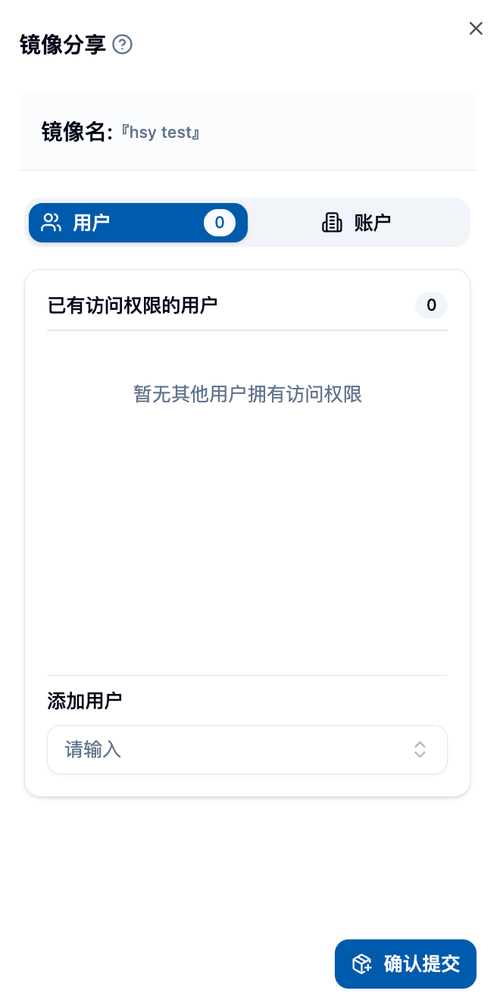

## Feature Overview 📋

The image list feature under administrator privileges provides platform administrators with comprehensive management and monitoring capabilities for all user images. Compared to regular users who can only manage their own images, the administrator version has the following features:

- **🌐 Full Platform View**: View and manage images of all users on the platform
- **🔐 Advanced Permission Control**: Can modify visibility, description, type, and other attributes of any image
- **📦 Batch Management**: Supports batch deletion and image validity checks
- **🤝 Image Sharing Management**: Monitor and manage image sharing between users
- **🏗️ Architecture and Tag Management**: Unified management of image architecture information and tags

## 🚪 Accessing the Administrator Image List Page

Administrators can access the administrator image list page through the "Image List" option under the "Image Management" menu in the "Management" category on the sidebar.

On the page, you can see:
- A list of all users' images on the platform 📋
- Detailed information about each image (name, architecture, creator, visibility, etc.) 📊
- Image creation time and status information 📅
- Rich filtering and search functions 🔍

## 📊 Image Information Display

### 📋 Basic Image Information
Each image entry displays the following key information:

**🏷️ Image Identifier**
- Image description and link
- Associated tag information
- Image type identifier

**🏗️ Architecture Support**
- Displays the CPU architecture supported by the image
- Common architectures include: amd64, arm64, etc.
- Displayed intuitively in the form of tags

**👤 User Information**
- User information of the image creator
- Including username and display name
- Facilitates tracing the origin of the image

**👁️ Visibility Status**
- Public (Public): Visible to all users
- Private (Private): Visible only to the creator
- Distinguished by different colored tags

**📅 Creation Time**
- Displays the image creation time
- Supports sorting by time
- Uses a friendly relative time format

## ⚙️ Administrator Exclusive Features

### 1. 🔍 Global Search and Filtering

#### 🔎 Search Function
- **🌐 Global Search**: Search for keywords in all images
- **⚡ Real-time Search**: Instantly display search results as you type
- **🔍 Multi-field Matching**: Can search image name, description, tags, etc.

#### 🎯 Advanced Filtering
**👁️ Filter by Visibility**
- Public images
- Private images
- Facilitates managing images with different permission levels

**👤 Filter by Creator**
- View all images created by a specific user
- Used for analyzing image usage by users

### 2. ⚙️ Image Attribute Management

Administrators can perform the following management operations on any image on the platform:

#### 👁️ Visibility Control
- **🌐 Set to Public**: Make a private image visible to all users
- **🔒 Set to Private**: Make a public image visible only to the creator
- Takes effect immediately without service restart

#### ✏️ Image Description Modification
- Modify image description information
- Used for standardizing image naming
- Helps users better understand the image's purpose

#### 🏷️ Tag Management
- Add, edit, or delete image tags
- Tags are used for categorizing and searching images

#### 🏗️ Architecture Settings
- Set the CPU architecture supported by the image
- Includes: amd64, arm64, 386, etc.
- Affects scheduling of images on different nodes

### 3. 📦 Batch Operation Functionality

#### 🗑️ Batch Delete Images
- Select multiple images for batch deletion
- Displays detailed deletion confirmation information
- Deletion will affect related jobs and tasks

The deletion confirmation interface will show:
- The list of images to be deleted 📋
- Detailed information for each image 📊
- Security warnings and operational risk alerts ⚠️

#### ✅ Batch Validity Check
- Select multiple images for availability check
- Verify whether the image can be pulled and used normally
- After the check, you can selectively delete invalid images

The check includes:
- Image link accessibility test 🔗
- Image format validity verification ✅
- Image repository connectivity check 🌐

### 4. ⚙️ Individual Image Operations

For each image, administrators can perform the following operations via the right-side operation menu:

#### 📋 Basic Operations
**📋 Copy Link**
- Quickly copy the complete link of the image
- Useful for using the image elsewhere

**✅ Check Validity**
- Check the availability of the image individually
- Displays detailed check results

#### ⚙️ Advanced Management
**🤝 Image Sharing Management**
- View the sharing status of the image
- Manage which users or accounts the image is shared with
- Can cancel or add sharing permissions

**✏️ Rename Image**
- Modify the image's description name
- Used for standardized management and organization

**🗑️ Delete Image**
- Delete a single image
- Detailed confirmation prompts are displayed before the operation

### 5. 👀 Image Detail View

Clicking the image name will display the detailed information page of the image:

**📋 Basic Information**
- Complete metadata of the image
- Creation time and modification history
- Associated build information

**🏗️ Build Information** (if the image is built by the platform)
- Build logs and history
- Build configuration and parameters
- Dockerfile or build script

## 🔐 Permissions and Security Management

### 👥 Cross-User Permissions
- Administrators can modify the properties of any user's image
- Can set a private image to public or vice versa
- Can manage image sharing on behalf of users

### 🔒 Security Controls
- All management operations are logged
- Important operations require secondary confirmation
- Supports permission audits and tracking

### 🛡️ Data Protection
- Deletion operations are irreversible; handle with care
- It is recommended to regularly back up important images
- Provides image export functionality

## 📊 Monitoring and Statistics

### 💾 Storage Management
- View storage usage of each image
- Identify large capacity images
- Develop cleaning strategies

### 💚 Health Status Monitoring
- Regularly check the validity of images
- Monitor the connection status of the image repository
- Promptly detect and resolve problematic images

## 💡 Best Practices

### 📝 Image Naming Standards
1. **📋 Unified Naming**: Establish platform-level image naming standards
2. **📝 Clear Description**: Ensure the image description accurately reflects its purpose
3. **🏷️ Tag Management**: Use a consistent tag classification system
4. **🔢 Version Control**: Establish clear identifiers for different versions of images

### 🔐 Permission Management Strategies
1. **🔒 Principle of Least Privilege**: Only grant necessary image access permissions
2. **🔍 Regular Review**: Regularly check image sharing and permission settings
3. **🔐 Sensitive Images**: Strengthen management of images containing sensitive information
4. **👥 User Education**: Guide users to set image visibility correctly

### 🛠️ Maintenance Recommendations
1. **🧹 Regular Cleanup**: Delete unused, outdated images
2. **✅ Validity Checks**: Regularly perform batch validity checks
3. **📊 Capacity Monitoring**: Pay attention to image storage usage
4. **💾 Backup Strategy**: Establish a backup mechanism for important images

## 🔧 Troubleshooting

### ❓ Common Issues
**🚫 Image Not Accessible**
- Check the connection status of the image repository
- Verify the format of the image link is correct
- Confirm the access permission configuration

**❌ Batch Operation Failed**
- Check network connection status
- Verify operation permissions
- Check system logs for detailed error information

**🤝 Sharing Function Abnormal**
- Confirm the target user account status
- Check the sharing permission configuration
- Verify the visibility settings of the image

## ⚠️ Notes

<Callout type="warning">
1. Changing the visibility of an image may affect jobs using that image
2. Batch deletion operations cannot be undone. Confirm before execution
3. Changes made by administrators to user images may affect user experience. Communication in advance is recommended
4. Regularly back up important platform images to prevent accidental deletion
5. Monitor the storage quota of the image repository to avoid running out of space
</Callout>