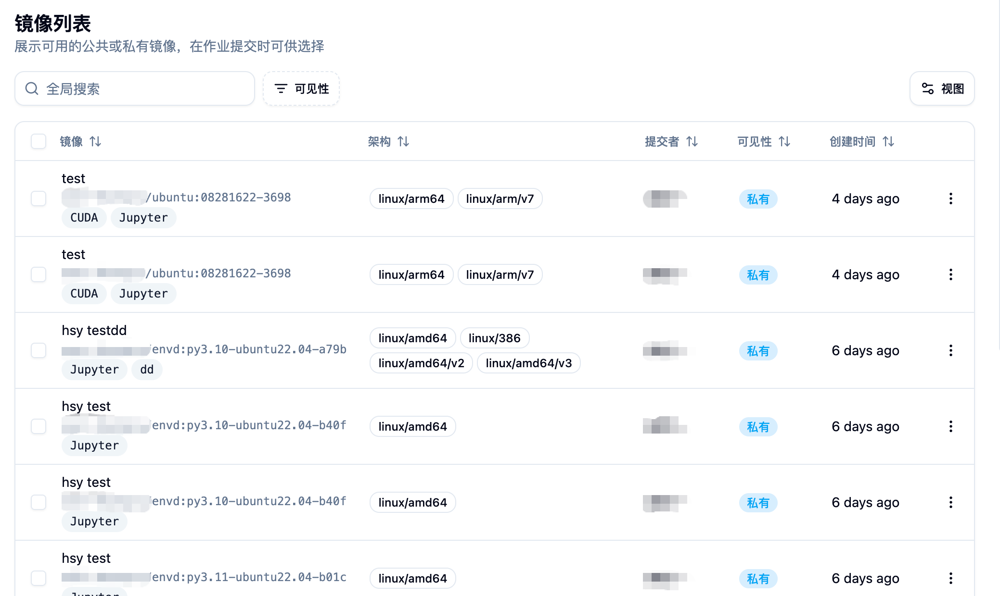

## 機能概要 📋

管理者権限によるミラー一覧機能は、プラットフォーム管理者がすべてのユーザーのミラーを包括的に管理および監視する能力を提供します。通常のユーザーは自分のミラーのみを管理できるのに対し、管理者バージョンには以下の特徴があります：

- **🌐 全プラットフォームビュー**：プラットフォーム上のすべてのユーザーのミラーを確認および管理
- **🔐 高度な権限制御**：任意のミラーの可視性、説明、タイプなどの属性を変更可能
- **📦 バッチ管理**：ミラーのバッチ削除、有効性の検出をサポート
- **🤝 ミラー共有管理**：ユーザー間でのミラー共有状況を監視および管理
- **🏗️ アーキテクチャおよびタグ管理**：ミラーのアーキテクチャ情報およびタグを統一的に管理

## 🚪 管理者ミラー一覧ページへのアクセス

管理者はサイドバーの「管理」カテゴリにある「ミラーマネージメント」メニューの「ミラー一覧」から、管理者ミラー一覧ページにアクセスできます。

ページ上では以下が表示されます：
- プラットフォーム上のすべてのユーザーのミラーリスト 📋
- 各ミラーの詳細情報（名前、アーキテクチャ、作成者、可視性など）📊
- ミラーの作成日時およびステータス情報 📅
- 検索とフィルタリング機能が豊富 🔍

## 📊 ミラーデータの表示

### 📋 ミラーの基本情報
各ミラーエントリでは以下の主要な情報が表示されます：

**🏷️ ミラーID**
- ミラーディスクリプションとリンク
- 関連するタグ情報
- ミラータイプID

**🏗️ アーキテクチャサポート**
- ミラーがサポートするCPUアーキテクチャを表示
- 一般的なアーキテクチャには：amd64、arm64など
- タグ形式で直感的に表示

**👤 ユーザー情報**
- ミラー作成者のユーザー情報
- ユーザー名と表示名を含む
- ミラーの出所を追跡するために役立ちます

**👁️ 可視性ステータス**
- 公開（Public）：すべてのユーザーが見える
- 個人用（Private）：作成者以外は見えない
- 異なる色のタグで区別

**📅 作成日時**
- ミラーの作成日時を表示
- 日時でソート可能
- 親しみやすい相対日時形式で表示

## ⚙️ 管理者専用機能

### 1. 🔍 全局検索とフィルタリング

#### 🔎 検索機能
- **🌐 全局検索**：すべてのミラーからキーワードを検索
- **⚡ 実時検索**：入力時に検索結果を即座に表示
- **🔍 複数フィールドマッチ**：ミラー名、説明、タグなどから検索可能

#### 🎯 高度なフィルタリング
**👁️ 可視性によるフィルタリング**
- 公開ミラー
- 個人用ミラー
- 異なる権限レベルのミラーを管理するために便利

**👤 作成者によるフィルタリング**
- 特定のユーザーが作成したすべてのミラーを確認可能
- ユーザーのミラー使用状況を分析するために役立ちます

### 2. ⚙️ ミラー属性管理

プラットフォーム上の任意のミラーに対して、管理者は以下の管理操作を行うことができます：

#### 👁️ 可視性制御
- **🌐 公開にする**：個人用ミラーよりすべてのユーザーに見えるように設定
- **🔒 個人用にする**：公開ミラーより作成者だけに見えるように設定
- 立即効果があり、サービスを再起動する必要はありません

#### ✏️ ミラーディスクリプションの変更
- ミラーの説明情報を変更
- ミラー命名の規範化に役立ちます
- ユーザーがミラーの用途をよりよく理解するのに役立ちます

#### 🏷️ タグ管理
- ミラータグの追加、編集、削除
- タグはミラーの分類と検索に使用されます

#### 🏗️ アーキテクチャ設定
- ミラーがサポートするCPUアーキテクチャを設定
- 例：amd64、arm64、386など
- ミラーが異なるノードでスケジュールされる影響を与える

### 3. 📦 バッチ操作機能

#### 🗑️ ミラーのバッチ削除
- 複数のミラーを選択してバッチ削除
- 削除確認情報が詳細に表示
- 削除後は関連するジョブやタスクに影響を与える

削除確認画面では表示されます：
- 削除されるミラーリスト 📋
- 各ミラーの詳細情報 📊
- セキュリティ警告と操作リスクの提示 ⚠️

#### ✅ バッチ有効性検出
- 複数のミラーを選択して利用可能性を検出
- ミラーが正常にプルおよび使用できるかを確認
- 検出後、無効なミラーを任意に削除可能

検出機能には以下が含まれます：
- ミラーリンクのアクセス性テスト 🔗
- ミラーフォーマットの有効性検証 ✅
- ミラーリポジトリの接続性チェック 🌐

### 4. ⚙️ 単一ミラーオペレーション

各ミラーに対して、管理者は右側の操作メニューから以下の操作を実行できます：

#### 📋 基本的な操作
**📋 リンクをコピー**
- ミラーの完全なリンクを素早くコピー
- 他の場所でミラーを使用するのに便利です

**✅ 有効性を確認**
- ミラーの可用性を個別に検出
- 詳細な検出結果を表示

#### ⚙️ 高度な管理
**🤝 ミラーシェアリング管理**
- ミラーの共有状況を確認
- ミラーをどのユーザーまたはアカウントと共有しているかを管理
- 共有権をキャンセルまたは追加可能です

**✏️ ミラーのリネーム**
- ミラーの説明名を変更
- 規範的な管理および整理に役立ちます

**🗑️ ミラーを削除**
- 単一のミラーを削除
- 操作前には詳細な確認メッセージが表示されます

### 5. 👀 ミラーの詳細表示

ミラーネームをクリックして、ミラーの詳細情報ページを確認できます：

**📋 基本情報**
- ミラーの完全なメタデータ
- 作成日時と変更履歴
- 関連するビルド情報

**🏗️ ビルド情報**（プラットフォームで作成されたミラーの場合）
- ビルドログと履歴
- ビルド構成とパラメーター
- Dockerfileまたはビルドスクリプト

## 🔐 権限とセキュリティ管理

### 👥 ユーザー間権限
- 管理者は任意のユーザーのミラー属性を変更可能
- 個人用ミラーより公開に、またはその逆に設定可能
- ユーザーのミラーシェアリングを代表して管理可能

### 🔒 セキュリティ制御
- すべての管理操作がログに記録される
- 重要な操作には二次確認が必要
- 権限監査とトレースをサポート

### 🛡️ データ保護
- 削除操作は不可逆です。慎重に処理してください
- 重要なミラーを定期的にバックアップすることを推奨します
- ミラーのエクスポート機能を提供

## 📊 モニタリングと統計

### 💾 ストレージ管理
- 各ミラーのストレージ使用量を確認
- 大容量のミラーを特定
- 清掃戦略を策定

### 💚 健康状態モニタリング
- ミラーの有効性を定期的にチェック
- ミラーリポジトリの接続状態を監視
- 問題のあるミラーを早期に発見し対処

## 💡 最適な実践

### 📝 ミラーネームの規範
1. **📋 一貫したネーミング**：プラットフォームレベルでミラーネームの規範を確立
2. **📝 明確な説明**：ミラーの説明が用途を正確に反映するように保証
3. **🏷️ タグ管理**：一貫したタグ分類システムを使用
4. **🔢 バージョン管理**：異なるバージョンのミラーに明確な識別子を設定

### 🔐 権限管理戦略
1. **🔒 最小権限原則**：必要なミラーへのアクセス権限のみ付与
2. **🔍 定期的なレビュー**：ミラーシェアリングおよび権限設定を定期的にチェック
3. **🔐 敏感なミラー**：機密情報が含まれるミラーを厳格に管理
4. **👥 ユーザー教育**：ユーザーがミラーの可視性を正しく設定するよう指導

### 🛠️ 維持管理の推奨
1. **🧹 定期的なクリーンアップ**：使用されていない過期ミラーを削除
2. **✅ 有効性チェック**：定期的にバッチ有効性チェックを実施
3. **📊 容量モニタリング**：ミラーストレージの使用状況を注視
4. **💾 バックアップ戦略**：重要なミラーにバックアップメカニズムを確立

## 🔧 問題の解決

### ❓ 一般的な質問
**🚫 ミラーにアクセスできません**
- ミラーリポジトリの接続状態を確認
- ミラーリンクの形式が正しいかを検証
- アクセス権限設定を確認

**❌ バッチ操作が失敗しました**
- ネットワーク接続状態を確認
- 操作権限を確認
- システムログを確認して詳細なエラーメッセージを取得

**🤝 シェア機能が異常**
- 対象ユーザーのアカウント状態を確認
- シェア権限設定を確認
- ミラーの可視性設定を検証

## ⚠️ 注意事項

<Callout type="warning">
1. ミラーの可視性を変更すると、そのミラーを使用しているジョブに影響を与える可能性があります
2. バッチ削除操作は取り消せません。操作を実行する前に確認してください
3. 管理者がユーザーのミラーを変更すると、ユーザー体験に影響を与える可能性があります。事前にコミュニケーションを取ることを推奨します
4. 重要なプラットフォームミラーを定期的にバックアップし、誤って削除されるのを防ぎましょう
5. ミラーリポジトリのストレージクォータを監視し、空き容量が不足しないようにしましょう
</Callout>