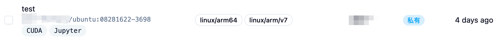
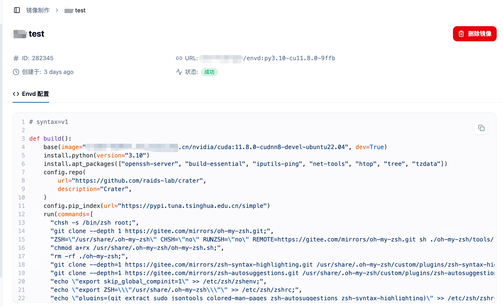
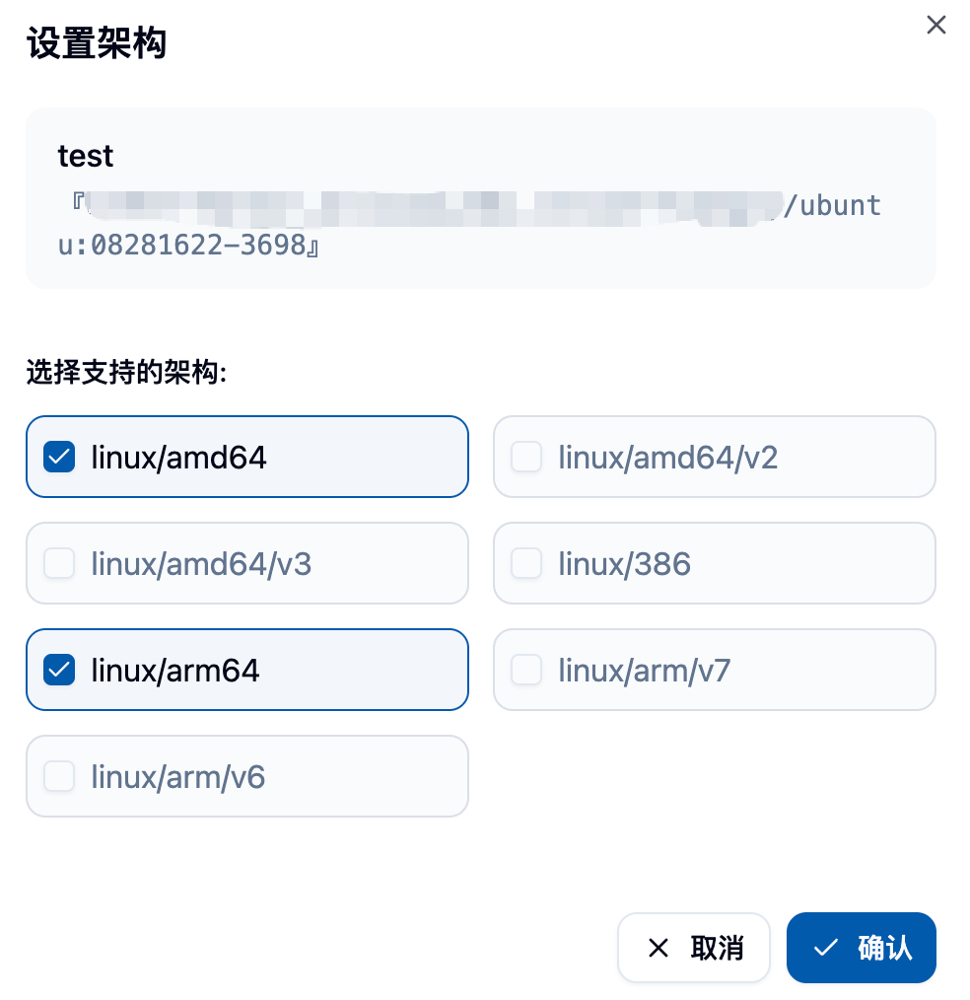
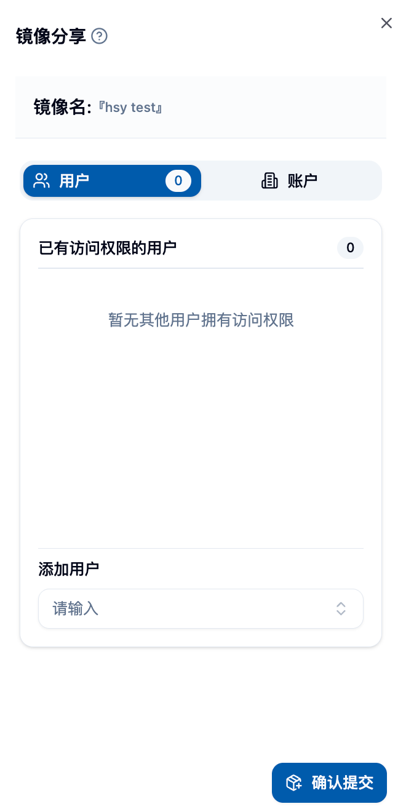

## 功能概述 📋

管理员权限下的镜像列表功能为平台管理员提供了对所有用户镜像的全面管理和监控能力。相比普通用户只能管理自己的镜像，管理员版本具有以下特点：

- **🌐 全平台视图**：查看和管理平台上所有用户的镜像
- **🔐 高级权限控制**：可以修改任何镜像的可见性、描述、类型等属性
- **📦 批量管理**：支持批量删除、检测镜像有效性
- **🤝 镜像分享管理**：监控和管理镜像在用户间的分享情况
- **🏗️ 架构和标签管理**：统一管理镜像的架构信息和标签

## 🚪 进入管理员镜像列表页面

管理员可以通过侧边栏"管理"分类中的"镜像管理"菜单下的"镜像列表"，来进入到管理员镜像列表页面。

在页面上，您可以看到：
- 平台上所有用户的镜像列表 📋
- 每个镜像的详细信息（名称、架构、创建者、可见性等）📊
- 镜像创建时间和状态信息 📅
- 丰富的筛选和搜索功能 🔍

## 📊 镜像信息展示

### 📋 镜像基本信息
每个镜像条目显示以下关键信息：

**🏷️ 镜像标识**
- 镜像描述和链接
- 关联的标签信息
- 镜像类型标识

**🏗️ 架构支持**
- 显示镜像支持的 CPU 架构
- 常见架构包括：amd64、arm64 等
- 以标签形式直观展示

**👤 用户信息**
- 镜像创建者的用户信息
- 包括用户名和显示名称
- 便于追踪镜像的来源

**👁️ 可见性状态**
- 公共（Public）：所有用户可见
- 私有（Private）：仅创建者可见
- 通过不同颜色的标签区分

**📅 创建时间**
- 显示镜像的创建时间
- 支持按时间排序
- 使用友好的相对时间格式

## ⚙️ 管理员专有功能

### 1. 🔍 全局搜索和筛选

#### 🔎 搜索功能
- **🌐 全局搜索**：在所有镜像中搜索关键词
- **⚡ 实时搜索**：输入即时显示搜索结果
- **🔍 多字段匹配**：可搜索镜像名称、描述、标签等

#### 🎯 高级筛选
**👁️ 按可见性筛选**
- 公共镜像
- 私有镜像
- 便于管理不同权限级别的镜像

**👤 按创建者筛选**
- 可以查看特定用户创建的所有镜像
- 用于用户镜像使用情况分析

### 2. ⚙️ 镜像属性管理

对于平台上的任何镜像，管理员都可以进行以下管理操作：

#### 👁️ 可见性控制
- **🌐 设为公共**：将私有镜像设置为所有用户可见
- **🔒 设为私有**：将公共镜像设置为仅创建者可见
- 即时生效，无需重启服务

#### ✏️ 镜像描述修改
- 修改镜像的描述信息
- 用于规范化镜像命名
- 帮助用户更好地理解镜像用途

#### 🏷️ 标签管理
- 添加、编辑、删除镜像标签
- 标签用于分类和搜索镜像

#### 🏗️ 架构设置
- 设置镜像支持的 CPU 架构
- 包括：amd64、arm64、386 等
- 影响镜像在不同节点上的调度

### 3. 📦 批量操作功能

#### 🗑️ 批量删除镜像
- 选择多个镜像进行批量删除
- 显示详细的删除确认信息
- 删除后会影响相关的作业和任务

删除确认界面会显示：
- 将要删除的镜像列表 📋
- 每个镜像的详细信息 📊
- 安全警告和操作风险提示 ⚠️

#### ✅ 批量有效性检测
- 选择多个镜像进行可用性检测
- 验证镜像是否可以正常拉取和使用
- 检测完成后可以选择性删除无效镜像

检测功能包括：
- 镜像链接可访问性测试 🔗
- 镜像格式有效性验证 ✅
- 镜像仓库连通性检查 🌐

### 4. ⚙️ 单个镜像操作

对于每个镜像，管理员可以通过右侧操作菜单执行以下操作：

#### 📋 基础操作
**📋 复制链接**
- 快速复制镜像的完整链接
- 便于在其他地方使用镜像

**✅ 检验有效性**
- 单独检测镜像的可用性
- 显示详细的检测结果

#### ⚙️ 高级管理
**🤝 镜像分享管理**
- 查看镜像的分享情况
- 管理镜像分享给哪些用户或账户
- 可以取消或添加分享权限

**✏️ 重命名镜像**
- 修改镜像的描述名称
- 用于规范化管理和组织

**🗑️ 删除镜像**
- 删除单个镜像
- 操作前会有详细的确认提示

### 5. 👀 镜像详情查看

点击镜像名称可以查看镜像的详细信息页面：

**📋 基本信息**
- 镜像的完整元数据
- 创建时间和修改历史
- 关联的构建信息

**🏗️ 构建信息**（如果是平台制作的镜像）
- 构建日志和历史
- 构建配置和参数
- Dockerfile 或构建脚本

## 🔐 权限和安全管理

### 👥 跨用户权限
- 管理员可以修改任何用户的镜像属性
- 可以将私有镜像设为公共，或反之
- 可以代表用户管理镜像分享

### 🔒 安全控制
- 所有管理操作都会记录日志
- 重要操作需要二次确认
- 支持权限审计和追踪

### 🛡️ 数据保护
- 删除操作不可逆，需谨慎处理
- 建议定期备份重要镜像
- 提供镜像导出功能

## 📊 监控和统计

### 💾 存储管理
- 查看每个镜像的存储占用
- 识别大容量镜像
- 制定清理策略

### 💚 健康状态监控
- 定期检查镜像有效性
- 监控镜像仓库连接状态
- 及时发现和处理问题镜像

## 💡 最佳实践

### 📝 镜像命名规范
1. **📋 统一命名**：建立平台级的镜像命名规范
2. **📝 描述清晰**：确保镜像描述准确反映其用途
3. **🏷️ 标签管理**：使用一致的标签分类系统
4. **🔢 版本控制**：为不同版本的镜像建立清晰的标识

### 🔐 权限管理策略
1. **🔒 最小权限原则**：只给予必要的镜像访问权限
2. **🔍 定期审查**：定期检查镜像的分享和权限设置
3. **🔐 敏感镜像**：对包含敏感信息的镜像加强管理
4. **👥 用户教育**：指导用户正确设置镜像可见性

### 🛠️ 维护建议
1. **🧹 定期清理**：删除不再使用的过期镜像
2. **✅ 有效性检查**：定期进行批量有效性检测
3. **📊 容量监控**：关注镜像存储的使用情况
4. **💾 备份策略**：为重要镜像建立备份机制

## 🔧 故障排除

### ❓ 常见问题
**🚫 镜像无法访问**
- 检查镜像仓库连接状态
- 验证镜像链接格式是否正确
- 确认访问权限配置

**❌ 批量操作失败**
- 检查网络连接状态
- 验证操作权限
- 查看系统日志获取详细错误信息

**🤝 分享功能异常**
- 确认目标用户账户状态
- 检查分享权限配置
- 验证镜像的可见性设置

## ⚠️ 注意事项

<Callout type="warn">
1. 修改镜像可见性可能会影响正在使用该镜像的作业
2. 批量删除操作无法撤销，请确认后再执行
3. 管理员对用户镜像的修改会影响用户体验，建议提前沟通
4. 定期备份重要的平台镜像，防止误删除
5. 监控镜像仓库的存储配额，避免空间不足
</Callout>
