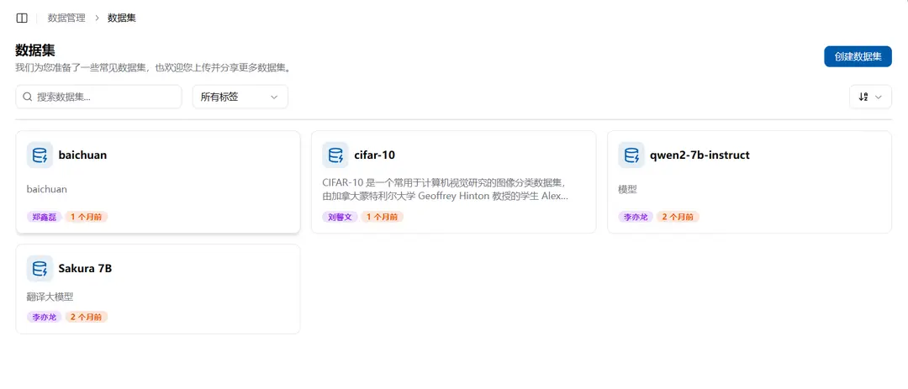
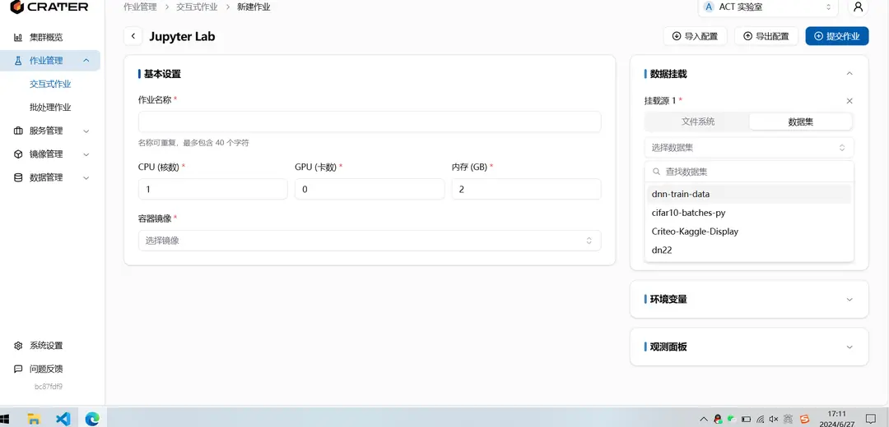

# 데이터셋

## 데이터셋이란 무엇인가

데이터셋은 데이터셋을 특정 파일 위치로 연결하는 링크로, 이는 마운트 및 공유를 더 쉽게 할 수 있습니다. 현재는 오픈소스 커뮤니티에서 직접 다운로드하는 기능은 지원되지 않으며, 주로 공유를 위해 특정한 설명을 제공합니다. 오픈소스 커뮤니티에서 다운로드가 필요할 경우, 작업 템플릿에서 모델 및 데이터셋을 모다 타운 커뮤니티에서 다운로드하는 방법을 참고하거나, 로컬에 다운로드 후 플랫폼에 업로드할 수 있습니다. 대용량 파일 업로드는 파일 시스템 섹션에서 참고하시기 바랍니다.

## 데이터셋/모델과 공유 파일의 차이점

데이터셋/모델은 주로 읽기 전용 파일을 제공합니다. 이후 데이터셋/모델을 읽기 전용 공유 폴더로 이동하고, 데이터셋/모델에 대한 가속 기술을 적용하여 훈련 효율성을 높일 예정입니다. 공유 파일은 개인 파일을 타인과 공유하고, 타인이 읽고 쓸 수 있도록 허용합니다. 공용 공간의 파일에 대해 읽기 및 쓰기 권한이 필요할 경우 관리자에게 문의하시기 바랍니다.

## 데이터셋을 어디서 볼 수 있나요

`데이터 관리 - 데이터셋`에서 데이터셋을 볼 수 있습니다. 여기에 표시되는 데이터셋은 사용자가 직접 생성한 데이터셋, 개인에게 공유된 데이터셋, 계정에 공유된 데이터셋을 포함합니다.

각 데이터셋에는 기본적인 설명이 포함되어 있으며, 오른쪽에는 삭제, 개인 공유, 계정 공유, 이름 변경이라는 네 가지 버튼이 있습니다. 이러한 작업은 데이터셋 생성자만이 수행할 수 있습니다.

## 데이터셋을 어떻게 생성하나요

데이터셋 페이지의 좌상단에 데이터셋 생성 버튼이 있으며, 클릭 후 이름, 설명을 입력하고 파일 폴더 위치를 선택하여 생성할 수 있습니다.

생성된 데이터셋 이름은 중복될 수 없으며, 폴더를 선택할 때는 공용, 개인, 현재 계정의 공간 파일 중에서 볼 수 있는 파일들을 자동으로 표시하여 선택할 수 있습니다.

## 데이터셋을 어떻게 사용하나요

새로운 작업 페이지의 오른쪽에는 데이터 마운트 창이 있으며, 데이터 마운트를 추가한 후 데이터셋을 선택하여 컨테이너에 마운트할 수 있습니다.

