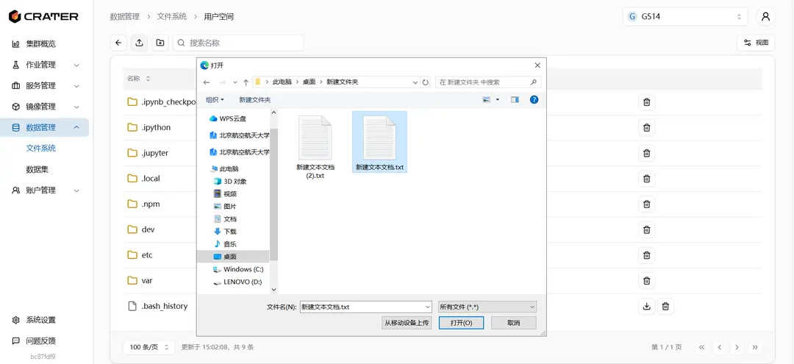

## Where to View Files

Under `Data Management - File System`, you can find three spaces: Public Space, Account Space, and User Space.
  
The Account Space will only appear and be visible when you have joined and selected an account.

## How to Use the File System

Taking the User Space as an example, after entering, you can see your own files in the user space.

There is a delete button on the right side of the file/folder, which can be used to delete the current file/folder. File download is only available for individual files. If you want to download a folder, you need to package the folder first before downloading.

The three buttons in the top-left corner are: go back to the previous level, upload file, and create folder.
You can only upload one file at a time. If you want to upload multiple files, please compress them before uploading.

The file size limit for uploading is 1GB. If you need to upload larger files, please use Jupyter or contact the administrator.

To perform upload, delete, and other operations in the Public Space and Account Space, you need certain permissions. Please contact the administrator to obtain the permissions.

### How to Mount Files

On the page to create a new job, there is a data mounting box on the right. After adding data mounting, you can select a folder. When selecting a folder, it will automatically pop up the files in the public, personal, and current account spaces that you can see, and then select and mount it into the container.


## Managing Files in Jupyter

If you run a Jupyter task, the system will automatically mount the files in your user space to the `/home/user` directory in Jupyter. You can modify the files in this directory in Jupyter.


Jupyter also has built-in functions for file creation and uploading. It is more convenient to process files directly here.

### Using scp to Copy Files

First, open the terminal in Jupyter. To use scp, you need to connect to a remote server. Below is the setup for SSH connection.

Generate an SSH key in the terminal:

```bash
ssh-keygen -t ed25519
```

Copy the public key in `~/.ssh/id_ed25519.pub`, and create the file `~/.ssh/authorized_keys` on the server where you need to transfer the files, then copy the public key content into it.

After connecting to the remote server, you can use scp to transfer files.
Enter the following command line to download the scp package.

```bash
sudo apt-get update
sudo apt-get install openssh-client
```

The basic usage of scp is as follows:

```bash
scp [options] [source file] [target address]
```

For example, to upload the local file `file.txt` to the `/tmp` directory on a remote server, you can use the following command:

```bash
scp file.txt user@remote-host:/tmp
```

This command will transfer the `file.txt` file to the `/tmp` directory on the remote server. You need to replace `user` with the username of the remote server, and `remote-host` with the address or IP of the remote server.
Similarly, you can also download files from the remote server to your local machine.