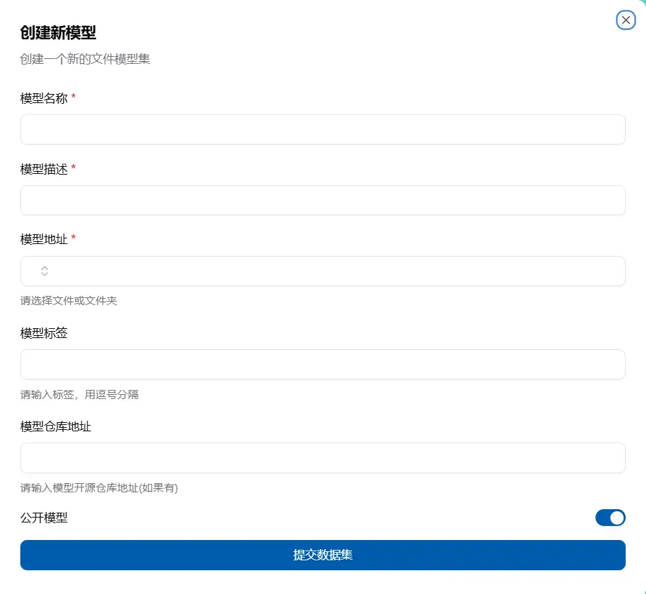

## モデルとは

モデルはデータセットと同様に、モデルを特定のファイル位置にリンクするためのものです。これにより、マウントや共有がより簡単にできます。データセットと同様に、現在はオープンソースコミュニティから直接ダウンロードする機能は提供されておらず、主に共有を容易にするための特定の記述を提供しています。オープンソースコミュニティからダウンロードする必要がある場合は、作業テンプレート内の魔搭コミュニティからのモデルとデータセットのダウンロードを参照してください。または、ローカルにダウンロードした後、プラットフォームにアップロードすることもできます。大規模なファイルのアップロードについてはファイルシステムのセクションを参照してください。

## モデルをどこで確認するか

`データ管理-モデル`の下でモデルを確認できます。ここに表示されるモデルは、ユーザー自身が作成したモデル、個人に共有されたモデル、およびアカウントに共有されたモデルを含みます。

各モデルにはいくつかの基本的な説明が表示され、右側には「リネーム」「個人共有」「アカウント共有」「削除」の4つのボタンがあります。これらの操作はモデル作成者のみが使用できます。

## モデルはどのように作成するか

モデルページの左上隅に「データセットを作成」ボタンがあります。クリックすると、モデル名、説明、フォルダ位置、モデルのタグ、モデルのオープンソースアドレスを選択し、公開するかどうかを選んで作成します。

作成したモデル名は同じであってはいけません。フォルダを選択する際には、見える公共、個人、現在のアカウントのスペースファイルが自動的に表示され、そこから選択できます。

## モデルはどのように使用するか

新しい作業のページで、右側にはデータマウントボックスがあります。データマウントを追加した後、モデルを選択し、それをコンテナ内にマウントできます。

