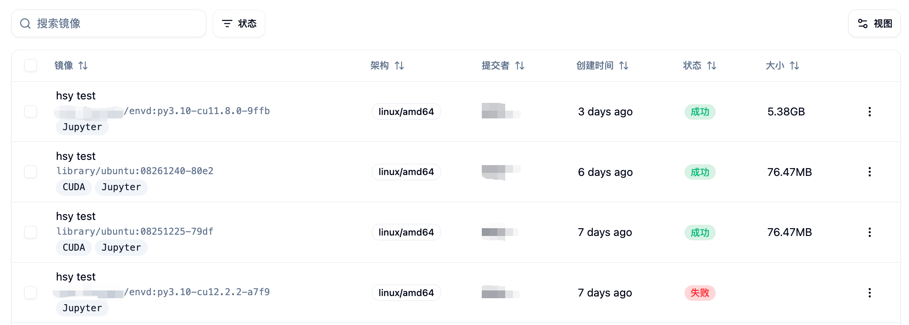
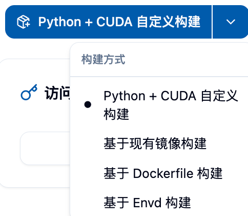
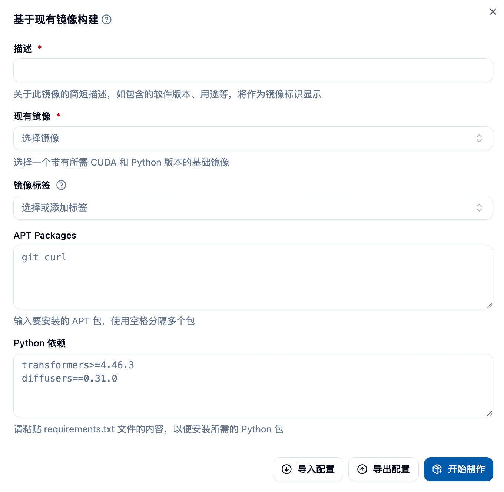
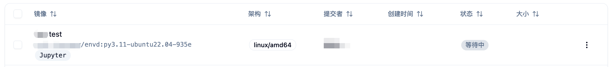
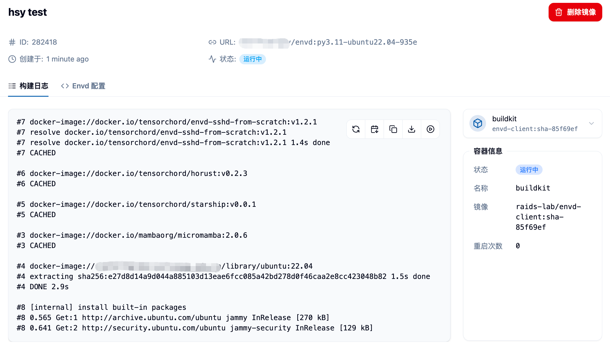
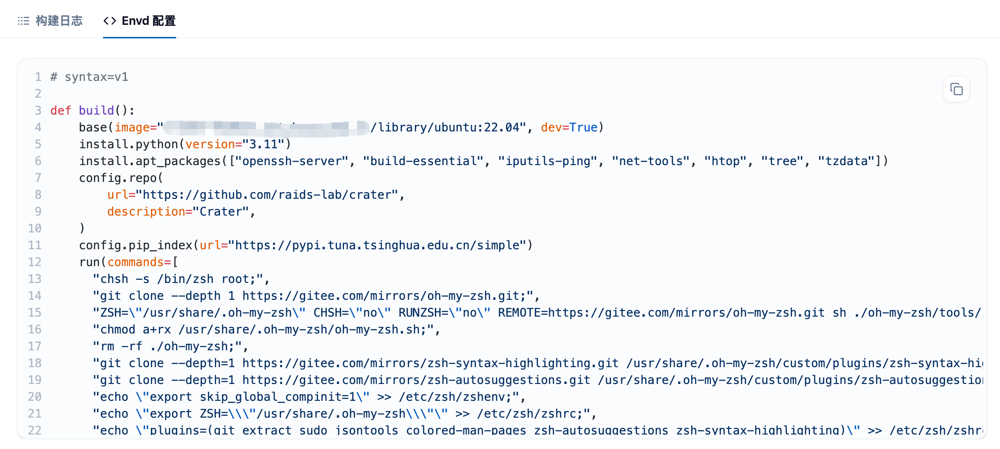

## Accessing the Image Building Page

You can access the image building page by clicking on the "Image Management" menu under the "Data and Images" category in the sidebar.


## Page Overview

After entering the page, you will see:

### Top Information Area
- **Total Images**: The number of images successfully created using the image building feature
- **Storage Usage**: The storage usage in your Harbor image repository

## View Images 👀

After clicking "Start Building," you will be able to see the images you have submitted for building in the list below the page. The initial status should be "Pending."
- **Harbor Project Name**: Your dedicated Harbor project, where all built images are stored
- **Get Initial Credentials Button**: Used to retrieve access credentials for the Harbor repository


### Harbor Repository Access Credentials

Clicking the "Get Initial Credentials" button retrieves the username and password for the Harbor image repository, allowing you to:
- Log in directly to the Harbor repository to view images
- Manually upload locally built images
- Use Docker command line tools to manage images


<Callout type="warning">
**Important Note**: The password will be shown only once, please save it securely. Clicking this button again will reset your password.
</Callout>

### Image Building Task List

The page displays all your image building tasks below, including:
- Image description and link
- Supported architecture information
- Creation time
- Build status (Pending, Building, Success, Failed)
- Image size



## Choosing the Image Building Method 🎯

The platform provides **four** methods for building images, which are:

1. **Python+CUDA Custom Build** 🐍 - Suitable for deep learning and scientific computing scenarios
2. **Build from Existing Image** 📦 - Quickly customize on top of base images provided by the platform
3. **Build from Dockerfile** 🐳 - Provides the highest flexibility and control
4. **Build from Envd** ⚡ - Declarative build using Python-like syntax

You can choose the desired build method by clicking the dropdown button in the top right corner of the page, and then click the button to open the corresponding build form.



---

## Accessing the Image Building Page

You can access the image building page by clicking on the "Image Management" menu under the "Data and Images" category in the sidebar.


After entering the page, you can see the total number of images you have created using the image building feature, your Harbor image repository storage usage and quota, as well as your Harbor project name. You can find the images you created in the corresponding project in Harbor.

In the example shown in the image, since the user has uploaded a locally built image directly, and not through the "Image Building" feature, the total image count here is zero, but the storage usage is not zero. For instructions on this part, please refer to "Uploading a Local Image."

The "Get Initial Credentials" button on the far right of the top section is used to retrieve the username and password for Harbor, allowing you to directly log in to the Harbor repository for manual uploads or to view images in the Harbor repository. However, please note that clicking this button again will reset your password.

## Choosing the Image Building Method

Currently, we provide **four** methods for building images, which are:

1. Python+CUDA Custom Build
2. Build from Existing Image
3. Build from Dockerfile
4. Build from Envd

You can select the desired build method by using the dropdown button as shown in the image, and then click the button to open the build form.


### 1. Python+CUDA Custom Build 🚀

This is the most popular build method, designed specifically for deep learning and scientific computing users. You can easily select the required Python and CUDA version combinations without writing complex configurations.


#### Detailed Form Filling

**Basic Configuration**
- **Python Version**: Choose the Python version you need (e.g., 3.8, 3.9, 3.10, 3.11, etc.)
- **CUDA Version**: Choose the corresponding CUDA version (e.g., 11.8, 12.1, 12.4, etc.)
- **Image Description**: Provide a clear description of your image for easy identification later

**Optional Software Package Configuration**
- **APT Packages**: System-level packages, multiple packages separated by spaces
  - Example: `curl tree htop vim git`
  - Common tools: `wget unzip zip git-lfs`
- **Python Dependencies**: Follow the requirements.txt format
  - Support for version specification: `numpy==1.21.0`
  - Support for version range: `pandas>=1.3.0,<2.0.0`
  - Support for comment lines: `# Packages related to data processing`

**Build Settings**
- **Enable Jupyter Support**: Enables the image to be used for Jupyter interactive tasks
- **Image Name**: Customize the image name (optional, system will generate automatically)
- **Image Tag**: Customize the image tag (optional, system will generate automatically)


#### Tips 💡

**Version Selection Recommendations**
- Python 3.9 + CUDA 11.8: Best compatibility, suitable for most deep learning frameworks ✅
- Python 3.10 + CUDA 12.1: Performance optimization, suitable for the latest PyTorch and TensorFlow ⚡
- Python 3.11 + CUDA 12.4: Latest features, suitable for cutting-edge research 🔬

**Common Software Package Combinations**
```bash
# Data science basic packages
curl wget git git-lfs vim htop

# Development tool packages
build-essential cmake pkg-config
```

**Python Dependency Examples**
```txt
# Deep learning frameworks
torch>=2.0.0
torchvision>=0.15.0
tensorflow>=2.13.0

# Data processing
numpy>=1.21.0
pandas>=1.5.0
scikit-learn>=1.3.0

# Visualization
matplotlib>=3.5.0
seaborn>=0.11.0
```

### 2. Build from Existing Image 📦

Considering the need for users to build new images on top of existing ones, we provide the `Build from Existing Image` method.

This method requires you to fill out a form, where you must select a base image and provide a short description of the image, which will be displayed as the image's identifier. APT packages and Python dependencies can be left blank, but if you need to install packages, you can enter the package names, separated by spaces. For example, if you need to install curl and tree, you can enter `curl tree`.



If your project includes a requirements.txt file, you can copy its contents into the Python dependencies section for installation. However, note that pip may encounter unsolvable dependency issues during parsing, to avoid image building failures, you can first try installing the dependencies manually in the container, and then fill in the dependencies based on the installation results. The image above shows an example of form filling. After completing the form, you can click the "Start Building" button in the bottom right corner of the form to start the image building process.

### 3. Build from Dockerfile 🐳

To provide maximum flexibility for users with high customization needs, you can write a complete Dockerfile to precisely control the image building process.


#### Detailed Form Components

**Dockerfile Editor**
- Supports syntax highlighting and auto-completion
- Real-time syntax checking
- Supports importing Dockerfile content from a file

**Image Configuration**
- **Image Description**: Required, describe the purpose and features of the image
- **Image Settings**: Customize the name, tag, and architecture

#### Dockerfile Writing Guide

**Basic Structure**
```dockerfile
# Choose base image
FROM gpu-harbor.act.buaa.edu.cn/user-base/nvidia-pytorch:24.12-v1.2.1

# Switch to root user for system configuration
USER root

# Install system packages
RUN apt-get update && apt-get install -y \
  curl \
  wget \
  vim \
  && rm -rf /var/lib/apt/lists/*

# Install Python packages
RUN pip install --no-cache-dir \
  numpy \
  pandas \
  scikit-learn

# Set working directory
WORKDIR /workspace

# Switch back to a regular user
USER $NB_USER
```

**Optimization for Domestic Networks**
```dockerfile
# Change APT source
RUN sed -i 's/archive.ubuntu.com/mirrors.aliyun.com/g' /etc/apt/sources.list

# Change pip source
RUN pip config set global.index-url https://pypi.tuna.tsinghua.edu.cn/simple
```

**Common Usage Examples**
```dockerfile
# Copy files to the image
COPY requirements.txt /tmp/
RUN pip install -r /tmp/requirements.txt

# Set environment variables
ENV PYTHONPATH=/workspace
ENV CUDA_VISIBLE_DEVICES=0

# Create directories and set permissions
RUN mkdir -p /workspace/data && \
  chown $NB_USER:$NB_GID /workspace/data
```

### 4. Build from Envd ⚡

Envd is an image building tool that uses Python-like syntax, has a low learning curve, and builds images quickly, making it especially suitable for deep learning users.


Please paste the screenshot of the Envd build form here.

#### Envd Script Writing

**Basic Configuration Function**
```python
def build():
  # Set base image
  base(os="ubuntu20.04", language="python3.9")
    
  # Install system packages
  install.apt_packages(["curl", "wget", "vim"])
    
  # Install Python packages
  install.python_packages([
    "torch>=2.0.0",
    "torchvision",
    "numpy",
    "pandas"
  ])
    
  # Set CUDA
  install.cuda(version="11.8")
    
  # Configure Jupyter
  config.jupyter(password="")
```

**Advanced Features**
```python
def build():
  # Use a custom base image
  base(image="nvidia/cuda:11.8-devel-ubuntu20.04")
    
  # Install dependencies from a file
  install.python_packages(requirements="requirements.txt")
    
  # Set environment variables
  runtime.environ({"PYTHONPATH": "/workspace"})
    
  # Run custom commands
  run.commands([
    "echo 'Setup complete' > /tmp/setup.log"
  ])
    
  # Mount local directories
  runtime.mount("/local/data", "/workspace/data")
```

**Reference Links**
- [Envd Quick Start](https://envd.tensorchord.ai/guide/getting-started.html)
- [Envd API Reference](https://envd.tensorchord.ai/api/starlark/v1/config.html)

## Viewing Images

After clicking "Start Building," you will be able to see the images you have submitted for building in the list below the page. The initial status should be "Pending."



You can click on the image description to view detailed information. At this point, you will be able to see the detailed logs of the image building process in the "Build Log" tab, which will help you troubleshoot any potential issues.



Additionally, you can switch to the "Dockerfile" or "Envd Configuration" tab to view the Dockerfile or Envd script that the system generated for you or that you filled in.



Finally, if your image is successfully built, you will see the status change to "Success" on this page, and you will be able to see the size of the completed image. Please note that due to Docker's layered storage mechanism, the actual storage usage may be much less than the total size of all images. Also, you can see the newly created "Custom" type image in the "Image List," which you can use to start "Batch Jobs" or "Interactive Jobs."


For more information about browsing, sharing, tagging, and importing, please refer to the "[Image List](./imagelist)" document.

## Importing and Exporting Configurations 📥📤

When filling out the build form, you can also export your form as a JSON file for easy reuse or further modification next time you need it.