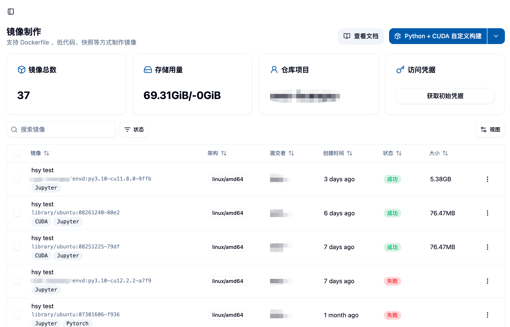
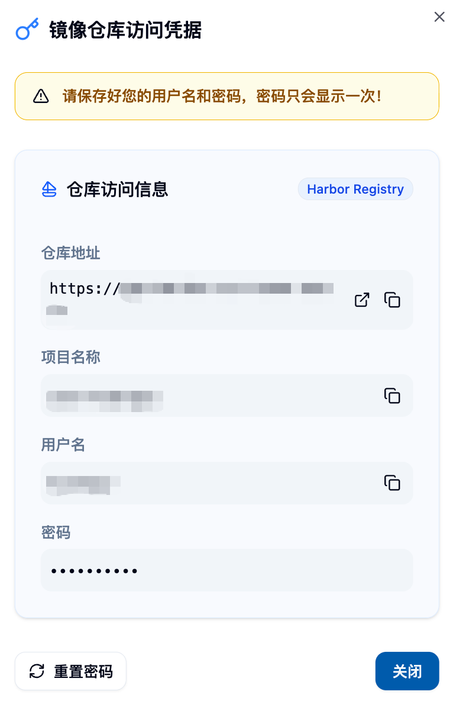
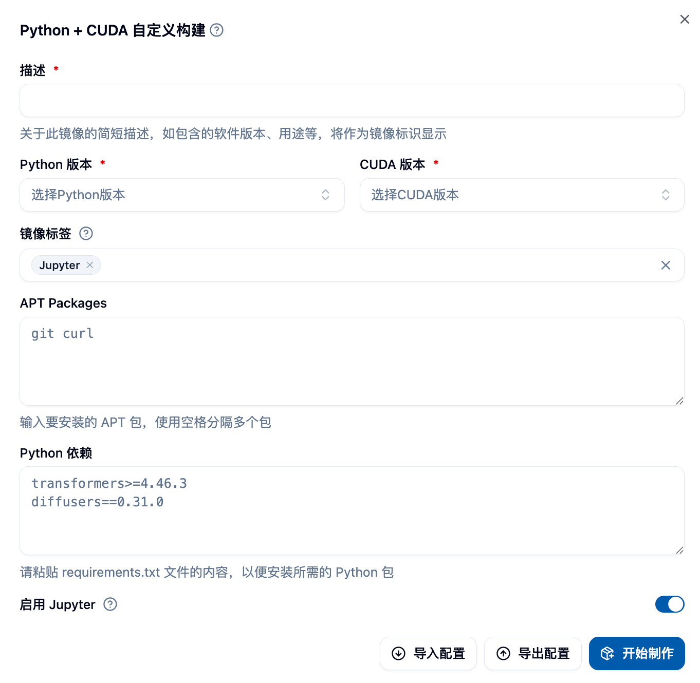

## ミラービルディングページへのアクセス

サイドバーの「データとミラー」カテゴリの「ミラーマネージメント」メニュー内の「ミラービルディング」をクリックして、ミラービルディングページにアクセスできます。



## ページ概要

ページにアクセスすると、以下が表示されます：

### 上部情報エリア
- **ミラーの総数**：ミラービルディング機能で成功裏に作成したミラーの数
- **ストレージ使用状況**：Harbor ミラーリポジトリでのストレージ使用量## ミラーの確認 👀

「開始する」をクリックすると、ページ下部のリストに作成したミラーが表示され、初期状態は「待機中」になります。
- **Harbor プロジェクト名**：あなたの専用 Harbor プロジェクト。すべての作成されたミラーはこのプロジェクトに保存されます
- **初期資格情報を取得するボタン**：Harbor リポジトリのアクセス資格情報を取得するために使用します


### Harbor リポジトリへのアクセス資格情報

「初期資格情報を取得する」ボタンをクリックすると、Harbor ミラーリポジトリのユーザー名とパスワードを取得できます。これにより、以下のことができます：
- Harbor リポジトリに直接ログインしてミラーを確認する
- ローカルで作成したミラーを手動でアップロードする
- Docker コマンドラインツールでミラーを操作する



<Callout type="warning">
**重要なお知らせ**：パスワードは一度だけ表示されます。安全に保管してください。このボタンを再度クリックするとパスワードがリセットされます。
</Callout>

### ミラービルディングタスク一覧
ページの下部には、あなたのすべてのミラービルディングタスクが表示されます。以下を含みます：
- ミラーの説明とリンク
- 対応するアーキテクチャ情報
- 作成日時
- ビルド状態（待機中、ビルド中、成功、失敗）
- ミラーのサイズ


## ミラービルディング方法の選択 🎯

プラットフォームは**4つの**ミラービルディング方法を提供しています：

1. **Python+CUDA カスタムビルド** 🐍 - 深層学習や科学計算のシナリオに適しています
2. **既存ミラーからビルド** 📦 - プラットフォームが提供する基本ミラー上で迅速にカスタマイズできます
3. **Dockerfile からビルド** 🐳 - 最大の柔軟性と制御能力を提供します
4. **Envd からビルド** ⚡ - Python シンタックスに似た宣言的ビルドを使用します

ページ右上にあるビルド方法のドロップダウンボタンから、望むビルド方法を選択し、ボタンをクリックして対応するビルドフォームを開くことができます。


---

## ミラービルディングページへのアクセス

サイドバーの「データとミラー」カテゴリの「ミラーマネージメント」メニュー内の「ミラービルディング」をクリックして、ミラービルディングページにアクセスできます。


ページにアクセスすると、上部に表示されるミラービルディング機能で作成したミラーの総数、Harbor ミラーリポジトリのストレージ使用量と上限、また、Harbor プロジェクト名が表示されます。Harbor の該当プロジェクトで作成したミラーを確認できます。

画像で示された例では、このユーザーが「ミラービルディング」機能ではなく、ローカルで作成したミラーを直接アップロードしたため、ミラー総数はゼロですが、ストレージ使用量はゼロではありません。この部分のチュートリアルについては「ローカルミラーのアップロード」を参照してください。

上部右端の「初期資格情報を取得する」ボタンは、Harbor のユーザー名とパスワードを取得するために使用され、Harbor リポジトリに直接ログインして、手動でミラーをアップロードしたり、Harbor リポジトリ内のミラーを確認したりするために役立ちます。ただし、再度このボタンをクリックすると、パスワードがリセットされる点に注意してください。

## ミラービルディング方法の選択

現在、**4つの**ミラービルディング方法を提供しています：

1. Python+CUDA カスタムビルド
2. 既存ミラーからビルド
3. Dockerfile からビルド
4. Envd からビルド

図のようにドロップダウンボタンから希望するビルド方法を選択し、ボタンをクリックしてビルドフォームを開くことができます。


### 1. Python+CUDA カスタムビルド 🚀

最も人気のあるビルド方法で、深層学習や科学計算ユーザーのために設計されています。必要な Python と CUDA のバージョンの組み合わせを選択するだけで、複雑な構成を書く必要がありません。



#### フォームの詳細入力

**基本設定**
- **Python バージョン**：必要な Python バージョンを選択（例：3.8, 3.9, 3.10, 3.11 など）
- **CUDA バージョン**：対応する CUDA バージョンを選択（例：11.8, 12.1, 12.4 など）
- **ミラーの説明**：ミラーにわかりやすい説明を提供し、後で識別しやすくする

**オプションソフトウェアパッケージ設定**
- **APT パッケージ**：システムレベルのパッケージ。複数のパッケージはスペースで区切ります
  - 例：`curl tree htop vim git`
  - 一般的なツール：`wget unzip zip git-lfs`
- **Python 依存パッケージ**：`requirements.txt` 形式で指定します
  - バージョン指定が可能です：`numpy==1.21.0`
  - バージョン範囲指定が可能です：`pandas>=1.3.0,<2.0.0`
  - コメント行が可能です：`# データ処理関連のパッケージ`

**ビルド設定**
- **Jupyter サポートを有効にする**：有効にすると、ミラーは Jupyter インタラクティブジョブに使用できます
- **ミラー名**：ミラーの名前をカスタマイズ（任意、システムが自動的に生成します）
- **ミラータグ**：ミラーのタグをカスタマイズ（任意、システムが自動的に生成します


#### 使用のコツ 💡

**バージョン選択の提案**
- Python 3.9 + CUDA 11.8：互換性が最適で、大多数の深層学習フレームワークに適しています ✅
- Python 3.10 + CUDA 12.1：性能が最適化されており、最新の PyTorch と TensorFlow に適しています ⚡
- Python 3.11 + CUDA 12.4：最新機能で、最前線の研究に適しています 🔬

**一般的なソフトウェアパッケージの組み合わせ**
```bash
# データサイエンス基礎パッケージ
curl wget git git-lfs vim htop

# 開発ツールパッケージ  
build-essential cmake pkg-config
```

**Python 依存関係の例**
```txt
# 深層学習フレームワーク
torch>=2.0.0
torchvision>=0.15.0
tensorflow>=2.13.0

# データ処理
numpy>=1.21.0
pandas>=1.5.0
scikit-learn>=1.3.0

# 可視化
matplotlib>=3.5.0
seaborn>=0.11.0
```

### 2. 既存ミラーからビルド 📦

ユーザーが既存のミラーの上に新しいミラーを作成する必要がある場合を考慮して、「既存ミラーからビルド」のビルド方法を提供しています。

このビルド方法では、フォームを埋める必要があります。このフォームでは、基本ミラーを選択し、ミラーの簡単な説明を入力する必要があります。これは、ミラーの識別に使用されます。APT パッケージと Python 依存は空欄にすることが可能です。パッケージをインストールしたい場合は、パッケージ名を入力してください。複数のパッケージはスペースで区切ります。例えば、curl と tree をインストールするには、`curl tree` と入力します。


プロジェクトの実行中に requirements.txt ファイルが含まれている場合は、その内容を Python 依存にコピーしてインストールできます。ただし、pip が依存関係を解析する際に解決できない問題に遭遇する可能性があるため、ミラーのビルドが失敗するのを避けるために、まずコンテナ内で手動で依存関係をインストールして試してみ、インストール結果に基づいて依存関係を入力してください。上記の図はフォーム入力の例です。フォームの入力を終えた後、フォーム右下の「開始する」をクリックしてミラービルドを開始できます。

### 3. Dockerfile からビルド 🐳

高度なカスタマイズが必要なユーザーにとって最大の柔軟性を提供します。完全な Dockerfile を作成して、ミラービルドプロセスを正確に制御できます。


#### フォームコンポーネントの詳細説明

**Dockerfile エディタ**
- シンタックスハイライトとオートコンプリートをサポート
- 実時間のシンタックスチェック
- Dockerfile 内容をファイルからインポートするサポート

**ミラーコンフィギュレーション**
- **ミラーコメント**：必須。ミラーの用途と特徴を記述
- **ミラーセットアップ**：名前、タグ、アーキテクチャをカスタマイズ

#### Dockerfile 作成ガイド

**基本構造**
```dockerfile
# ベースイメージを選択
FROM gpu-harbor.act.buaa.edu.cn/user-base/nvidia-pytorch:24.12-v1.2.1

# root ユーザーに切り替えてシステム構成
USER root

# システムパッケージのインストール
RUN apt-get update && apt-get install -y \
  curl \
  wget \
  vim \
  && rm -rf /var/lib/apt/lists/*

# Python パッケージのインストール
RUN pip install --no-cache-dir \
  numpy \
  pandas \
  scikit-learn

# ワークスペースの設定
WORKDIR /workspace

# 普通のユーザーに戻る
USER $NB_USER
```

**国内ネットワーク最適化**
```dockerfile
# APT ソースの変更
RUN sed -i 's/archive.ubuntu.com/mirrors.aliyun.com/g' /etc/apt/sources.list

# pip ソースの変更
RUN pip config set global.index-url https://pypi.tuna.tsinghua.edu.cn/simple
```

**一般的な使用例**
```dockerfile
# ファイルをイメージにコピー
COPY requirements.txt /tmp/
RUN pip install -r /tmp/requirements.txt

# 環境変数の設定
ENV PYTHONPATH=/workspace
ENV CUDA_VISIBLE_DEVICES=0

# ディレクトリの作成と権限の設定
RUN mkdir -p /workspace/data && \
  chown $NB_USER:$NB_GID /workspace/data
```

### 4. Envd からビルド ⚡

Envd は、Python シンタックスに似たミラービルドツールであり、学習コストが低く、ビルド速度が速く、特に深層学習ユーザーに適しています。


 ここに Envd ビルドフォームのスクリーンショットを貼り付けます 

#### Envd スクリプト作成

**基本設定関数**
```python
def build():
  # ベースイメージを設定
  base(os="ubuntu20.04", language="python3.9")
    
  # システムパッケージをインストール
  install.apt_packages(["curl", "wget", "vim"])
    
  # Python パッケージをインストール  
  install.python_packages([
    "torch>=2.0.0",
    "torchvision",
    "numpy",
    "pandas"
  ])
    
  # CUDA を設定
  install.cuda(version="11.8")
    
  # Jupyter を構成
  config.jupyter(password="")
```

**高度な機能**
```python
def build():
  # カスタムベースイメージを使用
  base(image="nvidia/cuda:11.8-devel-ubuntu20.04")
    
  # ファイルから依存関係をインストール
  install.python_packages(requirements="requirements.txt")
    
  # 環境変数を設定
  runtime.environ({"PYTHONPATH": "/workspace"})
    
  # カスタムコマンドを実行
  run.commands([
    "echo 'Setup complete' > /tmp/setup.log"
  ])
    
  # ローカルディレクトリをマウント
  runtime.mount("/local/data", "/workspace/data")
```

**参考リンク**
- [Envd クイックスタート](https://envd.tensorchord.ai/guide/getting-started.html)
- [Envd API リファレンス](https://envd.tensorchord.ai/api/starlark/v1/config.html)

## ミラーの確認

「開始する」をクリックした後、ページ下部のリストに作成したミラーが表示され、初期状態は「待機中」になります。


ミラーの説明をクリックして詳細情報を確認できます。すると、「ビルドログ」タブでミラービルドの詳細ログが表示され、問題の特定が容易になります。


さらに、「Dockerfile」または「Envd 設定」タブに切り替えて、システムがフォームから生成したか、またはあなたが入力した Dockerfile や Envd スクリプトを確認できます。


最後に、ミラーのビルドが成功した場合、このページでミラーの状態が「成功」に変わり、完成したミラーのサイズが表示されます。ご注意ください、Docker が使用する階層ストレージ構造により、実際のストレージ使用量は各ミラーのサイズ合計よりはるかに小さくなる可能性があります。また、「ミラーリスト」で「カスタム」タイプのミラーが確認でき、このミラーを使用して「バッチジョブ」または「インタラクティブジョブ」を開始できます。


「[ミラーリスト](./imagelist)」ドキュメントをご覧ください。ミラーの閲覧、共有、タグ付け、インポートなどの操作についてもっと詳しく知りたい場合は。

## 設定のインポートとエクスポート 📥📤

ビルドフォームを埋める際、フォームを JSON ファイルとしてエクスポートすることもできます。これにより、次回必要となったときにファイルからインポートして再利用したり、さらなる修正を行ったりすることが可能です。