## 进入镜像制作页面

您可以通过点击侧边栏"数据与镜像"分类中的"镜像管理"菜单中的"镜像制作"，来进入到镜像制作页面。

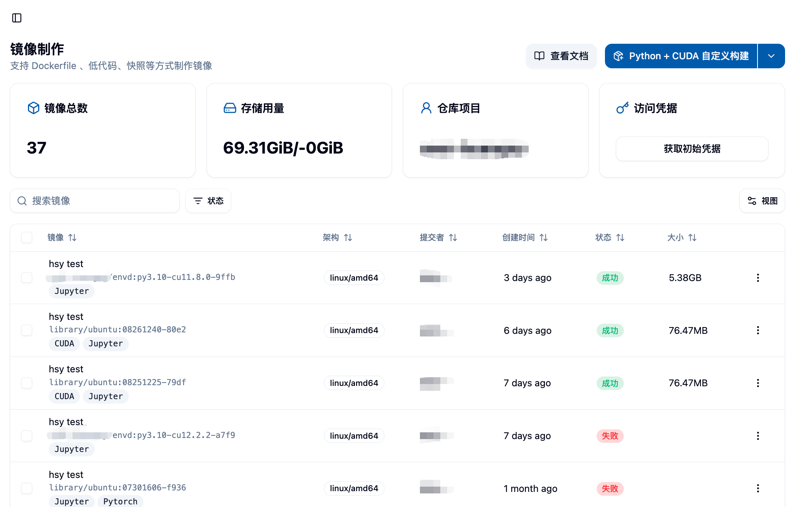

## 页面概览

进入页面后，您可以看到：

### 顶部信息区域
- **镜像总数**：您通过镜像制作功能成功制作的镜像数量
- **存储使用情况**：您在 Harbor 镜像仓库的存储用量## 查看镜像 👀

在您点击"开始制作"之后，您将能够在页面下方的列表中看到您提交制作的镜像，初始的状态应为"等待中"。
- **Harbor 项目名称**：您的专属 Harbor 项目，所有制作的镜像都存储在此项目中
- **获取初始凭据按钮**：用于获取 Harbor 仓库的访问凭据

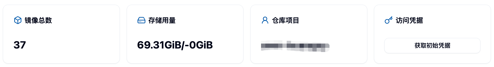

### Harbor 仓库访问凭据

点击"获取初始凭据"按钮可以获取 Harbor 镜像仓库的用户名和密码，使您能够：
- 直接登录 Harbor 仓库查看镜像
- 手动上传本地制作的镜像
- 使用 Docker 命令行工具操作镜像

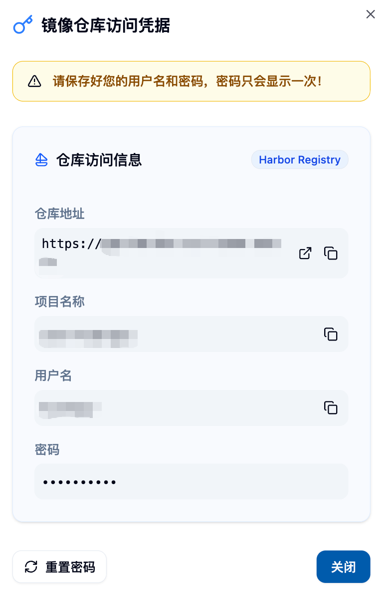

<Callout type="warn">
**重要提醒**：密码只会显示一次，请妥善保存。再次点击该按钮会重置您的密码。
</Callout>

### 镜像制作任务列表
页面下方显示您的所有镜像制作任务，包括：
- 镜像描述和链接
- 支持的架构信息
- 创建时间
- 构建状态（等待中、构建中、成功、失败）
- 镜像大小

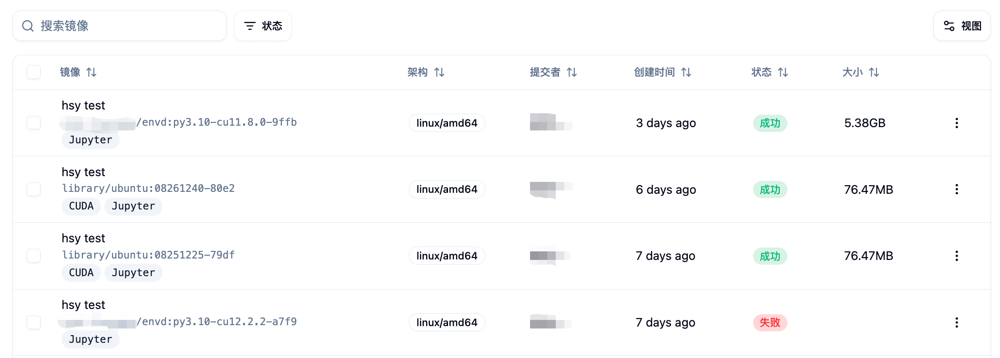

## 选择镜像制作方式 🎯

平台提供**四种**制作镜像的方式，分别是：

1. **Python+CUDA 自定义构建** 🐍 - 适合深度学习和科学计算场景
2. **基于现有镜像构建** 📦 - 在平台提供的基础镜像上快速定制
3. **基于 Dockerfile 构建** 🐳 - 提供最大的灵活性和控制能力
4. **基于 Envd 构建** ⚡ - 使用类 Python 语法的声明式构建

您可以通过页面右上角的构建方式下拉按钮选择您期望的构建方式，然后点击按钮打开对应的构建表单。


---

## 进入镜像制作页面

您可以通过点击侧边栏“数据与镜像”分类中的“镜像管理”菜单中的“镜像制作”，来进入到镜像制作页面。


进入页面后，您可以在页面上方看到您使用镜像制作功能制作的镜像总数，以及您 Harbor 镜像仓库的存储用量和限额，同时还能够看到您的 Harbor 项目名称，您可以在 Harbor 的对应项目中找到您制作的镜像。

在图片所展示的例子中，由于该用户曾直接上传了本地制作好的镜像，而并非通过“镜像制作”功能制作镜像，因此虽然镜像此处总数为零，但是存储用量非零。这部分的教程请参阅“上传本地镜像”。

上方最右侧的“获取初始凭据”按钮，用于获取 Harbor 的用户名和密码，使您可以直接登录 Harbor 仓库，方便您手动上传镜像或者查看 Harbor 仓库中的镜像。但需要注意的是，再次点击该按钮会重置您的密码。

## 选择镜像制作方式

目前我们提供**四种**制作镜像的方式，分别是

1. Python+CUDA 自定义构建
2. 基于现有镜像构建
3. 基于 Dockerfile 构建
4. 基于 Envd 构建

您可以通过如图所示的下拉按钮选择您期望的构建方式，然后点击按钮呼出构建表单。


### 1. Python+CUDA 自定义构建 🚀

这是最受欢迎的构建方式，专为深度学习和科学计算用户设计。您可以轻松选择所需的 Python 和 CUDA 版本组合，无需编写复杂的配置。

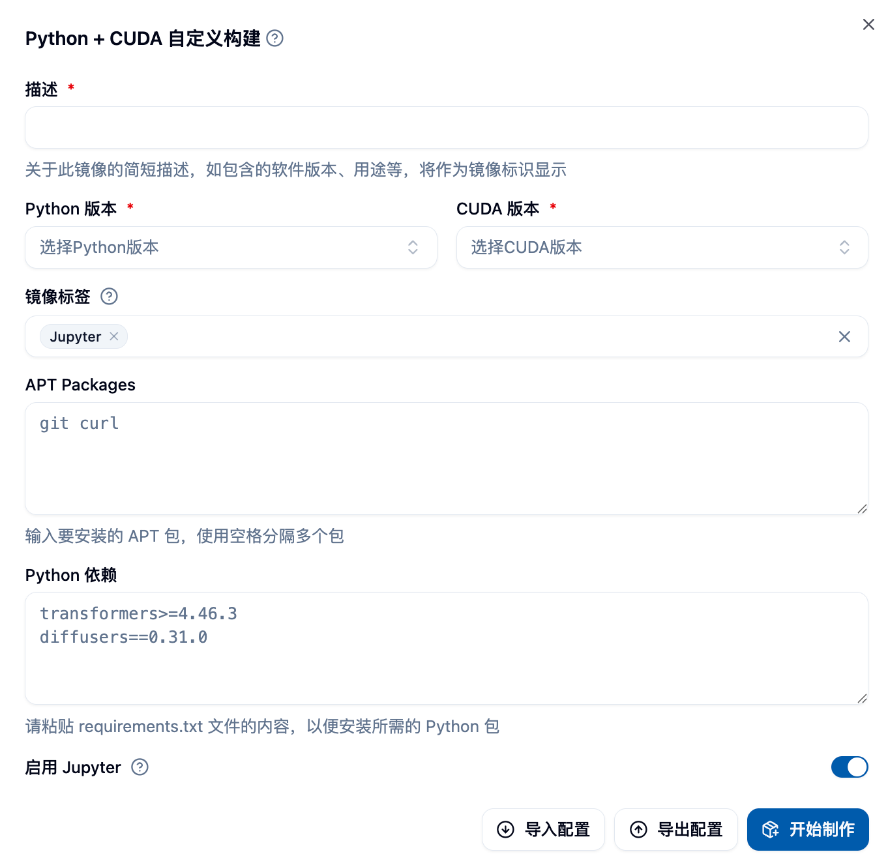

#### 填写表单详解

**基础配置**
- **Python 版本**：选择您需要的 Python 版本（如 3.8, 3.9, 3.10, 3.11 等）
- **CUDA 版本**：选择对应的 CUDA 版本（如 11.8, 12.1, 12.4 等）
- **镜像描述**：为您的镜像提供一个清晰的描述，便于后续识别

**可选软件包配置**
- **APT 软件包**：系统级软件包，多个包用空格分隔
  - 示例：`curl tree htop vim git`
  - 常用工具：`wget unzip zip git-lfs`
- **Python 依赖包**：遵循 requirements.txt 格式
  - 支持版本指定：`numpy==1.21.0`
  - 支持版本范围：`pandas>=1.3.0,<2.0.0`
  - 支持注释行：`# 数据处理相关包`

**构建设置**
- **开启 Jupyter 支持**：启用后镜像可用于 Jupyter 交互式作业
- **镜像名称**：自定义镜像名称（可选，系统会自动生成）
- **镜像标签**：自定义镜像标签（可选，系统会自动生成

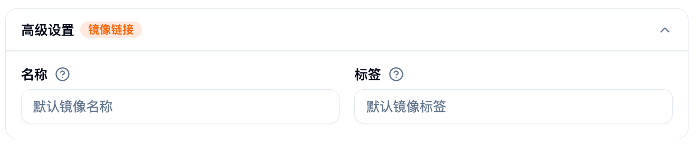

#### 使用技巧 💡

**版本选择建议**
- Python 3.9 + CUDA 11.8：兼容性最佳，适合大多数深度学习框架 ✅
- Python 3.10 + CUDA 12.1：性能优化，适合最新的 PyTorch 和 TensorFlow ⚡
- Python 3.11 + CUDA 12.4：最新特性，适合前沿研究 🔬

**常用软件包组合**
```bash
# 数据科学基础包
curl wget git git-lfs vim htop

# 开发工具包  
build-essential cmake pkg-config
```

**Python 依赖示例**
```txt
# 深度学习框架
torch>=2.0.0
torchvision>=0.15.0
tensorflow>=2.13.0

# 数据处理
numpy>=1.21.0
pandas>=1.5.0
scikit-learn>=1.3.0

# 可视化
matplotlib>=3.5.0
seaborn>=0.11.0
```

### 2. 基于现有镜像构建 📦

考虑到用户可能会在现有镜像基础之上构建新镜像的需求，我们提供了`基于现有镜像构建`的构建方式。

本构建方式需要您填写一个表单，其中，您必须要选择一个基础镜像，同时必须为镜像提供一个简短的描述，将作为镜像的标识展示。而 APT 软件包和 Python 依赖则可以留空，如果您需要安装软件包，则可以填写软件包名称，多个软件包之间用空格隔开。例如，如果您需要安装 curl 和 tree，则可以填写 `curl tree`。

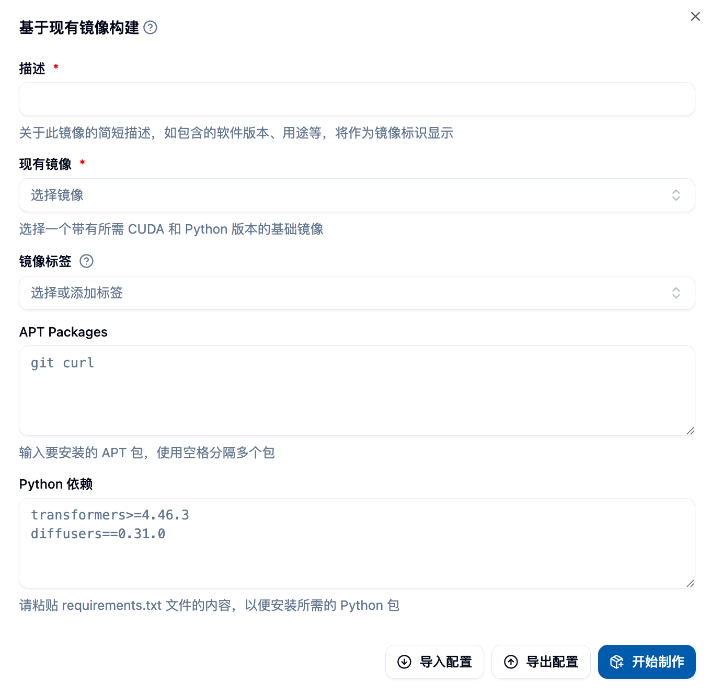

如果您计划运行的项目中包含 requirements.txt 文件，您可以将其内容拷贝至 Python 依赖处进行安装，但需要注意的是，pip 可能会在解析依赖时遇到无法解决的问题，为了避免镜像构建失败，您可以先尝试在容器中手动安装依赖尝试，再根据安装结果填写依赖。上图是一个表单填写的例子。在完成表单之后，您可以点击表单右下角的“开始制作”来启动镜像制作。

### 3. 基于 Dockerfile 构建 🐳

为有高度自定义需求的用户提供最大的灵活性，您可以编写完整的 Dockerfile 来精确控制镜像构建过程。

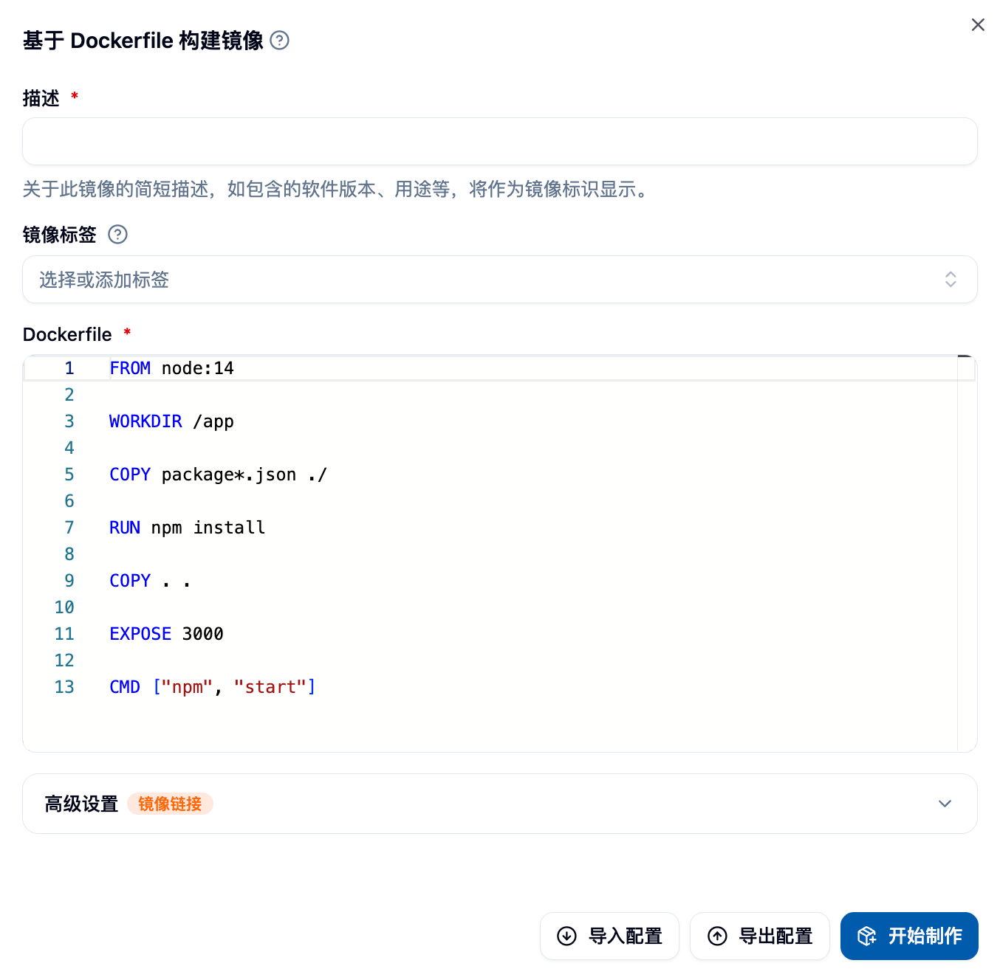

#### 表单组件详解

**Dockerfile 编辑器**
- 支持语法高亮和自动补全
- 实时语法检查
- 支持从文件导入 Dockerfile 内容

**镜像配置**
- **镜像描述**：必填，描述镜像的用途和特点
- **镜像设置**：自定义名称、标签和架构

#### Dockerfile 编写指南

**基础结构**
```dockerfile
# 选择基础镜像
FROM gpu-harbor.act.buaa.edu.cn/user-base/nvidia-pytorch:24.12-v1.2.1

# 切换到 root 用户进行系统配置
USER root

# 安装系统包
RUN apt-get update && apt-get install -y \
  curl \
  wget \
  vim \
  && rm -rf /var/lib/apt/lists/*

# 安装 Python 包
RUN pip install --no-cache-dir \
  numpy \
  pandas \
  scikit-learn

# 设置工作目录
WORKDIR /workspace

# 切换回普通用户
USER $NB_USER
```

**国内网络优化**
```dockerfile
# 更换 APT 源
RUN sed -i 's/archive.ubuntu.com/mirrors.aliyun.com/g' /etc/apt/sources.list

# 更换 pip 源
RUN pip config set global.index-url https://pypi.tuna.tsinghua.edu.cn/simple
```

**常见用法示例**
```dockerfile
# 复制文件到镜像
COPY requirements.txt /tmp/
RUN pip install -r /tmp/requirements.txt

# 设置环境变量
ENV PYTHONPATH=/workspace
ENV CUDA_VISIBLE_DEVICES=0

# 创建目录并设置权限
RUN mkdir -p /workspace/data && \
  chown $NB_USER:$NB_GID /workspace/data
```

### 4. 基于 Envd 构建 ⚡

Envd 是一个使用类 Python 语法的镜像构建工具，学习成本低，构建速度快，特别适合深度学习用户。

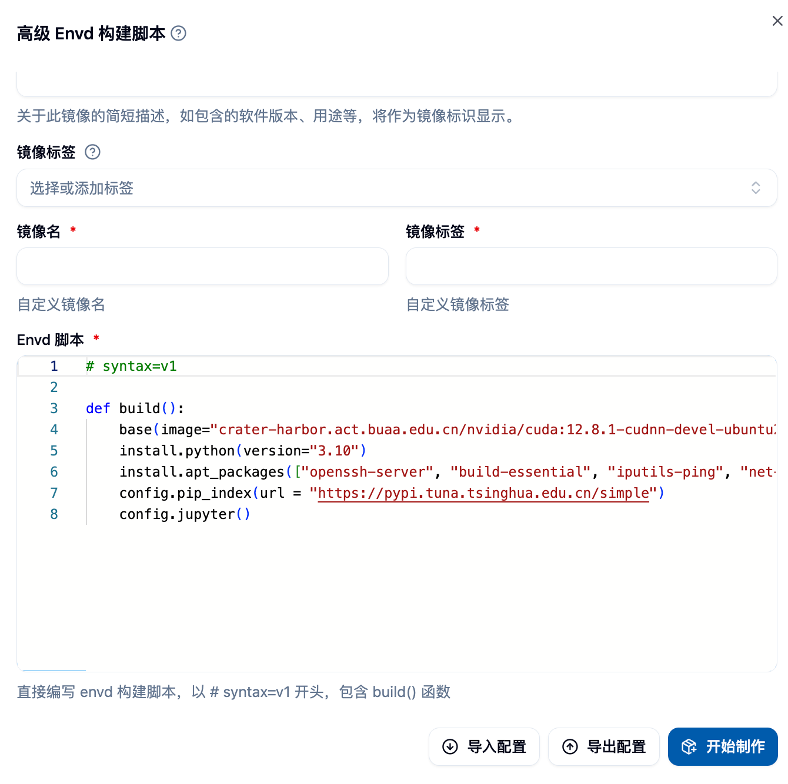

 请在此处粘贴 Envd 构建表单的截图 

#### Envd 脚本编写

**基础配置函数**
```python
def build():
  # 设置基础镜像
  base(os="ubuntu20.04", language="python3.9")
    
  # 安装系统包
  install.apt_packages(["curl", "wget", "vim"])
    
  # 安装 Python 包  
  install.python_packages([
    "torch>=2.0.0",
    "torchvision",
    "numpy",
    "pandas"
  ])
    
  # 设置 CUDA
  install.cuda(version="11.8")
    
  # 配置 Jupyter
  config.jupyter(password="")
```

**高级功能**
```python
def build():
  # 使用自定义基础镜像
  base(image="nvidia/cuda:11.8-devel-ubuntu20.04")
    
  # 从文件安装依赖
  install.python_packages(requirements="requirements.txt")
    
  # 设置环境变量
  runtime.environ({"PYTHONPATH": "/workspace"})
    
  # 运行自定义命令
  run.commands([
    "echo 'Setup complete' > /tmp/setup.log"
  ])
    
  # 挂载本地目录
  runtime.mount("/local/data", "/workspace/data")
```

**参考资料链接**
- [Envd 快速开始](https://envd.tensorchord.ai/guide/getting-started.html)
- [Envd API 参考](https://envd.tensorchord.ai/api/starlark/v1/config.html)

## 查看镜像

在您点击“开始制作”之后，您将能够在页面下方的列表中看到您提交制作的镜像，初始的状态应为“等待中”。

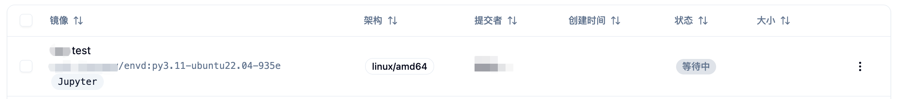

您可以通过点击镜像的描述来查看详细信息，此时您将能够在“构建日志”选项卡下看到镜像构建的详细日志，方便您排查可能出现的问题。

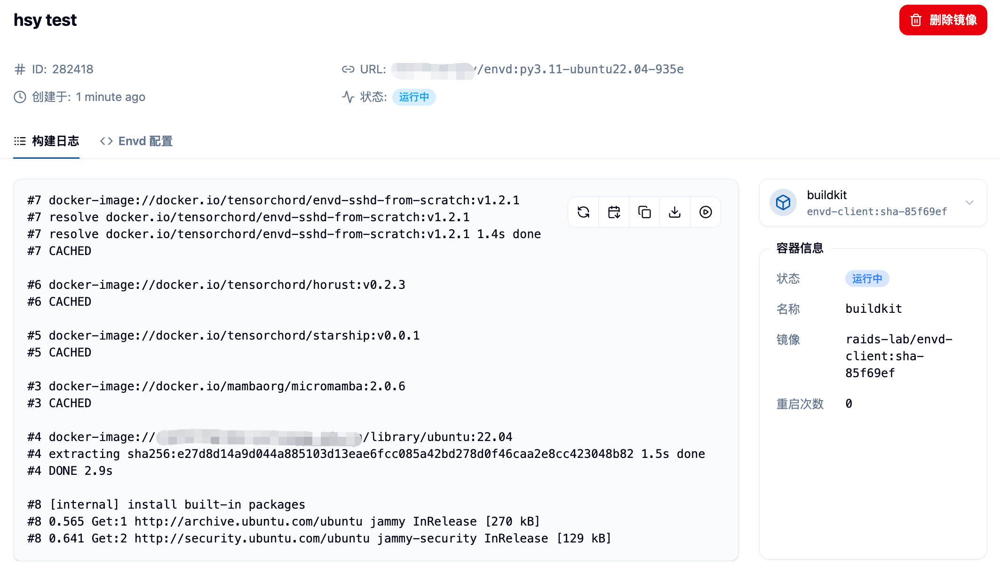

另外，您也可以切换标签页至“Dockerfile”或“Envd 配置”，以查看系统通过表单为您生成或是您填写的 Dockerfile 或者 Envd 脚本。

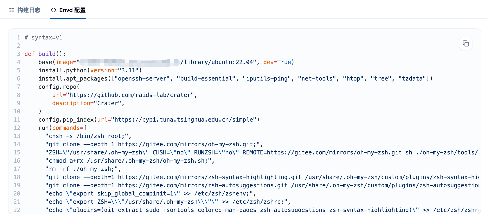

最后，如果您的镜像构建成功，则您能够在该页面看到镜像的状态变为“成功”，并且能够看到制作完成的镜像大小。请注意，由于 Docker 使用的分层存储机制，实际的存储用量可能会远小于各镜像的大小总和。同时，您也能够在“镜像列表”中看到您刚刚制作的类型为“Custom”的镜像，您将可以用它来启动“批处理作业”或“交互式作业”。


更多关于浏览、分享、标签与导入等操作，请参见《[镜像列表](./imagelist)》文档。

## 导入和导出配置 📥📤

在填写构建的表单时，您也可以将您的表单导出为 JSON 文件，以便于在下次需要它时从文件中导入，进行复用或是进一步的修改等。

