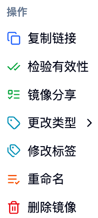
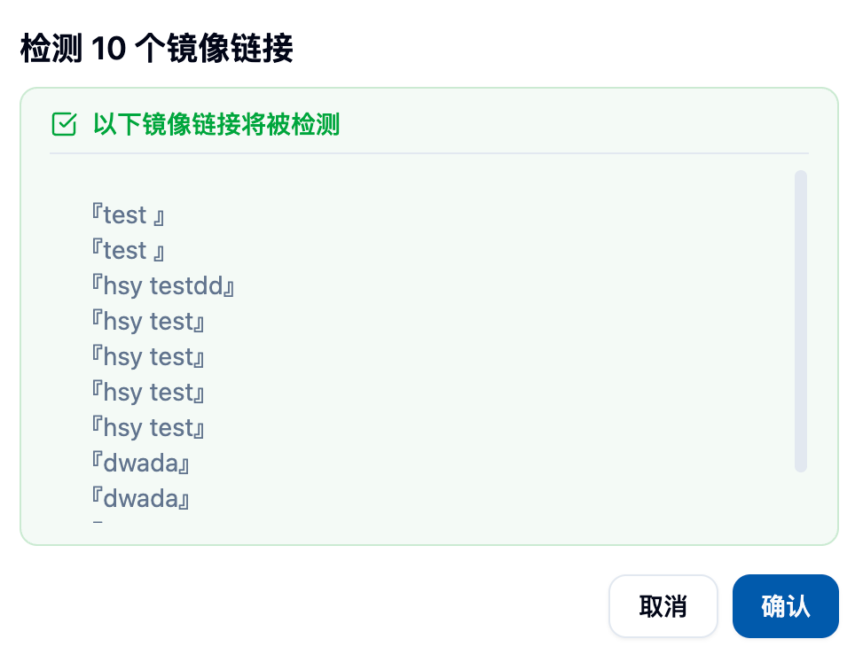

## Accessing the Image List Page

Navigate to this page via the sidebar: 「Data & Images > Image Management > Image List」.

Please paste a screenshot of the main image list page here.

## Page Overview 🎯

The image list displays your available image sources:
- Images you created (built on the platform or imported) 🏭
- Images made public by others 🌍
- Images shared with you 🤝

Default columns include:
- Image & Description: Image link + short description
- Architecture: Supported CPU architectures (e.g., amd64, arm64)
- Contributor: Image creator/owner
- Visibility: Public or private
- Creation Time: Time of creation

## Search & Filter 🔍

### Global Search
- Enter keywords in the top search box to quickly locate images by name, description, tags, etc. ⚡
- Search results update in real time as you type.

### Filter by Conditions
- Visibility: View only public / View only private
- (Optional) Other filters: Based on page configuration

## Image Details & Navigation

- For images built on the platform, clicking on 「Image & Description」 navigates to the build details page, where you can view build logs, Dockerfile/Envd, etc.
- For images imported from external sources, only basic information is shown (no navigation available).

## Common Operations (Single Image) ⚙️

In the 「Actions」 menu for each row, you can:

- Copy Link: One-click copy of the full image address 📋
- Validate: Check if the image link is valid, return the results (option to delete invalid items) ✅
- Share Image: Share the image with specific users or accounts (support revocation) 🤝
- Change Type: Set the image task type label (e.g., Jupyter, Pytorch, Ray, Custom, etc.) 🏷️
- Modify Tags: Add/remove image tags, for better classification and search 🔖
- Set Architecture: Configure the CPU architecture supported by the image (e.g., amd64, arm64) 🏗️
- Rename: Change the image description name (without altering the actual image address) ✏️
- Delete: Remove the image link 🗑️

<Callout type="info">
Permission Notes:
- Regular users can only operate on images they own;
- Visibility (public/private) switching is usually limited to administrators;
- Sensitive operations like sharing and deletion require secondary confirmation.
</Callout>

## Batch Operations 📦

After selecting multiple entries, you can perform:

- Batch Delete: Delete multiple image links at once 🗑️
- Batch Validate: Batch check, supporting bulk handling of invalid entries ✅

## Import Image 📥

Click 「Import Image」 in the top-right corner to register an existing image to the platform (no build is triggered).

Form fields:
- Image Link: Complete address (example: `registry.example.com/ns/image:tag`)
- Image Description: Used for display in the list and identification
- Tags: Optional, for categorization and retrieval

<Callout type="warning">
The image link must conform to the standard format (including repository, namespace, and tag). If it cannot be parsed, the submission will be rejected.
</Callout>

## Image Sharing 🤝

- Grant access to specified users or account groups
- View and revoke shared recipients at any time
- After sharing, the recipient can view and use the image in their image list

## Using Images

- When submitting a job (interactive or batch), you can directly select an image from this list in the image selector
- It is recommended to add clear descriptions and tags to frequently used images for quick retrieval

## Best Practices & Recommendations 💡

- Naming Convention: Be clear, include usage and version information 📝
- Tag Management: Tag by project, framework, or version for better team collaboration 🏷️
- Regular Checks: Use batch validation to clean up invalid images 🔍
- Architecture Matching: Ensure the image's architecture matches the compute node (e.g., arm64/amd64) ⚙️

## Frequently Asked Questions

- Validation Failed: Check repository network connectivity or verify the link's correctness
- Cannot Delete: Confirm if you are the image owner; administrators can contact platform support
- Cannot Share: Confirm that the target user/account exists and is active