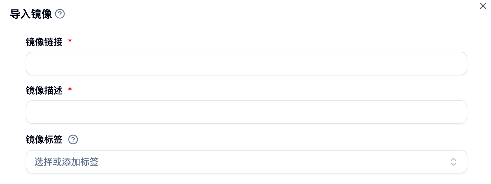
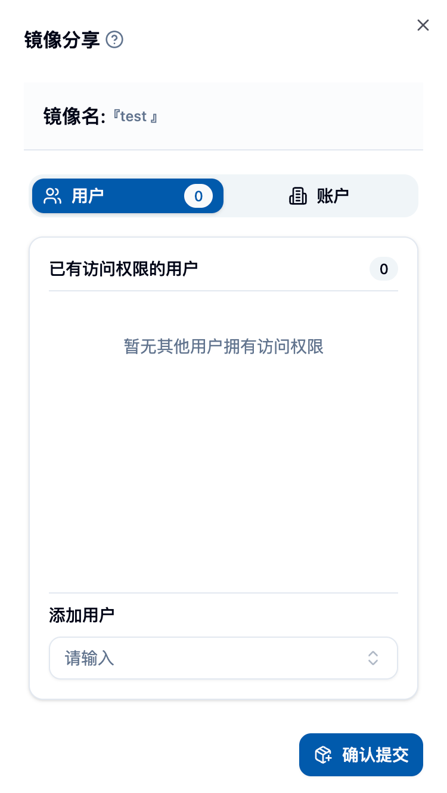

## 이미지 목록 페이지 진입

사이드바에서 「데이터 및 이미지 > 이미지 관리 > 이미지 목록」을 선택하여 이 페이지로 이동합니다.

이곳에 이미지 목록 메인 페이지의 스크린샷을 붙여넣어 주세요

## 페이지 개요 🎯

이미지 목록은 사용 가능한 이미지의 출처를 보여줍니다:
- 자체 제작한 이미지(플랫폼에서 빌드하거나 임포트한 것) 🏭
- 타인의 공개 이미지 🌍
- 나에게 공유된 이미지 🤝

기본 컬럼은 다음과 같습니다:
- 이미지 및 설명: 이미지 링크 + 간단한 설명
- 아키텍처: 지원하는 CPU 아키텍처 (예: amd64, arm64)
- 제출자: 이미지 생성자/소유자
- 가시성: 공개 또는 비공개
- 생성 시간: 생성 시간

## 검색 및 필터 🔍

### 전체 검색
- 상단 검색 상자에 키워드를 입력하면, 이름, 설명, 태그 등에 따라 이미지를 빠르게 찾을 수 있습니다. ⚡
- 입력 즉시 필터링되어 실시간으로 반영됩니다.

### 조건 필터
- 가시성: 공개만 보기 / 비공개만 보기
- (선택 사항) 기타 필터: 페이지 구성에 따라 제공됨

## 이미지 상세 정보 및 이동

- 플랫폼 내에서 제작한 이미지의 경우, 「이미지 및 설명」을 클릭하여 빌드 세부 정보 페이지로 이동하여 빌드 로그, Dockerfile/Envd 등의 정보를 확인할 수 있습니다.
- 외부에서 임포트한 이미지의 경우, 기본 정보만 표시되고 이동은 불가능합니다.

## 일반적인 작업(단일 이미지) ⚙️

각 행의 「작업」 메뉴에서 다음 작업을 수행할 수 있습니다:

- 링크 복사: 전체 이미지 주소를 한 번에 복사합니다. 📋
- 유효성 확인: 이미지 링크가 작동하는지 확인하고, 결과를 반환합니다 (유효하지 않은 항목을 삭제할 수 있음). ✅
- 이미지 공유: 지정된 사용자 또는 계정에 이미지를 공유합니다 (공유 취소 가능). 🤝
- 유형 변경: 이미지 작업 유형을 설정합니다 (예: Jupyter, Pytorch, Ray, Custom 등). 🏷️
- 태그 수정: 이미지 태그를 추가하거나 삭제하여 분류 및 검색을 용이하게 합니다. 🔖
- 아키텍처 설정: 이미지가 지원하는 CPU 아키텍처를 설정합니다 (예: amd64, arm64). 🏗️
- 이름 변경: 이미지 설명 이름을 수정합니다 (실제 이미지 주소는 변경되지 않음). ✏️
- 삭제: 해당 이미지 링크를 제거합니다. 🗑️

<Callout type="info">
권한 설명:
- 일반 사용자는 자신이 소유한 이미지만 조작할 수 있습니다;
- 가시성(공개/비공개) 전환은 일반적으로 관리자만 가능합니다;
- 공유 및 삭제와 같은 민감한 작업은 이중 확인이 필요합니다.
</Callout>

## 일괄 작업 📦

여러 개의 항목을 선택한 후 다음과 같은 작업을 수행할 수 있습니다:

- 일괄 삭제: 여러 개의 이미지 링크를 동시에 삭제합니다. 🗑️
- 일괄 유효성 확인: 일괄적으로 확인하며, 유효하지 않은 항목을 일괄적으로 처리할 수 있습니다. ✅

## 이미지 임포트 📥

우측 상단의 「이미지 임포트」를 클릭하여 기존 이미지를 플랫폼에 등록할 수 있습니다(빌드는 트리거되지 않음).

폼 필드:
- 이미지 링크: 전체 주소 (예: `registry.example.com/ns/image:tag`)
- 이미지 설명: 목록 표시 및 식별을 위해 사용됨
- 태그: 선택 사항, 분류 및 검색을 위해 사용됨

<Callout type="warning">
이미지 링크는 표준 형식(저장소, 네임스페이스, 태그 포함)을 따라야 합니다. 해석 불가능할 경우 제출할 수 없습니다.
</Callout>

## 이미지 공유 🤝

- 지정된 사용자 또는 계정 그룹에 이미지를 권한 부여
- 언제든지 공유 대상을 확인하거나 취소할 수 있음
- 공유 후, 상대방은 자신의 이미지 목록에서 해당 이미지를 볼 수 있으며 사용할 수 있음

## 이미지 사용

- 인터랙티브/배치 작업을 제출할 때, 여기서 이미지를 선택하여 직접 사용할 수 있음
- 자주 사용하는 이미지에는 명확한 설명과 태그를 추가하여 빠른 검색이 가능하도록 권장됨

## 최고의 실천 및 제안 💡

- 명명 규칙: 명확하게 설명하고 용도 및 버전 정보를 포함시킵니다. 📝
- 태그 관리: 프로젝트/프레임워크/버전에 따라 태그를 설정하여 팀 협업을 용이하게 합니다. 🏷️
- 정기 점검: 일괄 검사를 통해 유효하지 않은 이미지를 정리합니다. 🔍
- 아키텍처 일치: 이미지의 아키텍처가 컴퓨팅 노드와 일치하도록 확인합니다 (예: arm64/amd64). ⚙️

## 일반적인 질문

- 검증 실패: 저장소 네트워크 연결 상태 또는 링크 작성 여부를 확인하세요.
- 삭제 불가: 이미지 소유자인지 확인하세요; 관리자는 플랫폼 지원팀에 문의하세요.
- 공유 불가: 대상 사용자 또는 계정이 존재하고 사용 가능한지 확인하세요.