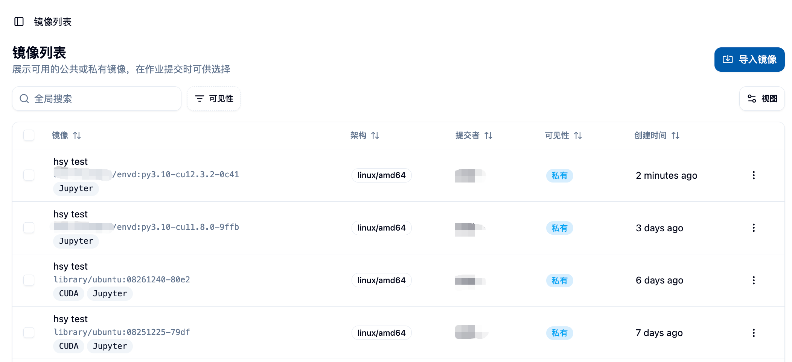
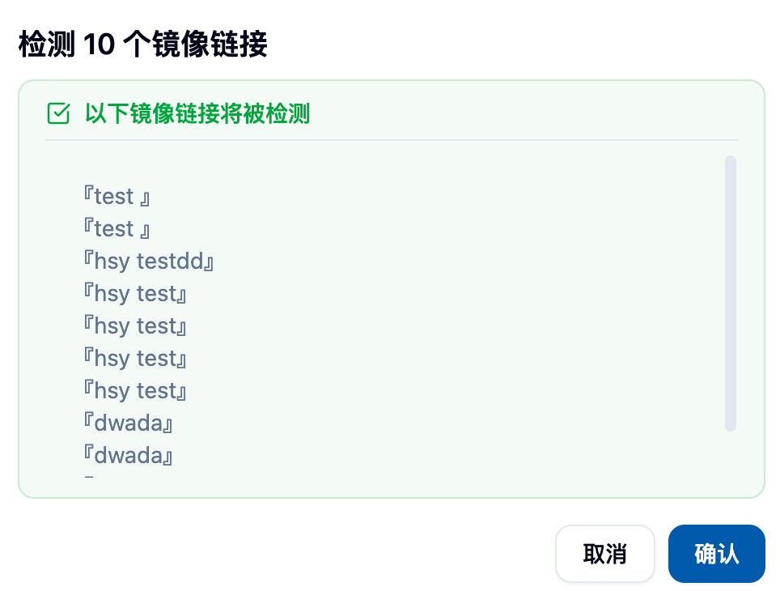
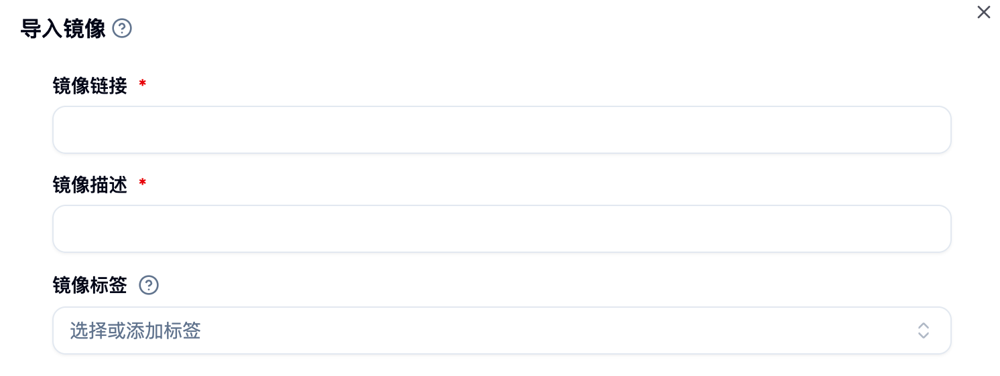
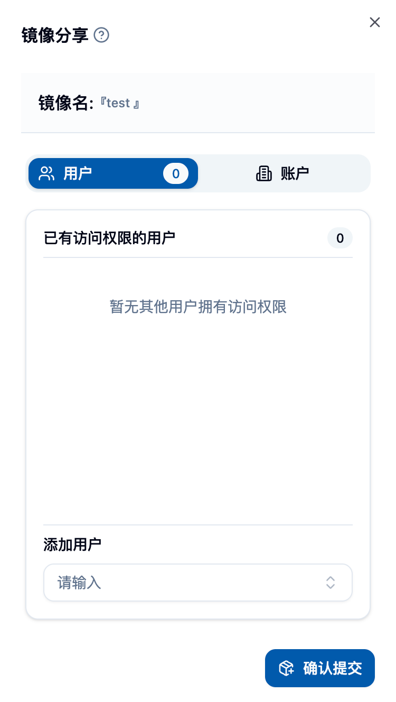

## 进入镜像列表页面

在侧边栏「数据与镜像 > 镜像管理 > 镜像列表」进入该页面。

 请在此处粘贴镜像列表主页面的截图 

## 页面概览 🎯

镜像列表展示了您可用的镜像来源：
- 自己制作的镜像（平台构建或导入）🏭
- 他人公开的镜像 🌍
- 被分享给您的镜像 🤝

默认列包含：
- 镜像与描述：镜像链接 + 简短描述
- 架构：支持的 CPU 架构（如 amd64、arm64）
- 提交者：镜像创建者/所有者
- 可见性：公共或私有
- 创建时间：生成时间

## 搜索与筛选 🔍

### 全局搜索
- 在顶部搜索框输入关键字，按名称、描述、标签等快速定位镜像 ⚡
- 输入即筛选，实时生效

### 条件筛选
- 可见性：仅看公共/仅看私有
-（可选）其他筛选：根据页面配置提供

## 镜像详情与跳转

- 对于在平台内制作的镜像，点击「镜像与描述」可跳转到构建详情页，查看构建日志、Dockerfile/Envd 等信息
- 对于外部导入的镜像，展示基本信息（不可跳转）

## 常用操作（单个镜像）⚙️

在每一行的「操作」菜单中，可进行：

- 复制链接：一键复制完整镜像地址 📋
- 检验有效性：检测镜像链接是否可用，返回检测结果（可选择删除无效项）✅
- 镜像分享：将镜像分享给指定用户或账户（支持撤销）🤝
- 更改类型：设置镜像任务类型标识（如 Jupyter、Pytorch、Ray、Custom 等）🏷️
- 修改标签：添加/删除镜像标签，便于分类与搜索 🔖
- 设置架构：配置镜像支持的 CPU 架构（如 amd64、arm64）🏗️
- 重命名：修改镜像描述名称（不改变实际镜像地址）✏️
- 删除：移除该镜像链接 🗑️

<Callout type="info">
权限说明：
- 普通用户只能操作自己拥有的镜像；
- 可见性（公共/私有）切换通常仅限管理员；
- 分享与删除等敏感操作会进行二次确认。
</Callout>

## 批量操作 📦

勾选多条记录后，可进行：

- 批量删除：同时删除多条镜像链接 🗑️
- 批量检验有效性：批量检测，支持针对无效条目批量处理 ✅

## 导入镜像 📥

点击右上角「导入镜像」，将已有镜像登记到平台（不触发构建）。

表单字段：
- 镜像链接：完整地址（示例：`registry.example.com/ns/image:tag`）
- 镜像描述：用于列表展示与辨识
- 标签：可选，用于归类与检索

<Callout type="warning">
镜像链接需符合标准格式（含仓库、命名空间与 tag）。若无法解析，将无法提交。
</Callout>

## 镜像分享 🤝

- 将镜像授权给指定用户或账户组
- 随时查看与撤销分享对象
- 分享后，对方可在其镜像列表中看到并使用该镜像

## 使用镜像

- 在提交作业（交互式/批处理）时，可在镜像选择器中直接选择这里的镜像
- 推荐为常用镜像添加清晰的描述与标签，便于快速检索

## 最佳实践与建议 💡

- 命名规范：描述清晰，包含用途与版本信息 📝
- 标签管理：为项目/框架/版本打标签，方便团队协作 🏷️
- 定期检查：使用批量检测清理无效镜像 🔍
- 架构匹配：确保镜像的架构与计算节点匹配（如 arm64/amd64）⚙️

## 常见问题

- 检测失败：检查仓库网络连通或链接书写是否正确
- 无法删除：确认是否为镜像所有者；管理员可联系平台支持
- 无法分享：确认目标用户/账户是否存在且可用

---
