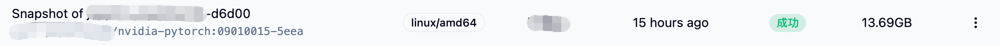

## ミラーリングの保存

ユーザーが Jupyter 環境内で新しい Python パッケージをインストールした後、ジョブを停止すると、デフォルトではこれらの Python パッケージが失われます。

このため、私たちはミラーリングの保存機能を提供しており、ユーザーが現在の変更を直接ミラーリングとして保存できます。これにより、次回の使用が容易になります。

<Callout>

深度学習のミラーリングは通常非常に大きく、ネットワークなどの要因により保存プロセスに干渉されやすく、ミラーリングの保存成功率を保証することは困難です。そのため、Dockerfile または低コードの方法でミラーリングを作成することをお勧めします。以下の制限をかける可能性があります：

1. ユーザーがアップロード可能なミラーリングの合計サイズ
2. ユーザーが保存可能なミラーリングの数（新しいミラーリングを保存するには古いミラーリングを削除する必要があります）

まとめ：Dockerfile または低コードの方法でミラーリングを作成することを強くお勧めします！

</Callout>

### Jupyter の起動例

[インタラクティブなジョブ](../quick-start/interactive.md)を参照して Jupyter Lab を起動してください。

その後、このコンテナ内でいくつかの操作を実行するかもしれません。例えば、Pip パッケージをインストールします：

```shell
# アリババクラウドの Pip ソースを使用
sudo pip config set global.index-url https://mirrors.aliyun.com/pypi/simple/

# 任意のパッケージをインストール
sudo pip install jieba
```

### ミラーリング内の変更の保存

Jupyter のインタラクティブなページで、Crater のアイコンがついたフローティングボールを見つけてください：


ミラーリングを保存し、確認してください。

Crater プラットフォームは、ミラーリング作成ページにリダイレクトします。このページでは、ミラーリングのパッケージ作成タスクの具体的な進行状況を確認できます。成功した後、ミラーリングを選択するときに、「XXXX のスナップショット」と記述されたミラーリングが表示されます。

