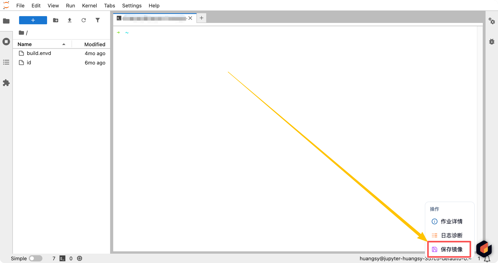

## 이미지 저장

사용자가 Jupyter 환경에서 새로운 Python 패키지를 설치한 후 작업을 중지하면, 기본적으로 이러한 Python 패키지는 사라집니다.

이를 위해 우리는 이미지 저장 기능을 제공합니다. 이를 통해 사용자의 현재 변경사항을 직접 이미지로 저장하여, 다음 번 사용이 편리해집니다.

<Callout>

딥러닝 이미지가 일반적으로 매우 크기 때문에, 네트워크 등 여러 요인으로 인해 이미지 저장 성공률을 보장하기 어렵습니다. 따라서 Dockerfile이나 저코드 방식으로 이미지를 제작하는 것을 추천드립니다. 아래와 같은 제한이 있을 수 있습니다:

1. 사용자가 업로드할 수 있는 이미지의 총 크기
2. 사용자가 저장할 수 있는 이미지의 수 (새로운 이미지를 저장하려면 이전 이미지를 삭제해야 함)

요약: Dockerfile이나 저코드 방식으로 이미지를 제작하는 것을 매우 추천드립니다!

</Callout>

### Jupyter 시작 예제

[Jupyter Lab](../quick-start/interactive.md)을 시작하려면 [상호작용형 작업](../quick-start/interactive.md)을 참조하세요.

그 후, 이 컨테이너 내에서 몇 가지 작업을 수행할 수 있습니다. 예를 들어, Pip 패키지를 설치할 수 있습니다:

```shell
# 알리운의 Pip 원천 사용
sudo pip config set global.index-url https://mirrors.aliyun.com/pypi/simple/

# 임의의 패키지 설치
sudo pip install jieba
```

### 이미지 내 변경사항 저장

Jupyter 상호작용형 페이지에서 Crater 아이콘의 플로팅 볼을 찾습니다:



이미지 저장을 클릭하고 확인합니다.

Crater 플랫폼은 사용자를 이미지 제작 페이지로 리디렉션합니다. 여기서 이미지 패키징 작업의 구체적인 진행 상황을 확인할 수 있습니다. 성공 후, 이미지 선택 시 `Snapshot of XXXX`로 설명된 이미지를 볼 수 있습니다.

