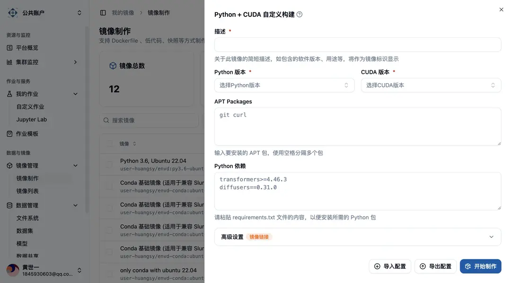
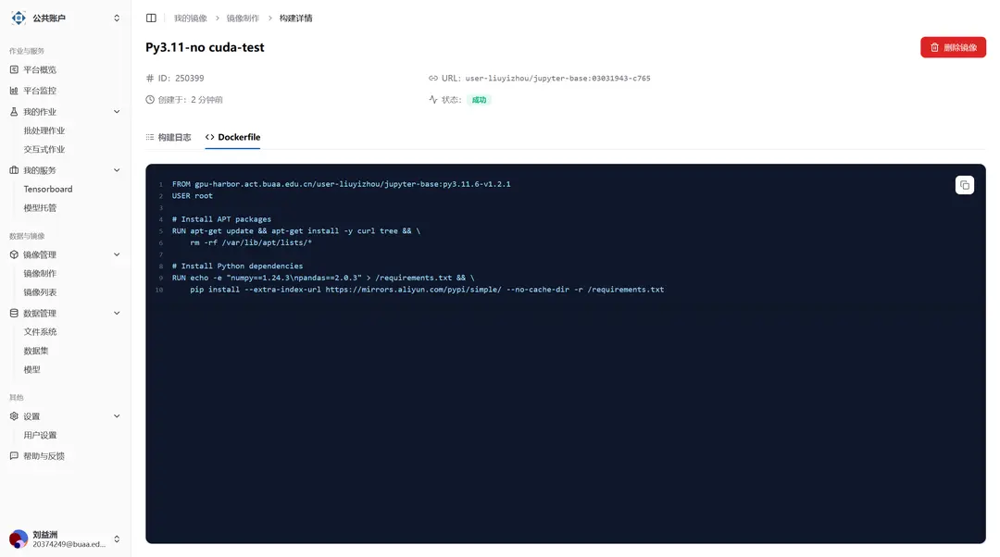

## 进入镜像制作页面

您可以通过点击侧边栏“数据与镜像”分类中的“镜像管理”菜单中的“镜像制作”，来进入到镜像制作页面。


进入页面后，您可以在页面上方看到您使用镜像制作功能制作的镜像总数，以及您 Harbor 镜像仓库的存储用量和限额，同时还能够看到您的 Harbor 项目名称，您可以在 Harbor 的对应项目中找到您制作的镜像。

在图片所展示的例子中，由于该用户曾直接上传了本地制作好的镜像，而并非通过“镜像制作”功能制作镜像，因此虽然镜像此处总数为零，但是存储用量非零。这部分的教程请参阅“上传本地镜像”。

上方最右侧的“获取初始凭据”按钮，用于获取 Harbor 的用户名和密码，使您可以直接登录 Harbor 仓库，方便您手动上传镜像或者查看 Harbor 仓库中的镜像。但需要注意的是，再次点击该按钮会重置您的密码。

## 选择镜像制作方式

目前我们提供**四种**制作镜像的方式，分别是

1. Python+CUDA 自定义构建
2. 基于现有镜像构建
3. 基于 Dockerfile 构建
4. 基于 Envd 构建

您可以通过如图所示的下拉按钮选择您期望的构建方式，然后点击按钮呼出构建表单。


### 1. Python+CUDA 自定义构建

为了更好地满足用户对 Python 和 CUDA 版本定制化的需求，我们提供了`Python+CUDA 自定义构建`的构建方式。

用户能够在表单中选择相应 Python 和 CUDA 版本，如有需要，用户则应当按规范填入 APT 软件包和 Python requirements 内容，即可轻松完成镜像的构建，构建完成的镜像能够适用于 Jupyter 交互式作业和 Custom 自定义作业。表单详细内容可见下图。



### 2. 基于现有镜像构建

考虑到用户可能会在现有镜像基础之上构建新镜像的需求，我们提供了`基于现有镜像构建`的构建方式。

本构建方式需要您填写一个表单，其中，您必须要选择一个基础镜像，同时必须为镜像提供一个简短的描述，将作为镜像的标识展示。而 APT 软件包和 Python 依赖则可以留空，如果您需要安装软件包，则可以填写软件包名称，多个软件包之间用空格隔开。例如，如果您需要安装 curl 和 tree ，则可以填写 `curl tree`。


如果您计划运行的项目中包含 requirements.txt 文件，您可以将其内容拷贝至 Python 依赖处进行安装，但需要注意的是，pip 可能会在解析依赖时遇到无法解决的问题，为了避免镜像构建失败，您可以先尝试在容器中手动安装依赖尝试，再根据安装结果填写依赖。上图是一个表单填写的例子。在完成表单之后，您可以点击表单右下角的“开始制作”来启动镜像制作。

### 3. 基于 Dockerfile 构建

具有高度自主化需求的用户可以选择使用`基于 Dockerfile 构建`的构建方式，本构建方式可以很好地满足用户对于镜像的灵活需求。

如果您选择了本构建方式，则您只需要填写一个镜像描述和完整且语法规范的 Dockerfile（考虑到国内网络问题，在相应的下载和拉取代码中，可能需要进行换源操作），这两项均为必填项，一个可能的示例如下图所示。


这里使用的示例 Dockerfile 见下。

```dockerfile
FROM gpu-harbor.act.buaa.edu.cn/user-liuyizhou/nvidia-pytorch:24.12-v1.2.1

USER root

RUN pip install onnxruntime-gpu && \
    echo -e '#!/bin/bash\nunzip -o /home/$NB_USER/workspaces/test.zip -d /workspace/test' >> /usr/local/bin/before-notebook.d/prepare_workspace.sh && \
    chmod +x /usr/local/bin/before-notebook.d/prepare_workspace.sh
```

您可以通过点击表单右下角的“开始制作”来启动镜像制作。

### 4. 基于 Envd 构建

`基于Envd构建`提供了以**类 Python 语法**进行镜像构建的构建方式，本构建方式可以很好地满足深度学习用户对于镜像的构建，并且学习成本低、构建功能强大、构建速度快，相应的简介可以参考链接：

<Callout title="参考资料">

- [Envd 快速开始](https://envd.tensorchord.ai/guide/getting-started.html)
- [Envd API 参考](https://envd.tensorchord.ai/api/starlark/v1/config.html)

</Callout>

在本构建方式中，用户需要填写一个简短的描述，将作为镜像的标识展示，并设置新镜像的镜像名和镜像标签，最后提供完整的 Envd 脚本，即可完成镜像构建。如用户对 Envd 脚本的使用有疑惑，欢迎随时与我们交流 👏🏻。


## 查看镜像

在您点击“开始制作”之后，您将能够在页面下方的列表中看到您提交制作的镜像，初始的状态应为“等待中”。


您可以通过点击镜像的描述来查看详细信息，此时您将能够在“构建日志”选项卡下看到镜像构建的详细日志，方便您排查可能出现的问题。


另外，您也可以切换标签页至“Dockerfile”或“Envd 配置”，以查看系统通过表单为您生成或是您填写的 Dockerfile 或者 Envd 脚本。



最后，如果您的镜像构建成功，则您能够在该页面看到镜像的状态变为“成功”，并且能够看到制作完成的镜像大小。请注意，由于 Docker 使用的分层存储机制，实际的存储用量可能会远小于各镜像的大小总和。同时，您也能够在“镜像列表”中看到您刚刚制作的类型为“Custom”的镜像，您将可以用它来启动“批处理作业”或“交互式作业”。


## 导入和导出配置

在填写构建的表单时，您也可以将您的表单导出为 JSON 文件，以便于在下次需要它时从文件中导入，进行复用或是进一步的修改等。


