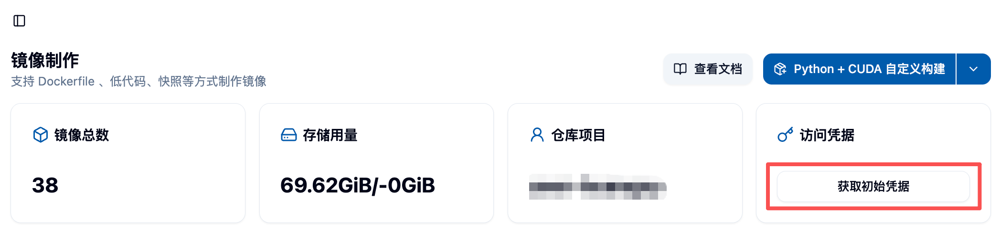

## 🔐 1. Harbor 액세스 자격 증명 얻기

### 🚀 1.1 플랫폼 로그인

먼저, 사용자의 플랫폼(예: Kubernetes 클러스터 관리 플랫폼, CI/CD 플랫폼 등)에 로그인하고, Harbor와 통합된 부분을 찾습니다.



### 🔑 1.2 액세스 자격 증명 얻기

플랫폼의 Harbor 통합 페이지에서 다음 정보를 확인할 수 있습니다:

- **🌐 Harbor URL**: Harbor 저장소의 주소, 예: `https://harbor.example.com`.
- **👤 사용자 이름**: Harbor 사용자 이름.
- **🔒 비밀번호**: Harbor 비밀번호.

### 🔐 1.3 Harbor 로그인

얻은 자격 증명을 사용하여 Harbor에 로그인합니다:

```bash
docker login crater-harbor.act.buaa.edu.cn -u <사용자 이름> -p <비밀번호>
```

로그인이 성공하면 `Login Succeeded`라는 메시지가 표시됩니다. ✅

## 📦 2. 로컬 이미지 Harbor 저장소로 업로드

### 🏷️ 2.1 로컬 이미지 라벨 지정

업로드 전, 로컬 이미지에 Harbor 저장소의 이름 규칙에 따라 라벨을 지정해야 합니다. 예:

```bash
docker tag local-image:tag harbor.example.com/project-name/repository-name:tag
```

- `local-image:tag`: 로컬 이미지 이름과 태그.
- `harbor.example.com/project-name/repository-name:tag`: Harbor 저장소의 전체 경로, 프로젝트 이름, 저장소 이름, 태그 포함.

각 사용자의 Project Name은 `user-{ACT 사용자 이름}`입니다. 💡

### ⬆️ 2.2 이미지 Harbor로 푸시

`docker push` 명령어를 사용하여 라벨이 지정된 이미지를 Harbor 저장소로 푸시합니다:

```bash
docker push harbor.example.com/project-name/repository-name:tag
```

푸시가 성공하면 Harbor 저장소에서 업로드된 이미지를 확인할 수 있습니다. ✨

## ✅ 3. 이미지 업로드 검증

### 🌐 3.1 Harbor Web UI에 로그인

브라우저를 열고, Harbor Web UI(예: `https://harbor.example.com`)에 접속한 후 사용자 자격 증명을 사용하여 로그인합니다.

### 👀 3.2 이미지 확인

적절한 프로젝트와 저장소로 이동하여 업로드한 이미지가 저장소에 성공적으로 표시되는지 확인합니다.

## ⚠️ 4. 일반적인 문제

### ❌ 4.1 로그인 실패

- 사용자 이름과 비밀번호가 올바른지 확인하세요.
- Harbor URL이 올바르고 네트워크로 접근 가능한지 확인하세요.

### ❌ 4.2 푸시 실패

- 이미지 라벨 경로가 올바른지 확인하세요.
- 지정된 프로젝트와 저장소로 이미지를 푸시할 수 있는 권한이 있는지 확인하세요.

## 📚 5. 참고 문서

- [Harbor 공식 문서](https://goharbor.io/docs/)
- [Docker 공식 문서](https://docs.docker.com/)