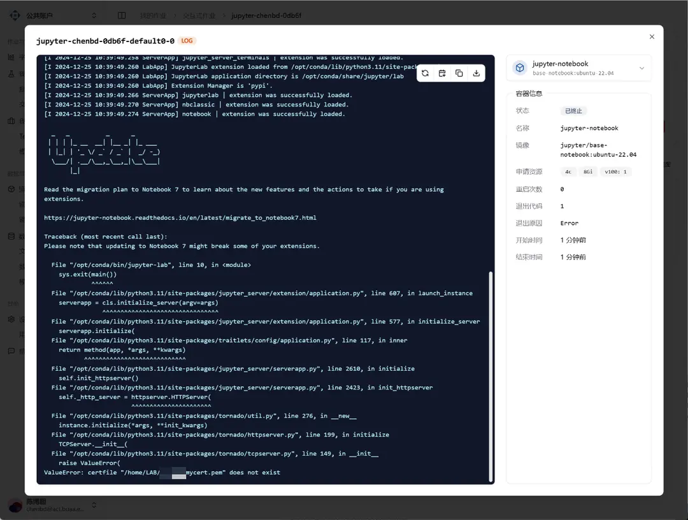

<Callout title="TL;DR">
  이전에 Jupyter를 구성한 경우, 사용자 폴더 아래의 `.jupyter` 폴더를 삭제하면 가능성이 높습니다.
</Callout>

## 1. Jupyter Pem 파일이 하드코딩되어 시작 실패

2024년 12월 25일 피드백, 사용자의 시작 로그는 다음과 같습니다:

인터랙티브 작업 시작이 실패한 이유는 `/home/LAB/{username}/mycert.pem`을 찾을 수 없기 때문입니다. 이는 사용자가 Slurm 이전 클러스터의 파일을 동기화했기 때문이며, 이전 Slurm 클러스터의 홈 디렉토리는 `/home/LAB/{username}`이었고, 현재는 더 표준적인 `/home/{username}`입니다.

또한 사용자가 이전 Slurm 클러스터에서 Jupyter의 TLS 연결을 구성했기 때문에, `/home/{username}/.jupyter` 폴더 내의 Jupyter 구성 파일에 pem 인증서 경로가 하드코딩되어 있습니다.

이에 따라 두 가지 해결 방법이 있습니다:

1. `/home/{username}/.jupyter` 폴더를 삭제합니다.
2. `jupyter_notebook_config.py` 파일의 161행을 수정하여 경로를 `$HOME/mycert.pem`으로 변경합니다.