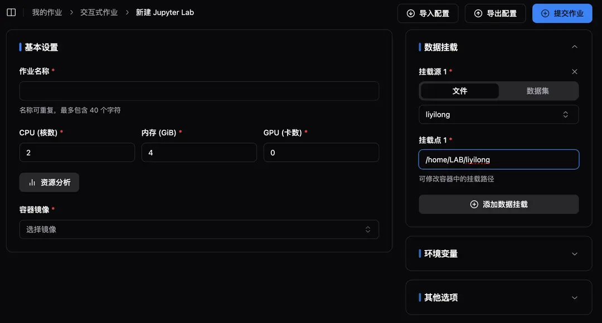

## 概要

計算クラスターのアップグレードまたは移行において、環境の移行は重要なステップです。本記事では、既存の Slurm クラスター環境を新しい計算プラットフォームに移行する方法について説明します。主に以下の2つの方法について重点的に説明します：既存の Conda 環境の直接再利用、および既存環境を基に Python 環境を再構築する方法。

## 1. 既存の Conda 環境の再利用

<Callout title="警告" type="warn">
既存の Conda 環境を直接再利用することは可能です。ただし、以下の点を慎重に検討することをお勧めします：

- **性能への影響**：Docker コンテナ内で Python 環境を再インストールした場合、通常より高い実行効率が得られます。
- **互換性の問題**：環境を直接再利用すると、パス依存の問題が発生する可能性があります。
- **環境の清潔さ**：既存の環境には、使用されていない依存関係が含まれている可能性があります。

</Callout>

1. **パスの調整**：
   指定されたパスを `/home/{username}` から `/home/LAB/{username}` に変更し、Slurm クラスターとの整合性を取るため、パスのハードコーディングの問題を解決します。環境を再利用しない場合は、このステップをスキップしてください。

   

2. **環境のアクティベート**：
   以下のコマンドのように、既存の環境をアクティベートします：

   ```bash
   export USERNAME=liyilong
   export PATH=/home/LAB/${USERNAME}/miniconda3/bin:${PATH}
   source /home/LAB/${USERNAME}/miniconda3/etc/profile.d/conda.sh
   export PATH=$CONDA_DIR/bin:${PATH}
   ```

3. **環境の確認**：
   以下のコマンドで環境が正常にアクティベートされているかを確認してください：

   ```bash
   conda activate
   ```

## 2. 既存環境を基に Python 環境を再構築する

<Callout title="利点" type="info">

- **環境の清潔さ**：不要な依存関係を削除できます
- **性能の向上**：新しいインストールは通常、より良いパフォーマンスを提供します
- **保守性の向上**：明確な依存関係リストは将来的な保守に役立ちます

</Callout>

1. **Requirements ファイルの生成**：
   pipreqs などのツールを使用して、プロジェクトディレクトリをスキャンし、正確な依存関係リストを生成します：

   ```bash
   pip install pipreqs
   pipreqs /path/to/project --encoding=utf8 --force
   ```

2. **依存関係リストの最適化**：

   - 生成された requirements.txt ファイルを手動で確認します
   - 使用されなくなった依存関係を削除します
   - キーとなる依存関係のバージョン番号を固定します

3. **新しい環境の作成**：イメージ作成のセクションを参照し、さまざまな方法で新しい環境を作成できます。

## 結論

長期的な保守性とパフォーマンスの観点から、2番目の方法（環境の再構築）を優先的に推奨します。初期に必要な作業は多くなりますが、将来的にメリットがあります。時間が限られている場合は、1番目の方法（環境の再利用）を一時的な解決策として使用することもできますが、後で環境を再構築することをおすすめします。

> 注意：環境の移行を行う際には、必ずバックアップを取ってください。また、すべての操作手順を記録し、問題が発生した場合に迅速にロールバックできるようにしてください。