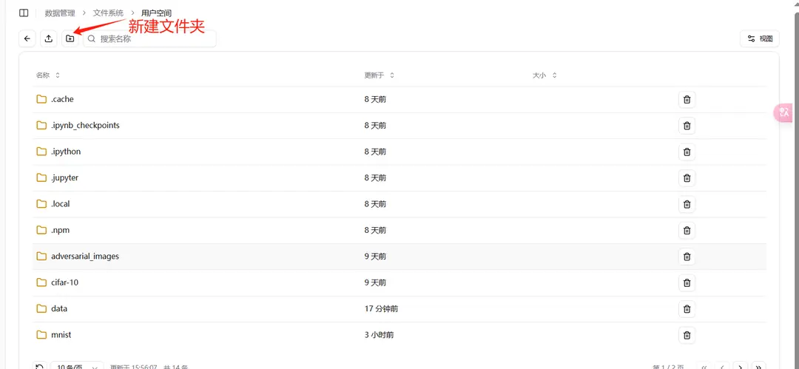
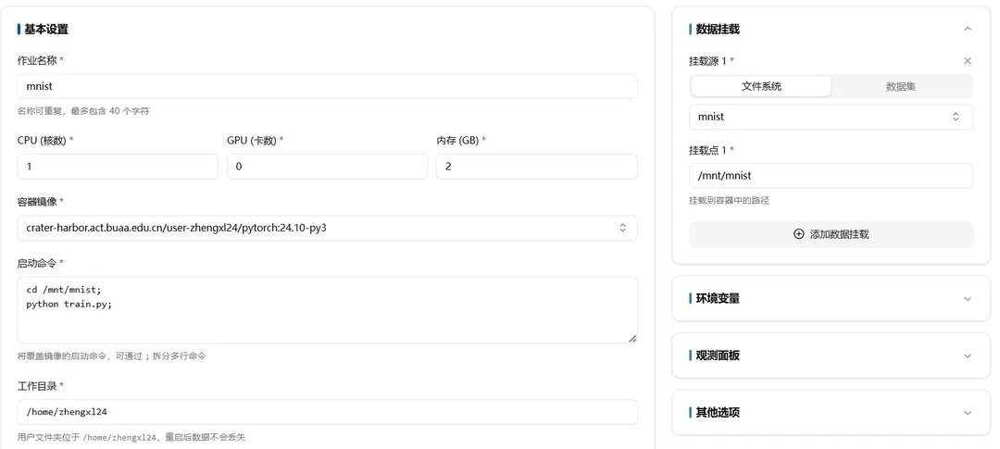
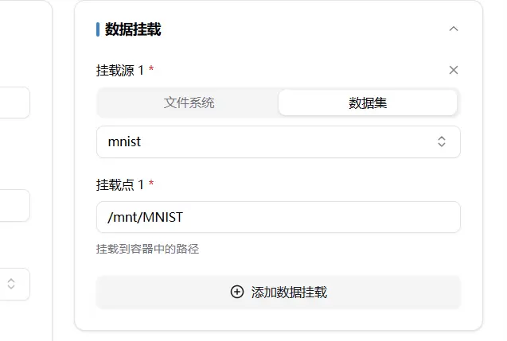
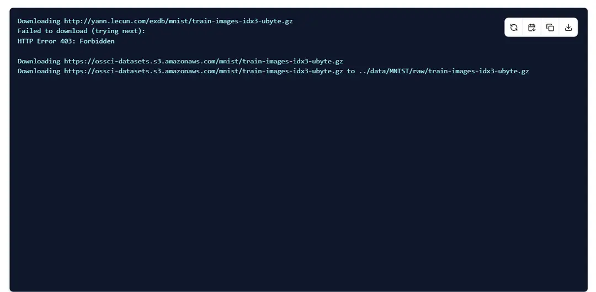

# バッチジョブ

## PyTorch 手書き文字認識 GPU 訓練ジョブを提出

Crater の **シングルマシンバッチタスク** は、特定の環境下で指定された指示に従って実行し、結果を得るためのものです。

## コードのアップロード

### ローカルでコードを作成

実行するコードファイルをローカルで作成してください。バッチシステムはコードのデバッグにおいて多くの不便をもたらすため、ローカルで成功裏にデバッグされ、正常に実行できるコードのみをバッチシステムに適用することを推奨します。これにより、全体的な業務フローの円滑な進行と安定性が保証されます。

```python
# このコードは github の PyTorch 手書き文字認識 GPU 訓練タスクの例を参考にしています
import argparse
import torch
import torch.nn as nn
import torch.nn.functional as F
import torch.optim as optim
from torchvision import datasets, transforms
from torch.optim.lr_scheduler import StepLR


class Net(nn.Module):
    def __init__(self):
        super(Net, self).__init__()
        self.conv1 = nn.Conv2d(1, 32, 3, 1)
        self.conv2 = nn.Conv2d(32, 64, 3, 1)
        self.dropout1 = nn.Dropout(0.25)
        self.dropout2 = nn.Dropout(0.5)
        self.fc1 = nn.Linear(9216, 128)
        self.fc2 = nn.Linear(128, 10)

    def forward(self, x):
        x = self.conv1(x)
        x = F.relu(x)
        x = self.conv2(x)
        x = F.relu(x)
        x = F.max_pool2d(x, 2)
        x = self.dropout1(x)
        x = torch.flatten(x, 1)
        x = self.fc1(x)
        x = F.relu(x)
        x = self.dropout2(x)
        x = self.fc2(x)
        output = F.log_softmax(x, dim=1)
        return output


def train(args, model, device, train_loader, optimizer, epoch):
    model.train()
    for batch_idx, (data, target) in enumerate(train_loader):
        data, target = data.to(device), target.to(device)
        optimizer.zero_grad()
        output = model(data)
        loss = F.nll_loss(output, target)
        loss.backward()
        optimizer.step()
        if batch_idx % args.log_interval == 0:
            print('Train Epoch: {} [{}/{} ({:.0f}%)]\tLoss: {:.6f}'.format(
                epoch, batch_idx * len(data), len(train_loader.dataset),
                100. * batch_idx / len(train_loader), loss.item()))
            if args.dry_run:
                break


def test(model, device, test_loader):
    model.eval()
    test_loss = 0
    correct = 0
    with torch.no_grad():
        for data, target in test_loader:
            data, target = data.to(device), target.to(device)
            output = model(data)
            test_loss += F.nll_loss(output, target, reduction='sum').item()  # sum up batch loss
            pred = output.argmax(dim=1, keepdim=True)  # get the index of the max log-probability
            correct += pred.eq(target.view_as(pred)).sum().item()

    test_loss /= len(test_loader.dataset)

    print('\nTest set: Average loss: {:.4f}, Accuracy: {}/{} ({:.0f}%)\n'.format(
        test_loss, correct, len(test_loader.dataset),
        100. * correct / len(test_loader.dataset)))


def main():
    # Training settings
    parser = argparse.ArgumentParser(description='PyTorch MNIST Example')
    parser.add_argument('--batch-size', type=int, default=64, metavar='N',
                        help='input batch size for training (default: 64)')
    parser.add_argument('--test-batch-size', type=int, default=1000, metavar='N',
                        help='input batch size for testing (default: 1000)')
    parser.add_argument('--epochs', type=int, default=2, metavar='N',
                        help='number of epochs to train (default: 2)')
    parser.add_argument('--lr', type=float, default=1.0, metavar='LR',
                        help='learning rate (default: 1.0)')
    parser.add_argument('--gamma', type=float, default=0.7, metavar='M',
                        help='Learning rate step gamma (default: 0.7)')
    parser.add_argument('--no-cuda', action='store_true', default=False,
                        help='disables CUDA training')
    parser.add_argument('--no-mps', action='store_true', default=False,
                        help='disables macOS GPU training')
    parser.add_argument('--dry-run', action='store_true', default=False,
                        help='quickly check a single pass')
    parser.add_argument('--seed', type=int, default=1, metavar='S',
                        help='random seed (default: 1)')
    parser.add_argument('--log-interval', type=int, default=10, metavar='N',
                        help='how many batches to wait before logging training status')
    parser.add_argument('--save-model', action='store_true', default=True,
                        help='For Saving the current Model')
    args = parser.parse_args()
    use_cuda = not args.no_cuda and torch.cuda.is_available()
    use_mps = not args.no_mps and torch.backends.mps.is_available()

    torch.manual_seed(args.seed)

    if use_cuda:
        device = torch.device("cuda")
    elif use_mps:
        device = torch.device("mps")
    else:
        device = torch.device("cpu")

    train_kwargs = {'batch_size': args.batch_size}
    test_kwargs = {'batch_size': args.test_batch_size}
    if use_cuda:
        cuda_kwargs = {'num_workers': 1,
                       'pin_memory': True,
                       'shuffle': True}
        train_kwargs.update(cuda_kwargs)
        test_kwargs.update(cuda_kwargs)

    transform=transforms.Compose([
        transforms.ToTensor(),
        transforms.Normalize((0.1307,), (0.3081,))
        ])
    dataset1 = datasets.MNIST('../data', train=True, download=True,
                       transform=transform)
    dataset2 = datasets.MNIST('../data', train=False,
                       transform=transform)
    train_loader = torch.utils.data.DataLoader(dataset1,**train_kwargs)
    test_loader = torch.utils.data.DataLoader(dataset2, **test_kwargs)

    model = Net().to(device)
    optimizer = optim.Adadelta(model.parameters(), lr=args.lr)

    scheduler = StepLR(optimizer, step_size=1, gamma=args.gamma)
    for epoch in range(1, args.epochs + 1):
        train(args, model, device, train_loader, optimizer, epoch)
        test(model, device, test_loader)
        scheduler.step()

    if args.save_model:
        torch.save(model.state_dict(), "mnist_cnn.pt")


if __name__ == '__main__':
    main()
```

### ローカルのコードをアップロード

システム内のデータ管理ファイルシステムを開き、ユーザー空間に進みます。


プロジェクトのために個別のフォルダーを作成し、関連ファイルをインポートできます。



この例では、train.py ファイルを mnist フォルダーにインポートします。


## ジョブの提出

バッチジョブでカスタムシングルマシンバッチジョブを選択します。


### ジョブ情報の入力



### コンテナイメージの選択

パブリックイメージを選択することも、自分のイメージを選択することもできます。パブリックイメージの紹介や、自分のイメージの作成方法については関連するドキュメントをご参照ください。

### 起動コマンド

#### 例のコマンド

```bash
cd /mnt/mnist;
python train.py
```

1. /mnt/mnist フォルダーを開きます
2. python を使用して train.py を実行します

#### 注意事項

- コマンドの間には `;` を使用して区切ることを確実にし、それらは同じシェルセッションで順番に実行されます。
- コマンドに特殊文字やスペースが含まれている場合は、全体のコマンド文字列をクォートで囲むことをお勧めします。これにより、解析エラーを避けることができます。

このようにして、コンテナを起動する際にイメージのデフォルト起動コマンドを上書きし、複数行のコマンドを実行できます。

### データのマウント

初期状態では、全体のユーザー ファイルシステムがマウントされています。一般的には、ファイルシステムとデータセットはすべて /mnt/ フォルダーにマウントされます。


例えば、ユーザー空間の mnist フォルダーをインポートする場合、cd /mnt/mnist;コマンドを使用してそのフォルダーにアクセスできます。


フォルダーの状況と同様に、データセットのマウントは、データセットを含むフォルダーを全体として /mnt/ フォルダーにマウントすることになります。




## ジョブの実行状況の確認

ジョブを成功裏に作成した後、バッチジョブ一覧で作成したばかりのジョブを見つけることができます。ジョブ名をクリックして詳細を確認できます。


ジョブが実行されている間、エラーが発生する可能性があります。例えば、対応するフォルダーを開けない、またはプログラムの実行中に問題が発生する場合などです。ジョブの実行状況を確認するには、ログを確認してください。


この時点では、プログラムがデータセットをダウンロードしています。システムのプロキシ問題により、ダウンロード速度が遅い場合があります。事前にデータセットをダウンロードしてアップロードすることをお勧めします。



ステータスが **完了済み** に変更されると、バッチジョブが正常に実行されたことを示します。失敗した場合は、問題が存在することを示しています。ログを確認して原因を特定してください。


#### ジョブの実行状況を確認する他の方法

また、新しいバッチジョブを作成する際に、環境の問題に遭遇する可能性があります。これは、**起動コマンド** に sleep コマンドを追加してデバッグを行うことで対処できます。例:

```
sleep 600;//プログラムを10分間停止
```

その後、ターミナルとログを使用して確認したい情報を確認できます。


## ジョブの結果の保存

実行ファイルで保存された内容は、イメージ空間の現在のフォルダーからユーザー空間の元のフォルダーに保存されます。例えば、サンプルコードでは、実行後 mnist_cnn.pt が train.py が存在する元のフォルダー mnist に保存されます。

```
torch.save(model.state_dict(), "mnist_cnn.pt")
```

