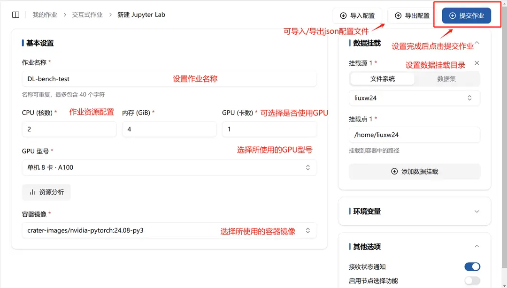
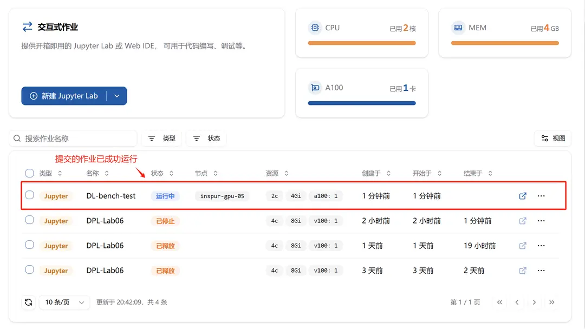
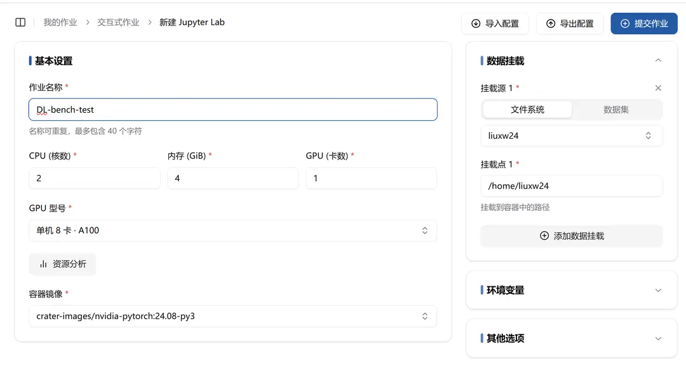
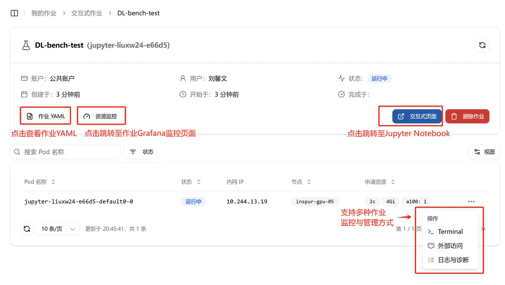
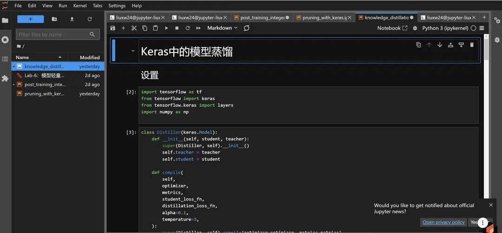
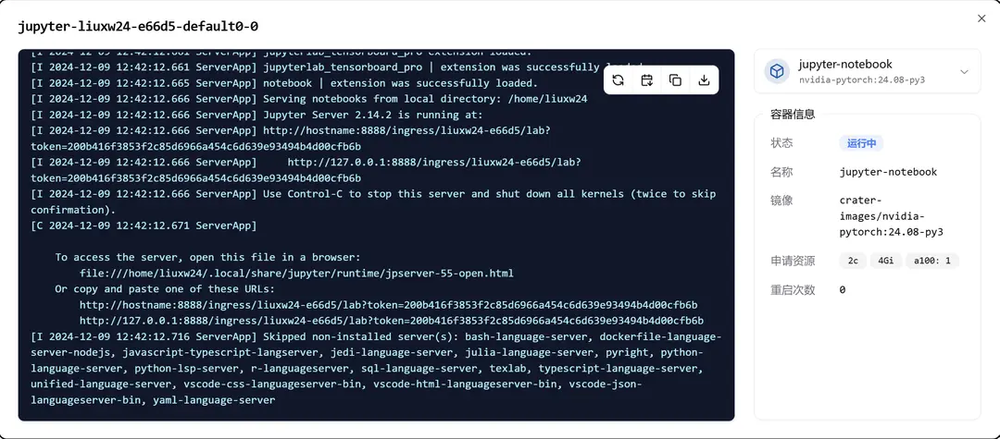

**インタラクティブなジョブ**機能は、ユーザーに**オールインワンの Jupyter Lab と Web IDE** を提供します。本ドキュメントでは、インタラクティブなジョブの作成と管理などについて説明します。

## インタラクティブなジョブの作成

**「プラットフォーム概観」**ページまたは **「私のジョブ」-> 「インタラクティブなジョブ」**ページで **「新しい Jupyter Lab を作成」**ボタンをクリックし、Jupyter Lab の作成ページに移動できます。


**「新しい Jupyter Lab」**ページでは、**インタラクティブなジョブのさまざまな設定**を行うことができます：

- ジョブ名
- ジョブリソース（CPU コア数、メモリ使用量、GPU 使用の有無、使用する GPU のモデルの選択）
- コンテナイメージ
- データマウントディレクトリの設定
- 環境変数の追加
- その他のオプション
  - ステータス通知の受信
  - ノード選択機能の有効化



インタラクティブなジョブの設定は**設定ファイルのインポート**で行うこともできます。また、すでに設定されたジョブは**設定ファイルのエクスポート**も可能です。以下は例です：

```json
{
  "version": "20240528",
  "type": "jupyter",
  "data": {
    "taskname": "DL-bench-test",
    "cpu": 2,
    "gpu": {
      "count": 1,
      "model": "nvidia.com/a100"
    },
    "memory": 4,
    "image": "harbor.act.buaa.edu.cn/crater-images/nvidia-pytorch:24.08-py3",
    "volumeMounts": [
      {
        "type": 1,
        "subPath": "liuxw24",
        "mountPath": "/home/liuxw24"
      }
    ],
    "envs": [],
    "observability": {
      "tbEnable": false
    },
    "nodeSelector": {
      "enable": false
    }
  }
}
```

提出されたジョブが正常に実行されていることが確認できます。



## 作成済みジョブの管理

- ジョブ名をクリックすると、ジョブの詳細ページに移動できます
- 詳細：ジョブの詳細ページに移動
- クローン：現在のジョブ設定を使用してジョブをクローン（ユーザーが類似の設定でジョブを再提出するのを容易にします）
- 停止：現在のジョブを停止し、使用しているリソースを解放


「クローン」をクリックすると、以下のページが表示されます：



クローンされたジョブと同じ設定で自動的にジョブが作成されていることが確認できます（自動で入力されます）。ユーザーは必要に応じて少し調整した後、提出できます。

## ジョブの詳細ページ

ジョブの詳細ページには、所属アカウント、ジョブ作成者、ジョブ状態、作成時間、開始時間、完了時間などの基本情報が含まれています。

また、ジョブの監視および管理を行うさまざまな方法も提供されています。



### ジョブ YAML

- ジョブ YAML：クリックするとジョブ YAML ファイルを確認できます


### リソース監視

- リソース監視：クリックするとジョブの Grafana モニタリングページに移動できます


### インタラクティブページ

- インタラクティブページ：クリックすると Jupyter Notebook に移動できます



### Terminal

- Terminal：クリックしてジョブの Web Terminal にアクセスできます


### 外部アクセス

- 外部アクセス：ジョブへの外部アクセスを制御します。詳細については、[外部アクセスルールの設定](../toolbox/external-access/ingress-rule.md)を参照してください。


### ログと診断

- ログと診断：ジョブのログを確認して、障害の特定と分析に役立てます

