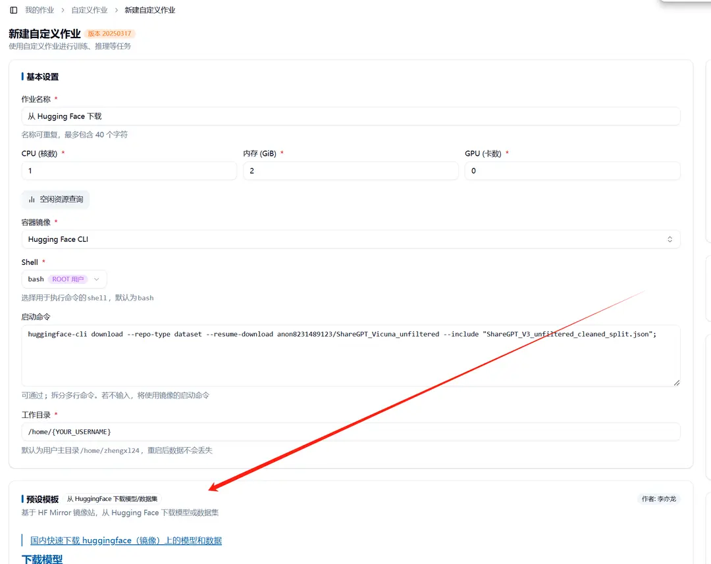
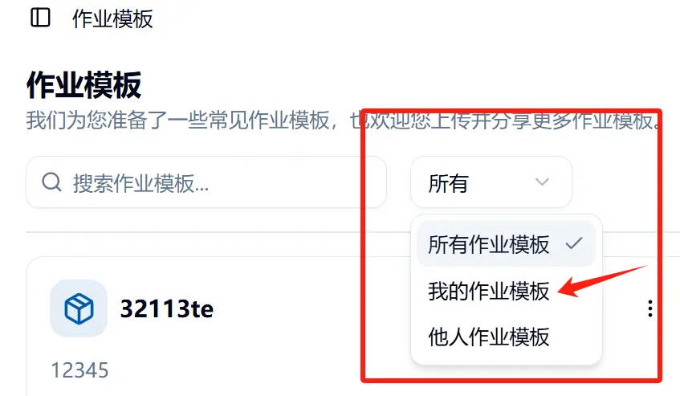
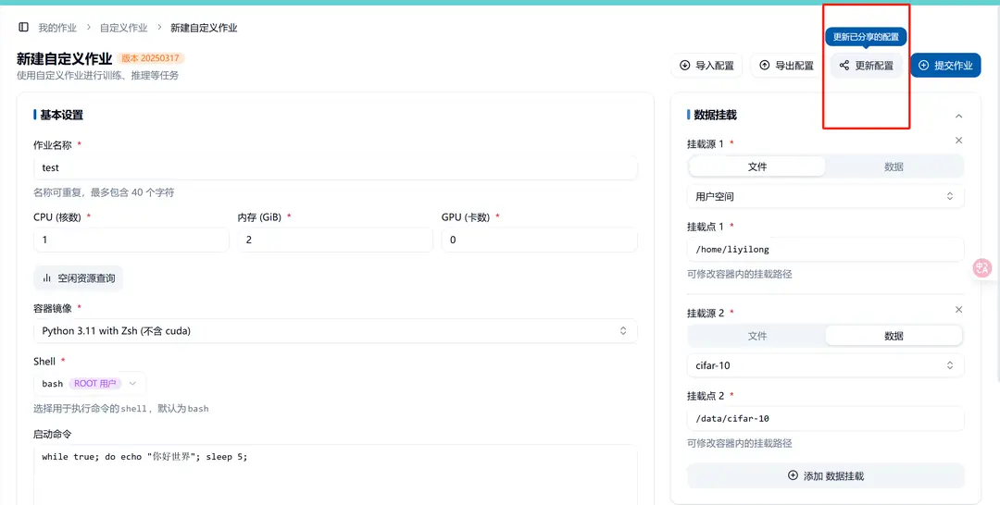

## What is a Job Template

A job template is a way for users to share the startup process of their jobs with others. For example, if you need to repeatedly submit similar batch jobs or want to share your batch job startup method with others, you can use this method. At the same time, users can also quickly reproduce some functions through job templates shared by other users.

## Creating a Job Template

In the top right corner when creating a job, there is a "Share Configuration" button. This button allows you to create a job template and share it.

When creating, you can write a markdown document to add more detailed usage instructions for the job template. The usage instructions will appear in the lower left of the job template.

## Updating and Deleting a Job Template

A job template can only be updated or deleted by its creator. The creator can select their own job templates through a filter box to update or delete them.

### Updating a Job Template

In the job template interface, click on the template you want to update to go to the job template details page. You can update the job template by updating the configuration.

### Deleting a Job Template

On the job template page, you can select delete by clicking on the identifier in the top right corner of the job template you want to delete.

