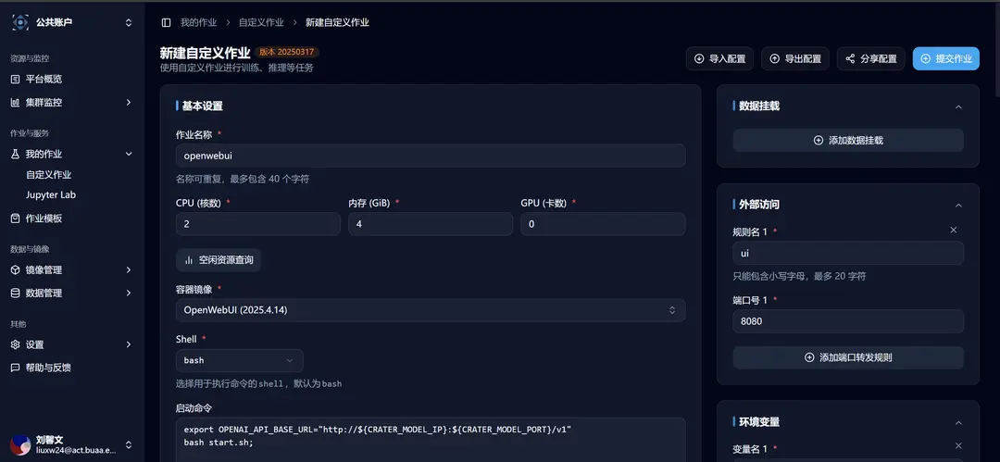
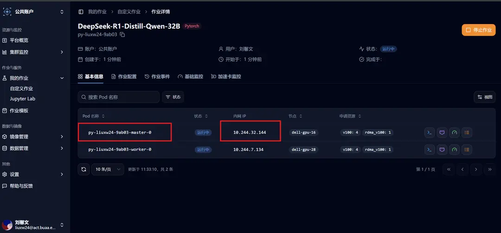

# 快速部署 DeepSeek R1 分布式推理

**作业模板** 栏目提供了 **DeepSeek R1 分布式推理** 的任务模板，您可以直接选取该模板快速部署 DeepSeek R1 分布式推理，也可以启动 Web UI 界面和大模型交互。

## 选取模板创建作业

点击侧边栏的作业模板，之后选取 **DeepSeek R1 分布式推理** 模板。


选取后跳转到新建自定义作业界面，可以看到相关模板参数已经填写完成：


## 启动命令及常见问题

### 启动命令

模板中的启动命令为：

```bash
ray start --head --port=6667 --disable-usage-stats;
NCCL_DEBUG=TRACE python3 -m vllm.entrypoints.openai.api_server \
--model=/models/DeepSeek-R1-Distill-Qwen-32B \
--max-model-len 32768 \
--tensor-parallel-size 4 \
--pipeline-parallel-size 2 \
--gpu-memory-utilization 0.90 \
--max-num-seqs 128 \
--trust-remote-code \
--disable-custom-all-reduce \
--port 8000 \
--dtype=half;
```

### 常见问题

> 问题 1：ValueError: Bfloat16 is only supported on GPUs with compute capability of at least 8.0. Your Tesla V100-SXM2-32GB GPU has compute capability 7.0. You can use float16 instead by explicitly setting the dtype flag in CLI, for example: --dtype=half.

回答 1：添加 vLLM 启动参数--dtype=half，该问题主要原因是很多加速算子在 v100 上跑不起来的无奈之举，现在很多高性能算子都是有一定的硬件限制

> 问题 2：如何预估需要申请多少算力？

回答 2：显存用量（最少） >= 模型参数量 \* 部署位宽（bit）/ 8，例如实例中使用 32b 的模型采用 16bit 进行部署，则最少需要 64GB 显存，crater 中一张 v100 的显存为 32GB，实际上 3-4 张 v100 就有可能跑起来，不用这块为了测试多机便用了 8 张卡

> 问题 3：可以用 sglang 吗？

回答 3：sglang 框架不支持使用 7.0 的显卡进行部署，vllm 有些功能也不太支持在 v100 上用（具体有哪些可以自行去翻一翻 vllm 的文档和 issue 区）

至此，您已经可以和使用作业模板快速部署的 DeepSeek R1 32b 模型对话啦 🥳！

## 启动 Web UI 界面和大模型交互

**Open WebUI 客户端模板** 用于和模型部署类型的模板配合，提供友好的大模型试用体验。

点击侧边栏的作业模板，之后选取 **Open WebUI 客户端** 模板。


选取后跳转到新建自定义作业界面，可以看到相关模板参数已经填写完成：



使用 **DeepSeek R1 分布式推理** 的任务模板在 Crater 平台启动大模型推理服务后，您需要修改环境变量第一条，OpenAI 服务的地址：

对于多机部署模型的情况，对应于作业的「基本信息」处，**Ray Head 节点的「内网 IP」**



Open WebUI 成功启动后，进入详情页，点击「外部访问」，我们已经设置好了转发，点击即可访问。


开始享受您的大模型之旅吧 🥳！
