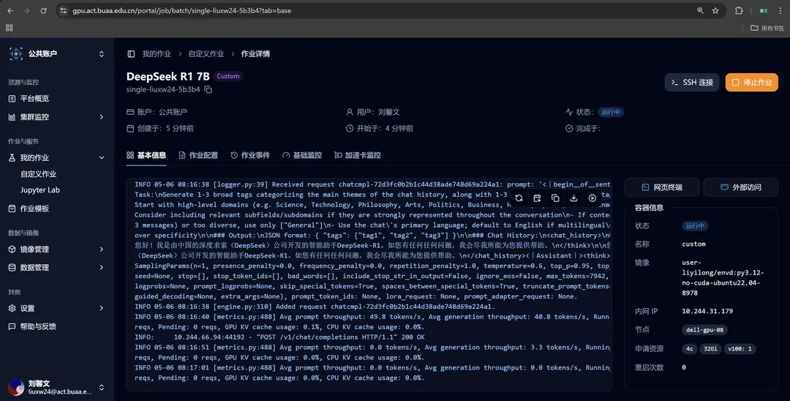

# DeepSeek R1 単体推論の高速展開

**ジョブテンプレート**セクションには **DeepSeek R1 単体推論** のタスクテンプレートが用意されており、このテンプレートを選択することで DeepSeek R1 単体推論を高速に展開できます。また、Web UI インターフェースを起動し、大規模モデルと対話することも可能です。

## テンプレート選択によるジョブ作成

サイドバーのジョブテンプレートをクリックし、その後 **DeepSeek R1 単体推論** テンプレートを選択してください。


選択後、カスタムジョブの新規作成画面に移動し、関連するテンプレートパラメータがすでに埋め込まれていることが確認できます。


## 起動コマンドの説明

テンプレート内の起動コマンドは以下の通りです：

```bash
vllm serve ./deepseek-r1-7b --dtype=half --enable-chunked-prefill=False --max-model-len=8192
```

各パラメータの説明は以下の通りです：

- ./deepseek-r1-7b

  - 使用するモデルのパスを指定します。現在の作業ディレクトリ内の deepseek-r1-7b フォルダには、モデルの重みファイルや設定ファイルなどの必要な情報が含まれています（Jupyter ジョブを起動する際にはマウントされます。必要に応じて自分のモデルパスを指定することも可能です）

- --dtype=half

  - モデルパラメータのデータタイプを半精度浮動小数点（float16）に指定します

- --enable-chunked-prefill=False

  - チャンク付きプリフィル機能を無効化します

- --max-model-len=8192

  - モデルが処理できる最大入力長を 8192 のトークン（tokens）に指定します

> 上記の後ろの 3 つのパラメータは、**申請した GPU のモデルに応じて各自で調整できます**。ここでは、**V100 上で正常に動作することを保証するため、vLLM の一部の機能を無効化しています**。
> vLLM serve で指定可能なパラメータの完全な説明については、[Engine Arguments](https://docs.vllm.ai/en/latest/serving/engine_args.html) を参照してください。

## ジョブの成功実行

ジョブを提出し、ジョブが実行されるのを待ちます。ジョブの詳細ページに移動し、「基本情報」欄でリアルタイム出力を確認できます。モデルが正常に実行されていることが確認できます。



ウェブ端末をクリックして、curl コマンドを使用してサービスにリクエストを送信できます。例は以下の通りです：

```bash
curl http://localhost:8000/v1/chat/completions \
  -H "Content-Type: application/json" \
  -d '{
  "model": "./deepseek-r1-7b",
  "messages": [
    {"role": "user", "content": "人工知能における深層学習と機械学習の違いは？"}
  ]
}'
```

これで、ジョブテンプレートを用いて高速に展開された DeepSeek R1 7b モデルと会話できます 🥳！

## Web UI インターフェースの起動と大規模モデルとの対話

**Open WebUI クライアントテンプレート**は、モデルデプロイメントタイプのテンプレートと併用して、大規模モデルの試用体験を提供します。

サイドバーのジョブテンプレートをクリックし、その後 **Open WebUI クライアント** テンプレートを選択してください。


選択後、カスタムジョブの新規作成画面に移動し、関連するテンプレートパラメータがすでに埋め込まれていることが確認できます。


Crater プラットフォームで **DeepSeek R1 単体推論** のタスクテンプレートを使用して大規模モデル推論サービスを起動した後、環境変数の最初の項目を変更する必要があります。OpenAI サービスのアドレスを指定してください。

単体デプロイメントモデルの場合、ジョブの「基本情報」欄にある「内網IP」に該当します。


Open WebUI が正常に起動した後、詳細ページに移動し、「外部アクセス」をクリックしてください。すでに転送設定が済んでいますので、クリックするだけでアクセスできます。


大規模モデルとの冒険を楽しんでください 🥳！