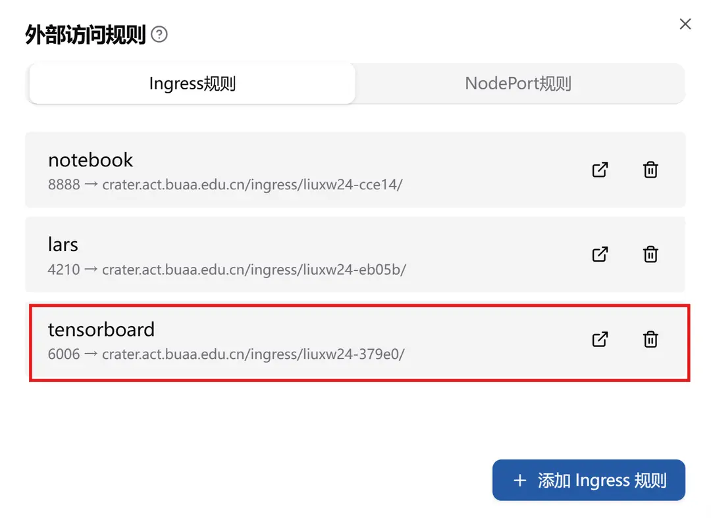
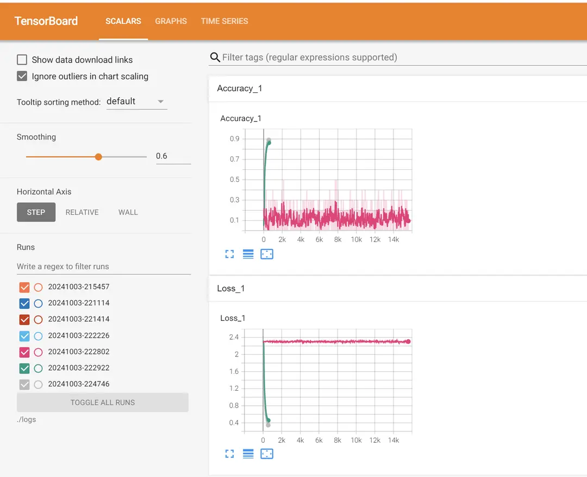

## 1.1 기능 소개

**Ingress 규칙**은 HTTP 또는 HTTPS 프로토콜을 통해 Kubernetes 클러스터 내부의 서비스를 외부로 노출시킵니다. 이는 **TensorBoard**, **Visdom**, **Jupyter** 등의 웹 기반 애플리케이션에 적합합니다. Ingress 규칙을 사용하여 외부 사용자가 특정 경로를 통해 서비스에 액세스하도록 할 수 있습니다.

예를 들어, TensorBoard 또는 Visdom을 통해 서비스에 액세스하고자 한다면, 컨테이너 내에서 해당 포트로 서비스를 노출시키고, 클러스터 내부의 서비스에 매핑해야 합니다. Ingress 컨트롤러는 이러한 요청을 자동으로 처리하여 클러스터 내부의 서비스로 전달하며, 필요에 따라 HTTPS 및 HTTP 프로토콜을 지원합니다.

**장점**:

- 웹 서비스 노출에 적합합니다.
- HTTP/HTTPS 프로토콜을 지원합니다.

**사용 시나리오**:

- TensorBoard 액세스.
- Visdom 액세스.
- Jupyter Notebook 액세스.

**전달 경로**: 모든 액세스 경로는 다음과 같은 통일된 형식을 따릅니다: `crater.act.buaa.edu.cn/ingress/{userName}-{uuid}`. 여기서, `userName`은 사용자 이름이며, `uuid`는 특정 서비스를 가리키는 자동 생성된 5자리 식별자입니다.


설정이 완료되면 해당 Pod의 `Annotations`에 다음과 같은 내용을 볼 수 있으며, `ingress.crater.raids.io`를 `key` 값으로 사용합니다:

```yaml
metadata:
  annotations:
    crater.raids.io/task-name: tensorboard-example
    ingress.crater.raids.io/lars: '{"Name":"lars","Port":4210,"Prefix":"/ingress/liuxw24-eb05b/"}'
    ingress.crater.raids.io/tensorboard: '{"Name":"tensorboard","Port":6006,"Prefix":"/ingress/liuxw24-379e0/"}'
    ingress.crater.raids.io/notebook: '{"Name":"notebook","Port":8888,"Prefix":"/ingress/liuxw24-cce14/"}'
```

## 1.2 사용 예시

웹 애플리케이션을 외부에 노출시키고자 할 때 **Ingress 규칙**을 사용할 수 있습니다. 예를 들어, TensorBoard에 대한 Ingress 규칙을 설정하여 외부 사용자가 브라우저를 통해 서비스에 액세스할 수 있도록 할 수 있습니다.

### Ingress 외부 액세스 규칙 설정

**Ingress 외부 액세스 규칙을 설정하는 단계는 다음과 같습니다:**

1. 작업 세부 정보 페이지에서 **외부 액세스 규칙 설정**을 클릭합니다.

   

2. 팝업된 대화창에서 **"Ingress 규칙 추가"**를 클릭하고, 해당 **규칙 이름**(소문자만 허용, 20자 이하, 중복 불가)과 **컨테이너 포트**를 입력한 후, 저장을 클릭합니다.

   

3. 저장이 성공적으로 완료되면 **대응하는 Ingress 규칙**을 볼 수 있습니다.

   

**예시 설정**:

```json
{
  "Name": "tensorboard",
  "Port": 6006,
  "Prefix": "/ingress/liuxw24-379e0/"
}
```

**필드 설명**:

- **포트 번호** (`port`): 사용자 정의 포트 번호, 여기서는 `6006`으로 설정되며, TensorBoard의 기본 포트이기 때문입니다.
- **액세스 경로** (`prefix`): 액세스 경로는 `crater.act.buaa.edu.cn/ingress/{userName}-{uuid}`로 매핑됩니다. 여기서, `userName`은 사용자 이름이며, `uuid`는 자동 생성된 5자리 식별자입니다.

### 컨테이너 내에서 TensorBoard 실행

> TensorBoard는 깊은 학습 모델 훈련 과정 및 관련 데이터를 시각화하는 도구입니다. 일반적으로, TensorBoard는 로컬의 기본 URL(`http://localhost:6006/` 등)에서 서비스를 시작하여 데이터를 표시합니다. 그러나 일부 시나리오에서는, 예를 들어 서버 환경이나 역방향 프록시를 통해 액세스할 때, TensorBoard를 정확하게 액세스할 수 있도록 사용자 정의 baseurl을 지정해야 합니다.

**baseurl을 지정하는 방법** (명령행을 통해 실행하는 예시로):

명령행을 통해 TensorBoard를 실행할 때는 `--logdir` 파라미터로 로그 디렉터리를 지정하고, `--bind_all` 및 `--path_prefix` 파라미터를 사용하여 baseurl 관련 설정을 지정할 수 있습니다.

예를 들어, TensorBoard의 로그 디렉터리가 `/path/to/logs`이고, baseurl을 `/tensorboard`로 설정하고자 한다면 다음 명령을 사용할 수 있습니다:

```bash
tensorboard --logdir=/path/to/logs --bind_all --path_prefix=/tensorboard
```

여기서, `--bind_all` 파라미터는 TensorBoard가 모든 네트워크 인터페이스에 바인딩하도록 하여 다른 머신에서도 액세스할 수 있도록 합니다(필요한 경우).

`--path_prefix` 파라미터는 baseurl을 지정하는 데 사용됩니다. 이 예시에서는 `http://your_server_ip:6006/tensorboard`와 같은 URL을 통해 TensorBoard에 액세스할 수 있습니다(여기서 기본 포트는 6006으로 가정).

**컨테이너 내에서 TensorBoard를 실행하고 관련 설정을 수행하는 단계는 다음과 같습니다:**

터미널 또는 명령 프롬프트를 열고 다음 명령을 실행합니다:

```bash
tensorboard --port {port} --logdir {your-logs-dir} --bind_all --path_prefix={your-ingress-prefix}
```

각 파라미터에 대한 설명은 다음과 같습니다:

- `port`: 포트를 지정, 기본값은 6006입니다.
- `{your-logs-dir}`: 사용자가 지정한 훈련 데이터의 출력 디렉터리(예: `./logs`)
- `--bind_all`: TensorBoard가 모든 네트워크 인터페이스에 바인딩하여 다른 머신에서도 액세스할 수 있도록 합니다.
- `{your-ingress-prefix}`: 지정된 Ingress 액세스 경로, 예시에서는 `/ingress/liuxw24-379e0`입니다(참조: Ingress 액세스 규칙 설정 부분)

**액세스 방법**:

- 사용자는 `gpu.act.buaa.edu.cn/ingress/{userName}-{uuid}` 경로를 통해 TensorBoard에 액세스할 수 있으며, 다음과 같은 페이지를 볼 수 있습니다:

  