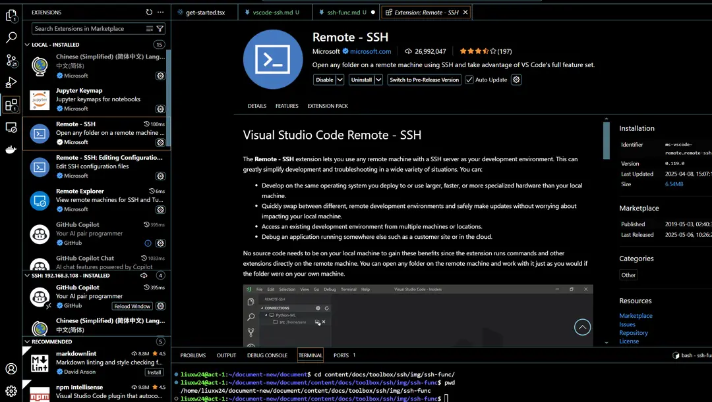
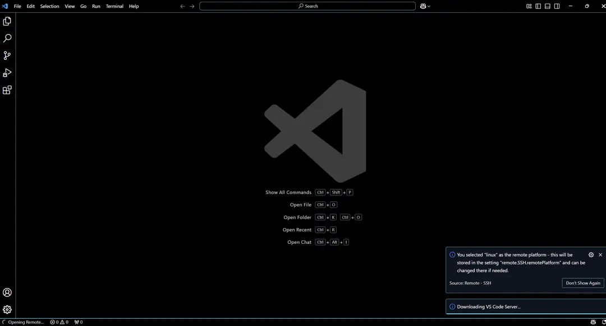

## Configure Password-less SSH Login

You can use `authorized_keys` to configure password-less login, uploading your public key (usually `id_rsa.pub`) to the server (the generation process can be referred to in the section "Ensure that your local machine has generated public and private keys" in [Connect VSCode to Jupyter Container](./vscode-ssh.md)).

- If the `.ssh` folder does not exist, you can create it using the following command and set the appropriate permissions:

```bash
mkdir ~/.ssh
chmod 700 ~/.ssh
```

- Add your local public key to the `~/.ssh/authorized_keys` file:

```bash
# Copy the content of your local id_rsa.pub file to ~/.ssh/authorized_keys
vim ~/.ssh/authorized_keys
# Set appropriate permissions for authorized_keys
chmod 600 ~/.ssh/authorized_keys
```

This process **only needs to be done the first time you connect**, and no additional operations are required for subsequent connections after the configuration is completed.

## Create a Task Using an Image with SSHD

The official images provided by the platform **already include SSHD**, so no additional installation is required 🚀.

If you need to use a custom image, ensure that the image you build already includes SSHD.

## One-click Copy Connection Command

Go to the **Job Details Page**, and click the **"SSH Connection"** button in the top right corner of the page.


After clicking, the following dialog box will appear:


You can copy the connection commands for Terminal and VSCode as needed.

## Terminal Connection

Enter the copied command in Terminal to connect to the container.


## VSCode Connection

(1) Install the Remote-SSH extension in VSCode, as shown below:



(2) Click the remote connection icon in the lower left corner of VSCode, and select **"Remote - SSH: Connect to Host"** from the menu.

(3) If it's your first connection, VSCode will prompt you to select the operating system type. Choose the corresponding operating system (such as Linux).

(4) Wait for VSCode to install the necessary components on the remote server (this step may take a longer time).



(5) After the installation is complete, VSCode can connect to the container.

