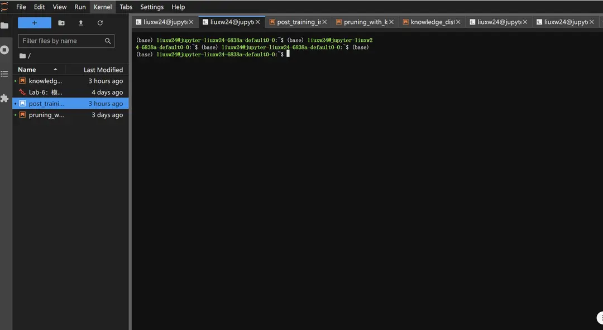

# VSCode を Jupyter コンテナに接続する

Jupyter ジョブを作成した後、VSCode を使って直接コンテナ環境に接続できるようサポートしています。これにより、VSCode のコード補完やデバッグ機能、豊富な拡張機能などを活用し、開発効率とユーザー体験を向上させることができます。

## 本機に公開鍵と秘密鍵が生成されていることを確認する

開始する前に、本機に公開鍵と秘密鍵ファイルが生成されていることを確認してください。通常は `C:\Users\<ユーザー名>\.ssh` または `~/.ssh` ディレクトリに保存されています。例えば次のように：

```bash
C:\Users\<ユーザー名>\.ssh\id_rsa
C:\Users\<ユーザー名>\.ssh\id_rsa.pub

~/.ssh/id_rsa
~/.ssh/id_rsa.pub
```

生成されていない場合は、次のコマンドで生成できます：

```bash
ssh-keygen -t rsa -b 4096 -C "your_email@example.com"
```

## Jupyter ジョブの作成

ユーザーが Jupyter ジョブを作成します。具体的な作成方法については [インタラクティブなジョブ](../quick-start/interactive.md) を参照してください。作成されたジョブの例は以下の通りです：


「インタラクティブページ」をクリックして Jupyter Notebook に移動します。



## コンテナ内で SSHD をインストールする

**SSHD（SSH Daemon）**：SSHD は SSH サービスのデーモンで、指定されたポートで SSH 接続リクエストを監視し、それに応じたサービスを提供します。SSHD をインストールして実行することで、コンテナが SSH プロトコルを通じてリモートアクセスできるようになります。

### OpenSSH サーバーのインストール

```bash
sudo apt update
sudo apt install -y openssh-server
```

### SSH サービスが正常に起動しているか確認する

以下のコマンドを実行して、`sshd` がインストールされているかを手動で確認できます。

```bash
ps -ef | grep sshd
```

また、`service` コマンドを使って SSHD の起動状態を確認および管理することもできます。

**service コマンドで ssh サービスを再起動する**

```bash
sudo service ssh restart
```

**状態の確認**

```bash
sudo service ssh status
```

出力例は以下の通りです：

```bash
(base) liuxw24@jupyter-liuxw24-6838a-default0-0:~$ sudo service ssh restart
 * Restarting OpenBSD Secure Shell server sshd                       [ OK ]
(base) liuxw24@jupyter-liuxw24-6838a-default0-0:~$ sudo service ssh status
 * sshd is running
```

### 22 ポートが正常にリスニングされているか確認する

以下のコマンドで `22` ポートがリスニングされているかを確認してください。

```bash
sudo netstat -tuln | grep 22
```

すべて正常であれば、`sshd` サービスは指定されたポートでリスニングし、接続を受け付けます。

### SSH のパスワードなし認証を設定する

`authorized_keys` を使用してパスワードなし認証を設定できます。ローカルの公開鍵（通常は `id_rsa.pub`）をサーバーにアップロードします（「本機に公開鍵と秘密鍵が生成されていることを確認する」セクションで説明されています）。

- `.ssh` フォルダが存在しない場合は、以下のコマンドで作成し、適切な権限を設定します。

```bash
mkdir ~/.ssh
chmod 700 ~/.ssh
```

- 本機の公開鍵を `~/.ssh/authorized_keys` ファイルに追加します。

```bash
# 本機の id_rsa.pub ファイルの内容を ~/.ssh/authorized_keys にコピー
vim ~/.ssh/authorized_keys
# authorized_keys に適切な権限を設定
chmod 600 ~/.ssh/authorized_keys
```

## NodePort ルールの設定

外部アクセスルールの **NodePort ルール** を設定することで、サービスポートを公開し、VSCode から Jupyter コンテナに接続できます。

NodePort ルールを使用すると、クラスタノードの IP アドレスと指定されたポート番号を通じてアクセスできます。クラスター内のノードに SSH で接続したい場合は、Kubernetes がそのサービスにポートを自動的に割り当て、外部からそのポート番号を通じてアクセスできます。

Jupyter ジョブの詳細ページで NodePort ルールを作成します。詳細な作成手順については [NodePort アクセスルールの設定](../toolbox/external-access/nodeport-rule.md) を参照してください。


**フィールドの説明**：

- **コンテナポート番号** (`containerPort`)：SSH サービスに使用する **22** ポートを選択してください。
- **クラスタノードアドレス** (`address`)：クラスタの任意のノードの IP アドレス。この例では `192.168.5.30` です。
- **割り当てられた NodePort ポート** (`nodePort`)：Kubernetes が 30000 から 32767 の範囲から自動的にポート番号を割り当てます。この例では `32310` です。

## VSCode の設定

### Remote-SSH 拡張のインストール

VSCode に Remote-SSH 拡張をインストールします。


### **Remote.SSH Config** ファイルの設定

設定で **Remote.SSH Config** ファイルのパスを指定します。


config ファイルの設定例は以下の通りです：

```yaml
Host 192.168.5.30
HostName 192.168.5.30
LogLevel verbose
IdentityFile C:\Users\lxw\.ssh\id_rsa
Port 32310
User liuxw24
```

各フィールドの説明は以下の通りです：

- `Host`：Host IP、NodePort ルールの `Host IP` を参照してください。この例では `192.168.5.30` です。
- `IdentityFile`：秘密鍵ファイルへのアクセスパスを指定します。
- `Port`：接続するポート番号、NodePort ルールの `NodePort ポート番号` を参照してください。この例では `32310` です。
- `User`：ユーザー名

設定が完了すると、VSCode 内で NodePort を使用して Jupyter コンテナに接続できます。

