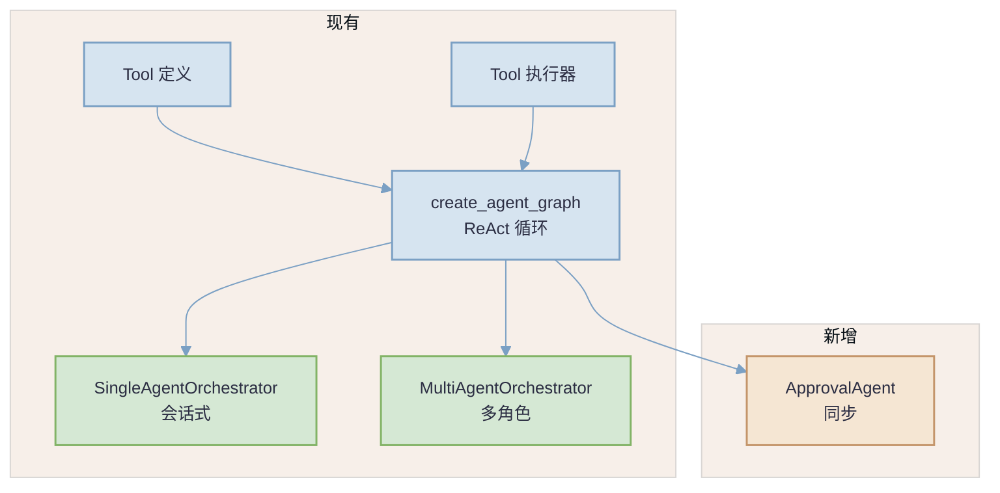
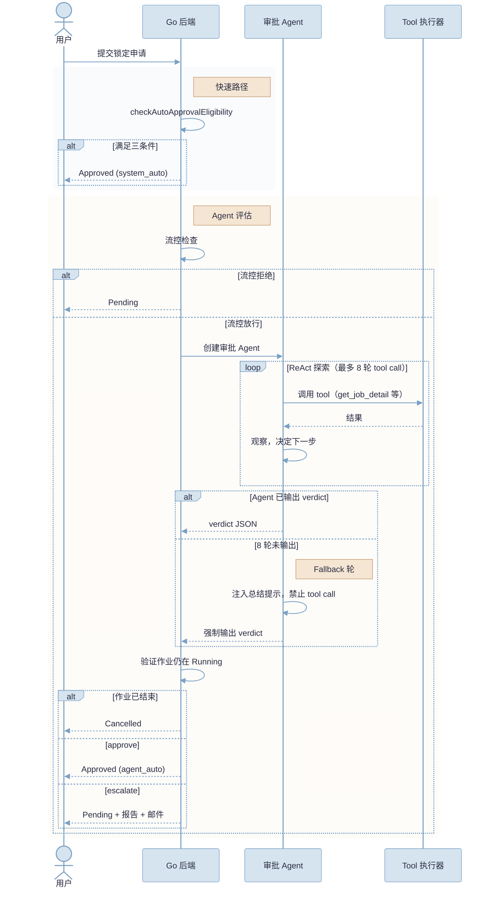
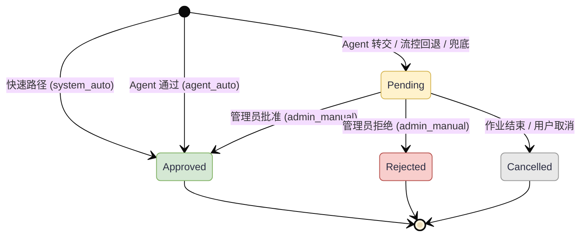
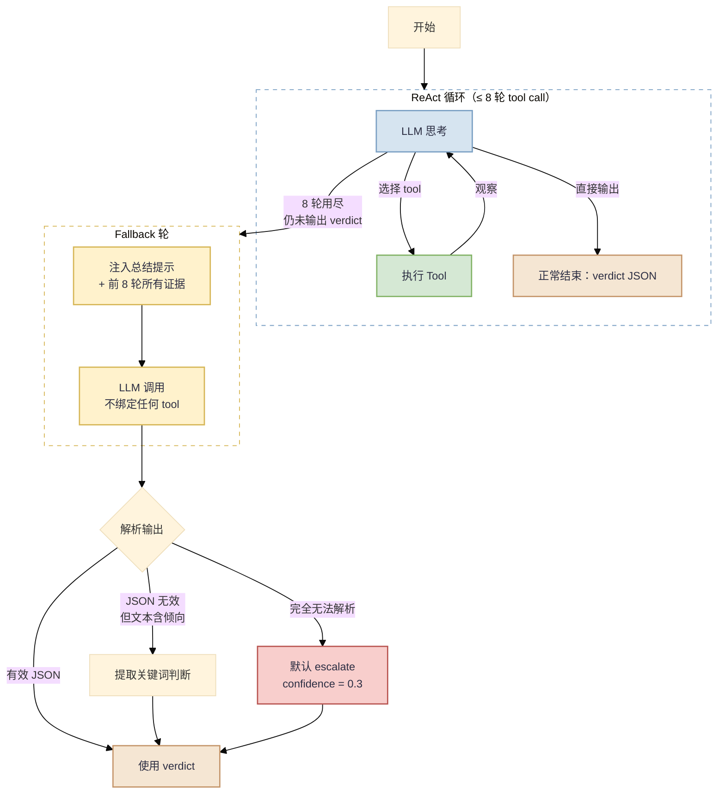
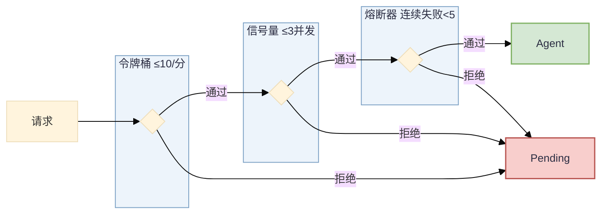

# 基于 Agent 的作业锁定工单智能审批

## 文档状态：草案，待 Review

---

## 一、背景与动机

### 1.1 现状

用户提交锁定工单（ApprovalOrder），申请延长**正在运行**的作业的锁定时间，
防止被平台 4 个自动清理器回收。

当前审批逻辑只有一条快速路径：Go 后端的 `checkAutoApprovalEligibility`
硬编码检查三个条件：
1. 工单类型为 `job`（非 `dataset`）
2. 申请延长小时数 < 12
3. 该用户 48 小时内未获得过自动审批

全满足 → 立即通过并锁定。否则 → 工单 `Pending`，等管理员人工审批。

### 1.2 工单状态（与作业状态区分）

| 工单状态 | 含义 |
|---------|------|
| `Pending` | 等待审批（非快速路径的初始态） |
| `Approved` | 已通过，作业已锁定 |
| `Rejected` | 管理员拒绝 |
| `Cancelled` | 作业已结束或用户取消 |

锁定申请的前提是**作业 Running**，这和作业的 Pending（排队等调度）无关。

### 1.3 目标

在快速路径之后、人工审批之前，引入**审批 Agent**。Agent 复用现有
ReAct 框架和 tool 体系，自主调用工具查询作业信息、资源使用、队列状态等，
做出判断：**通过**或**转交管理员并附评估报告**。

Agent 不拒绝，只通过或转交。拒绝是人的决策。

---

## 二、设计核心

### 2.1 复用 Agent 框架

不做纯 LLM 调用。Agent 自主决定调查路径——批处理查 GPU 利用率，
Jupyter 查会话时长和队列，资源密集型查集群容量和排队。

复用 `create_agent_graph` 的 ReAct 循环，配以专用 prompt、受限
tool 集、tool call 上限和结构化输出。同步执行，不走 SSE 流式。

### 2.2 架构定位



### 2.3 可扩展性

每种工单类型 = 不同 system prompt + 不同 tool 白名单，复用同一套
ReAct 图和执行器。当前只做作业锁定，未来可扩展到数据集、配额、
节点维护等工单类型。

---

## 三、审批流程

### 图 1：整体时序



### 图 2：工单状态机



---

## 四、ReAct 循环终止与 Fallback

### 4.1 正常终止

Agent 在 1-8 轮 tool call 之内的任何时刻，如果 LLM 不再调用 tool
而是直接输出包含 verdict JSON 的文本，ReAct 循环正常终止。

### 4.2 Fallback 轮（第 9 轮）

当 8 轮 tool call 用尽但 Agent 仍未输出 verdict：

1. 收集前 8 轮所有 tool 调用结果作为上下文
2. 发起**独立的 LLM 调用**，**不绑定任何 tool**
   （LLM 无法进入 tool node，只能进入输出 node）
3. 注入总结提示："你已用完所有工具调用。基于以上收集到的信息，
   直接输出你的最终 verdict JSON。"
4. 解析 LLM 输出

### 图 3：Fallback 流程



### 4.3 解析优先级

| 优先级 | 条件 | 结果 |
|--------|------|------|
| 1 | LLM 输出包含有效 verdict JSON | 直接使用 |
| 2 | JSON 无效，但文本中含"通过"/"approve" | approve，confidence 降至 0.5 |
| 3 | JSON 无效，但文本中含"转交"/"escalate"/"人工" | escalate |
| 4 | 完全无法解析 | escalate，confidence = 0.3 |
| 5 | Agent 整体超时 | 不调 Agent，Pending 等管理员 |

### 4.4 作业状态验证

verdict 确定后、锁定之前，验证作业仍在 Running。
如果作业已在评估期间结束 → 工单设为 `Cancelled`。

---

## 五、Tool 白名单

审批 Agent 只用只读工具，不执行任何写操作：

| Tool | 用途 |
|------|------|
| `get_job_detail` | 作业类型、资源规格、运行时长 |
| `get_job_events` | 调度、重启等事件 |
| `query_job_metrics` | GPU 利用率趋势 |
| `check_quota` | 配额使用情况 |
| `analyze_queue_status` | 队列压力 |
| `get_realtime_capacity` | 集群资源可用情况 |
| `list_cluster_jobs` | 同用户其他作业 |
| `get_approval_history`* | 近期审批记录 |

*新增 tool，查指定用户近 N 天审批工单。

Agent 根据查到的作业类型和资源规格自行决定需要深入查哪些维度。

---

## 六、评估判断原则（System Prompt）

**倾向通过**：配额充足、延长合理、队列无压力、作业有活跃迹象。

**倾向转交**：占用大量资源且队列有等待；批处理 GPU 利用率持续近零；
频繁申请（7 天 3+ 次）；长时间延长 + 高价值资源。

**交互式作业（Jupyter/WebIDE）**：不以 GPU 利用率为主要信号，
用户可能在配环境、调试或做 CPU 计算。主要看会话时长、申请频率、
队列压力，默认宽松。

**信号缺失**：不做假设，倾向转交。

---

## 七、实现：复用现有 Agent 基础设施

### 7.1 原则：统一基础，差异化配置

现有 Agent 框架已有完整的 token 管理、消息压缩、tool 观察构建管线。
**ApprovalAgent 不重写这些**，只做差异化配置。

**关键发现：`create_agent_graph` 已原生支持 tool 子集。**
`graph.py` 的 `get_enabled_tools(context)` 会检查
`context["capabilities"]["enabled_tools"]`，如果传入了 tool 名列表，
只绑定这些 tool 到 LLM。所以 ApprovalAgent **不需要修改
`create_agent_graph`**，只需正确构造 context 即可。

绑定 8 个 tool（~500 tokens schema）vs 全量 88 个 tool
（~8000 tokens schema），可节省约 7500 tokens 上下文。

| 基础设施 | 现有实现 | ApprovalAgent 复用 |
|---------|---------|-------------------|
| ReAct 循环 | `create_agent_graph` | **零改动**，通过 context 传 tool 白名单 |
| Tool 子集绑定 | `get_enabled_tools` + `capabilities.enabled_tools` | **零改动**，已支持 |
| Tool 结果截断 | `_build_tool_observation` + per-tool token budget | 完全复用 |
| LLM 超限压缩 | `_proactive_compact` + `compact_messages_with_llm` | 完全复用 |
| Token 计数 | `count_tokens` / `count_message_tokens` | 完全复用 |
| LLM 客户端 | `ModelClientFactory` | 复用，可配独立 client_key |
| Tool 执行器 | `CompositeToolExecutor` | 复用，tool call 走 Go 后端 |
| 重试与错误处理 | `BaseRoleAgent` 的 retry + exponential backoff | Fallback 轮继承 |
| JSON 解析修复 | `BaseRoleAgent.run_json` 的 repair loop | Fallback 轮使用 |
| 会话历史 | `build_history_messages` | 不加载（单次评估无历史） |
| Skills | `load_all_skills` | 不加载（不需诊断知识） |
| Tool 角色过滤 | `select_tools_for_context` | 由白名单取代 |

### 7.2 与其他 Agent 的差异

| 维度 | SingleAgent / MultiAgent | ApprovalAgent |
|------|--------------------------|---------------|
| 执行模式 | 流式 SSE | 同步 run-to-completion |
| 会话历史 | 加载并压缩 | 无（单次评估） |
| System prompt | `build_system_prompt` 全量（~3000 tokens） | 审批专用（~800 tokens） |
| Skills 知识 | 加载诊断 YAML | 不加载 |
| Tool 绑定 | 全量或按角色（53-88 个） | 固定白名单（8 个） |
| Tool schema 开销 | ~8000 tokens | ~500 tokens |
| 写操作 tool | 有（需确认） | 无 |
| Tool call 上限 | 由 config 控制 | 8 |
| Fallback | 压缩重试 | 无 tool 的 LLM 调用 |
| 输出格式 | 自然语言 | 结构化 JSON verdict |

### 7.3 crater-agent 实现

**新文件**：`crater_agent/agents/approval.py`

```python
from crater_agent.agents.base import BaseRoleAgent
from crater_agent.agent.graph import create_agent_graph
from crater_agent.tools.executor import CompositeToolExecutor

class ApprovalAgent:
    """工单审批 Agent。
    
    复用 create_agent_graph 的 ReAct 循环，通过 context 传入 tool 白名单。
    不修改 create_agent_graph，只利用现有 capabilities.enabled_tools 机制。
    """
    
    ALLOWED_TOOLS = [
        "get_job_detail", "get_job_events", "query_job_metrics",
        "check_quota", "analyze_queue_status", "get_realtime_capacity",
        "list_cluster_jobs", "get_approval_history",
    ]
    MAX_TOOL_CALLS = 8
    
    def __init__(self, tool_executor: CompositeToolExecutor, llm):
        self.tool_executor = tool_executor
        self.llm = llm
        self._fallback_agent = BaseRoleAgent(
            agent_id="approval-fallback",
            role="approval",
            llm=llm,
        )
    
    async def evaluate(self, request) -> ApprovalEvalResponse:
        # 1. 构造 context，用现有机制传入 tool 白名单
        context = {
            "capabilities": {
                "enabled_tools": self.ALLOWED_TOOLS,
            },
            "actor": {"role": "system", "user_id": request.user_id},
            "session_id": f"approval-{request.order_id}",
        }
        
        # 2. 用现有 create_agent_graph，零改动
        graph = create_agent_graph(
            tool_executor=self.tool_executor,
            llm=self.llm,
        )
        
        initial_state = {
            "messages": [
                SystemMessage(content=self._build_approval_prompt()),
                HumanMessage(content=self._build_request_message(request)),
            ],
            "context": context,
            "tool_call_count": 0,
            "attempted_tool_calls": {},
            "pending_confirmation": None,
            "trace": [],
        }
        
        # 3. 同步执行（非流式）
        final_state = await graph.ainvoke(initial_state)
        
        # 4. 提取 verdict → fallback
        verdict = self._extract_verdict(final_state)
        if verdict is None:
            verdict = await self._fallback_conclude(final_state)
        
        return verdict
    
    async def _fallback_conclude(self, state) -> ApprovalEvalResponse:
        """Fallback：用 BaseRoleAgent.run_json（无 tool）生成结论。"""
        evidence = self._summarize_evidence(state)
        result = await self._fallback_agent.run_json(
            system_prompt="你是审批助手。基于以下证据直接输出 verdict JSON。",
            user_prompt=f"证据：\n{evidence}\n\n请输出 verdict。",
        )
        if result is None:
            return ApprovalEvalResponse(
                verdict="escalate", confidence=0.3,
                reason="Agent 未能在有限轮次内得出结论",
                admin_summary=f"Agent 收集了证据但未能给出明确判断：\n{evidence}",
            )
        return ApprovalEvalResponse(**result)
```

**不需要修改 `create_agent_graph`** — 已有的 `capabilities.enabled_tools`
机制完全满足需求。

**新端点**：`POST /evaluate/approval`，同步，并发信号量 3。

### 7.4 Go 后端

**新文件**：`backend/internal/service/agent_approval.go`
- `AgentApprovalEvaluator`：HTTP 客户端 + 三层流控

**修改**：`CreateApprovalOrder` 中快速路径失败后调 Agent。

---

## 八、流控



回退原则：Agent 不可用 → Pending 等管理员，不丢失任何请求。

---

## 九、数据模型

```go
ReviewSource ReviewSource `gorm:"type:varchar(32);default:''"`
AgentReport  string       `gorm:"type:text;default:''"`
```

`ReviewSource` 值：`system_auto` / `agent_auto` / `admin_manual`。

---

## 十、报告展示与前端

因为审批 Agent 是纯后端 hook（无前端交互），报告信息需要在现有前端
页面中被动展示。以下是各展示位置的设计。

### 10.1 管理员工单详情页（主要展示位置）

现有 `admin/more/orders/$id.tsx` 已有 4 个 tab：
详情 / 关联工单 / 基础监控 / GPU 监控。

**新增 "Agent 评估" tab**（当 `AgentReport` 字段非空时显示）：

```
┌─────────────────────────────────────────────────┐
│  工单名称: jpt-user01-240418-abc12               │
│  [作业锁定] [Pending] 创建者: user01  2h ago     │
│  [审批来源: Agent 转交]                           │
├─────────────────────────────────────────────────┤
│  详情 │ Agent 评估 │ 关联工单 │ 基础监控 │ GPU   │
│  ─────┼───────────┼─────────┼─────────┼──────  │
│       │           │         │         │        │
│  ┌────┴───────────────────────────────────┐    │
│  │ 评估结论                                │    │
│  │  verdict: escalate  confidence: 0.72   │    │
│  ├────────────────────────────────────────┤    │
│  │ 判断依据                                │    │
│  │  该作业占用 4 张 V100，GPU 利用率近 6    │    │
│  │  小时均值 3.2%，同时有 8 个作业在排队    │    │
│  │  等待 V100 资源。建议管理员与用户沟通。  │    │
│  ├────────────────────────────────────────┤    │
│  │ 调查过程                                │    │
│  │  1. get_job_detail → pytorch-ddp, 4xV100│   │
│  │  2. query_job_metrics → GPU 均值 3.2%   │    │
│  │  3. analyze_queue_status → 8 pending    │    │
│  │  4. check_quota → 使用率 78%            │    │
│  └────────────────────────────────────────┘    │
└─────────────────────────────────────────────────┘
```

**实现**：AgentReport 字段存储 JSON，包含 verdict、reason、
signals_used 和 trace（tool 调用记录）。前端解析并分区展示。

### 10.2 管理员工单列表页

在 `admin/more/orders/index.tsx` 现有统计卡片旁新增：

- 统计卡片增加 "Agent 自动通过" 计数
- 表格增加 "审批来源" 列（ReviewSource badge）
- 增加筛选项："Agent 转交"（快速定位需要人工处理的工单）
- Agent 转交的行用浅黄色背景高亮

### 10.3 用户侧工单列表

在 `portal/more/orders/index.tsx`：
- 状态 badge 旁显示 ReviewSource（"系统" / "Agent" / "管理员"）
- 如果是 Agent 转交，tooltip 显示 user_message 摘要

### 10.4 Job Lock Sheet（用户提交界面）

在 `job-lock-sheet.tsx` 中，提交后如果返回 "agent_escalated"：
- 显示 toast 通知："您的申请需要管理员审核，已邮件通知您详情"
- 不需要额外交互

### 10.5 API 变更

现有 API 不需要新端点，只需在已有响应中返回新字段：

```typescript
// approvalorder.ts - 响应类型扩展
interface ApprovalOrderResp {
  // ... 现有字段 ...
  reviewSource: string    // "", "system_auto", "agent_auto", "admin_manual"
  agentReport: string     // JSON string, 空字符串表示无报告
}
```

---

## 十一、配置

```go
type AgentApprovalConfig struct {
    Enabled                 bool          // 默认 false
    AgentEndpoint           string
    TotalTimeout            time.Duration // 15s
    MaxPerMinute            int           // 10
    MaxConcurrent           int           // 3
    CircuitBreakerThreshold int           // 5
    CircuitBreakerCooldown  time.Duration // 60s
}
```

---

## 十二、范围

**内**：作业锁定工单 Agent 评估、ReAct + tool、fallback、
流控、通知、审计、前端。

**外**：数据集工单、Agent 拒绝、异步评估、外部消息、
配额/清理器变更。

---

## 十三、实现顺序

| # | 内容 | 涉及文件 | 依赖 |
|---|------|---------|------|
| 1 | DB 迁移 + 回填 | `hack/sql/` | 无 |
| 2 | Go Model 更新 + API 响应新增字段 | `dao/model/approvalorder.go`, `handler/approvalorder.go` | 1 |
| 3 | 新增 `get_approval_history` tool 定义 + Go handler | `tools/definitions.py`, `handler/agent/` | 无 |
| 4 | `ApprovalAgent` 类（复用 graph + BaseRoleAgent，零改动框架） | `agents/approval.py`（新建） | 3 |
| 5 | 审批专用 prompt | `agents/approval.py` 内 | 4 |
| 6 | FastAPI `POST /evaluate/approval` | `app.py` 或新 router | 4 |
| 7 | Go `AgentApprovalEvaluator` + 流控 | `service/agent_approval.go`（新建） | 无 |
| 8 | 接入 `CreateApprovalOrder` + 状态验证 | `handler/approvalorder.go` | 2, 6, 7 |
| 9 | 邮件通知 | `pkg/alert/` | 8 |
| 10 | 审计日志 | `service/operation_log.go` | 8 |
| 11 | 前端：工单详情 Agent 评估 tab | `routes/admin/more/orders/$id.tsx` | 2 |
| 12 | 前端：列表 ReviewSource 列 + 筛选 + 统计 | `routes/admin/more/orders/index.tsx` | 2 |
| 13 | 前端：用户侧 ReviewSource 展示 | `routes/portal/more/orders/index.tsx` | 2 |
| 14 | 测试 | 各层 | 8 |
| 15 | 灰度上线（config Enabled: true） | 部署配置 | 14 |
