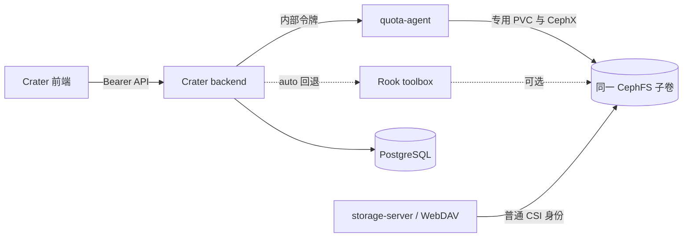

# CephFS 配额管理与 quota-agent 设计说明

本文面向维护 Crater 存储功能的开发者、代码评审者和集群管理员，说明当前 PR 中 CephFS 配额管理的需求、架构、数据流、配置、部署、测试、安全边界和回滚方法。

本文同时作为实现评审说明和平台管理员部署手册。

## 1. PR 概览

### 1.1 要解决的问题

Crater 原有的 WebDAV/storage-server Pod 可以挂载 CephFS 并读取文件，但普通 Ceph CSI 客户端通常没有 MDS `p` 权限，因此会出现以下情况：

- `ceph.dir.rbytes` 可以读取，目录用量能够显示。
- 写入 `ceph.quota.max_bytes` 返回 `permission denied`，即使容器内进程是 `root` 也无法绕过 CephX 权限。
- Rook toolbox 可以作为管理入口，但不是所有集群都部署 toolbox，不能把它作为唯一依赖。
- 直接给通用 CSI 客户端增加 `p` 权限会扩大所有使用该身份的工作负载权限，风险和影响范围过大。

本 PR 引入独立的 `quota-agent` 运行模式，以路径受限的 CephX 身份挂载现有 CephFS 子卷，为后端提供内部目录用量与配额接口。管理员通过显式刷新获取用量，通过单次操作修改配额，并在操作日志中查看配额修改记录。

### 1.2 当前交付范围

当前对外开放并承诺的功能包括：

- 检测当前共享 PVC 是否为受支持的 CephFS CSI 存储。
- 按能力决定前端是否展示存储管理入口、用量和配额修改控件。
- 读取用户、公共和账户目录的 `ceph.dir.rbytes`。
- 管理员手动刷新全部用户目录用量，并把结果缓存到数据库。
- 读取和修改用户目录的 `ceph.quota.max_bytes`。
- 使用 `-1` 表示 Crater 侧的无限制配额，写入 CephFS 时转换为 `0`。
- 记录成功和失败的配额修改操作。
- 在创建作业前实时读取 CephFS 的实际配额和用量，避免缓存误判。
- 在没有 Rook toolbox 的集群中，通过 quota-agent 完成真实 CephFS 配额管理。

当前产品界面和已注册 API 不提供以下功能：

- AI 配额建议。
- 自动扩容或自动缩容入口。
- 定时扫描全部用户目录。
- 目录对比。

### 1.3 主要改动模块

| 模块 | 作用 | 主要路径 |
| --- | --- | --- |
| 后端能力与管理 API | 检测存储能力、刷新用量、修改配额、记录日志 | `backend/internal/handler/storage.go` |
| CephFS Provider | 在 storage-server 与 toolbox 之间选择实现 | `backend/pkg/ceph/` |
| 内部客户端 | 调用 quota-agent 内部 API 并完成令牌认证 | `backend/pkg/storagequota/` |
| quota-agent | 校验路径并直接读写 CephFS xattr | `backend/internal/storage/quota*.go` |
| 用量缓存与准入 | 保存管理员页面的刷新结果；作业准入实时读取 CephFS | `backend/pkg/patrol/patrol.go`、`backend/internal/util/quota.go` |
| 数据模型与迁移 | 用户配额镜像字段、用量缓存表及可逆迁移 | `backend/dao/model/`、`backend/cmd/gorm-gen/models/migrate.go` |
| 前端 | 能力驱动的管理员存储页、文件页用量、配额修改记录 | `frontend/src/routes/admin/storage/`、`frontend/src/components/file/` |
| Helm | 部署 quota-agent、内部 Service 和认证 Secret | `charts/crater/templates/quota-agent/` |
| 运维脚本 | 初始化专用 CephX/PV/PVC，本地无镜像测试 | `backend/hack/` |

## 2. 用户可见行为

### 2.1 管理员存储管理页

后端能力探测成功后，管理员可以：

1. 查看所有用户及其最近一次缓存的目录用量。
2. 查看每条用量的刷新时间。
3. 点击“刷新用量”，依次读取全部用户目录并更新缓存。
4. 设置一个大于 `0` 的字节数作为配额，或设置为无限制。
5. 查看“配额修改记录”，确认操作人、目标用户、旧值、新值、Provider、结果和错误信息。

首次刷新前，用户仍会正常列出，用量显示为未知或等待刷新。刷新允许部分成功，接口返回成功数、失败数和完成时间，单个目录失败不会清空该用户此前的缓存值。

### 2.2 普通用户文件页

当后端返回 `usage_readable=true` 时，文件系统页面可以读取对应目录的实时 CephFS 用量。没有为目录设置配额时，`ceph.dir.rbytes` 仍然可读，因此“显示用量”和“设置配额”是两项独立能力。

当能力不可用时，文件浏览、上传和下载仍按原有 storage-server/WebDAV 流程工作，只隐藏 CephFS 用量或配额相关信息。

### 2.3 配额达到或低于现有用量

CephFS 设置配额不会删除已有文件。如果管理员把配额设置为小于或等于当前用量：

- 现有数据仍保留并可读取。
- 目录后续写入通常会失败，应用可能收到 `ENOSPC` 或空间不足错误。
- Crater 在新作业创建前实时读取 CephFS 配额和用量，因此不会受管理员页面缓存新鲜度影响。

生产环境修改配额前，应先刷新用量，并给业务保留合理余量。

## 3. 总体架构



quota-agent 复用 storage-server 镜像，但通过环境变量切换为受限模式：

```text
CRATER_STORAGE_MODE=quota-agent
```

该模式只注册 `/internal/storage/*`，不提供 WebDAV、文件下载、数据集管理或用户登录接口。它不需要数据库、LDAP、镜像仓库配置或完整 backend 配置。

### 3.1 为什么不直接修改普通 CSI 客户端

CephFS 的 `p` capability 允许设置布局和配额等扩展属性。给 `client.csi-cephfs-node` 等通用身份增加 `p`，会让所有复用该身份并挂载相关文件系统的 Pod 获得更高权限。

quota-agent 使用单独的 CephClient，并把 MDS capability 限制在 Crater 已使用的 `subvolumePath`。这样可以把权限控制在一个组件、一份专用 PVC 和一个 CephFS 子卷内，不改变 WebDAV 或其他业务 Pod 的身份。

### 3.2 为什么容器内 sudo 无法解决

Linux `root` 只决定容器或节点上的本地进程权限。CephFS 服务端还会根据挂载使用的 CephX 客户端 capability 授权。客户端没有 `p` 时，`sudo setfattr`、以 UID 0 运行 Pod 或给容器增加普通 Linux capability 都不能获得 CephFS 配额写权限。

## 4. CephFS 数据语义

本功能使用两个 CephFS 扩展属性：

| xattr | 含义 | 是否要求预先设置配额 |
| --- | --- | --- |
| `ceph.dir.rbytes` | 目录树当前占用字节数 | 否 |
| `ceph.quota.max_bytes` | 目录树最大可用字节数 | 是，仅在配置配额后存在有效限制 |

Crater API 使用以下约定：

- 正整数：具体的字节配额。
- `-1`：无限制。
- `0`：不接受为外部 API 输入；quota-agent 把 `-1` 转换成 CephFS 的 `0` 以取消限制。

示例：4 TiB 的准确字节数为 `4398046511104`。

```json
{
  "quota": 4398046511104
}
```

## 5. Provider 与能力探测

### 5.1 Provider 选择

| Provider | 行为 | 适用场景 |
| --- | --- | --- |
| `storageServer` | 只调用 quota-agent 或兼容的 storage-server 内部接口 | 推荐的生产配置，不依赖 toolbox |
| `toolbox` | 只通过 Rook toolbox 操作 CephFS | 已有 toolbox 的兼容方案 |
| `auto` | 优先调用内部存储服务，能力不足或调用失败时回退 toolbox | 迁移期或需要回退能力的集群 |
| `disabled` | 禁用 CephFS 用量和配额管理 | NFS、其他 CSI 或不需要该功能的集群 |

启用 Helm `quotaAgent.enabled` 后，Chart 会把 backend Provider 固定为 `storageServer`，避免生产链路意外依赖 toolbox。

### 5.2 后端探测顺序

后端不会仅根据配置开关展示页面，而是依次验证：

1. `storage.quota.enabled` 已开启。
2. `storage.pvc.readWriteMany` 已配置。
3. PVC 位于 `namespaces.job` 且已经绑定 PV。
4. PV 的 CSI Driver 与 `cephFSCSIDriver` 一致。
5. 当前 Provider 可以读取目录用量和配额，并在临时目录完成配额写入探测。
6. `auto` 模式下，内部服务能力不足时再探测 toolbox。

能力响应中的关键字段为：

| 字段 | 含义 |
| --- | --- |
| `quota_enabled` | 配置总开关是否开启 |
| `backend` | 检测到的存储后端，支持时为 `cephfs` |
| `quota_provider` | 当前 Provider |
| `storage_server_available` | quota-agent/storage-server 内部接口是否可访问 |
| `toolbox_available` | toolbox 回退是否可用 |
| `usage_readable` | 是否可读取目录用量 |
| `quota_readable` | 是否可读取目录配额 |
| `quota_writable` | 是否可修改目录配额 |
| `reasons` | 能力不可用或降级的具体原因 |

前端展示规则：

- 管理员存储入口要求 `quota_enabled=true` 且 `usage_readable=true`。
- 配额修改控件还要求 `quota_writable=true`。
- 普通文件页仅在 `usage_readable=true` 时请求目录用量。

## 6. 请求与数据流

### 6.1 手动刷新用量

管理员点击刷新后，backend 会按用户依次执行：

1. 根据用户记录和 `storage.prefix.user` 计算相对目录。
2. 通过当前 Provider 读取 `ceph.dir.rbytes`。
3. 在配额可读时读取 CephFS 实际配额，把成功的用量写入 `user_space_sizes`，并同步 `users.space_quota` 镜像；如果当前能力只能读取用量，则只更新用量缓存。
4. 保留失败用户的旧缓存并累计失败数。
5. 返回 `updated`、`failed` 和 `refreshed_at`。

当前没有 30 分钟定时扫描任务。顺序读取可以控制对 MDS 的瞬时压力，代价是用户很多时一次刷新会持续更久。前端在刷新期间禁用重复提交，并展示刷新完成时间。普通用户成功查询自己的用户空间用量时，也会尽力更新本人对应的 `user_space_sizes` 缓存；缓存写入失败不会让已经成功的实时用量查询失败。

### 6.2 修改配额

管理员提交新配额后，backend 按以下顺序处理：

1. 校验用户名和配额值。
2. 在数据库事务中锁定用户行，串行化同一用户的并发修改。
3. 从 CephFS 读取当前实际配额，作为审计旧值和失败回滚值。
4. 通过 Provider 写入 CephFS `ceph.quota.max_bytes`，并读回验证实际值；如果写入响应中断但读回值已经是新配额，则按写入成功继续处理。
5. 验证成功后更新 `users.space_quota` 数据库镜像，并检查受影响行数。
6. 写入、读回或数据库更新失败时，在用户行锁释放前尝试恢复 CephFS 实际旧配额。
7. 记录 `SetStorageQuota` 成功或失败操作日志。

CephFS xattr 是权威配额，数据库字段只是查询与审计镜像。写后读回可以避免数据库展示一个实际未生效的值，用户行锁可以避免两个管理员请求交错回滚并覆盖后一次修改。如果写入报错后连实际值也无法读回，backend 会把结果标记为不确定并进入补偿流程。若 GORM 回调成功但事务最终提交失败，backend 也会在独立超时上下文中重新锁定该用户，检查当前 CephFS 值，最多两次尝试恢复旧配额和数据库镜像；如果检测到更新的配额或补偿仍失败，则拒绝覆盖并在操作日志和服务日志中标记需要人工对账。

### 6.3 作业创建检查

创建 Jupyter、WebIDE、PyTorch、TensorFlow、Volcano、AIJob 等作业前，backend 会通过当前 Provider 实时读取用户目录的 CephFS 配额和用量：

- `storage.quota.enabled=false` 时立即跳过，不影响未启用功能的现有集群。
- 配额为 `-1` 或非正值时跳过容量检查。
- 实际用量大于或等于实际配额时拒绝创建新作业。
- 功能启用后，如果数据库用户路径或 CephFS Provider 不可用，则采用 fail-closed，避免缓存或探测故障导致错误放行。

该检查是平台侧的提前保护，不替代 CephFS 自身的强制配额。CephFS xattr 才是最终写入限制。

## 7. API 契约

### 7.1 对前端开放的 API

| 方法 | 路径 | 权限 | 用途 |
| --- | --- | --- | --- |
| `GET` | `/api/v1/storage/capabilities` | 登录用户 | 查询不含基础设施信息的能力布尔值 |
| `GET` | `/api/v1/storage/dirsize/{scope}` | 登录用户 | 查询由 JWT 推导的 `user`、`account` 或 `public` 根目录用量 |
| `GET` | `/api/v1/storage/my-quota` | 登录用户 | 查询本人 CephFS 实际配额 |
| `GET` | `/api/v1/admin/storage/capabilities` | 管理员 | 查询包含 Provider、PVC/PV、驱动和失败原因的诊断能力 |
| `GET` | `/api/v1/admin/storage/user-spaces` | 管理员 | 分页读取用户、缓存用量和配额 |
| `POST` | `/api/v1/admin/storage/user-spaces/refresh` | 管理员 | 手动刷新全部用户用量 |
| `PUT` | `/api/v1/admin/storage/user-spaces/{user}/quota` | 管理员 | 设置或取消用户配额 |

设置配额请求：

```json
{
  "quota": 4398046511104
}
```

取消配额请求：

```json
{
  "quota": -1
}
```

### 7.2 quota-agent 内部 API

| 方法 | 路径 | 用途 |
| --- | --- | --- |
| `GET` | `/internal/storage/capabilities` | 探测 xattr 读写能力 |
| `GET` | `/internal/storage/usage?path=<relative>` | 读取目录用量 |
| `GET` | `/internal/storage/quota?path=<relative>` | 读取目录配额 |
| `PUT` | `/internal/storage/quota` | 修改目录配额 |

内部接口使用 `X-Crater-Internal-Token`，不应通过 Ingress 暴露。路径必须是存储根目录下的相对目录；实现会拒绝绝对路径、`..` 穿越、普通文件以及解析后逃离存储根目录的符号链接。

## 8. 数据库模型

### 8.1 用户配额字段

`users` 表新增一个配额镜像字段：

| 字段 | 作用 |
| --- | --- |
| `space_quota` | 最近一次成功写入或显式刷新的 CephFS 配额镜像，`-1` 表示无限制；CephFS xattr 仍是权威值 |

### 8.2 用量缓存表

`user_space_sizes` 保存每个用户最近一次成功读取的目录用量及更新时间。它只用于管理员列表展示，不参与作业创建准入，也不是实时计量账本。

数据库迁移必须同时覆盖：

- 已有安装升级时创建字段和缓存表。
- 新安装通过初始化 Schema 获得同样结构。
- GORM 生成模型与手写模型字段保持一致。

## 9. 生产部署

### 9.1 前提条件

- Crater 共享 PVC 已经处于 `Bound`。
- 共享 PVC 由 Rook CephFS CSI 提供，不是 NFS、RBD 或本地盘。
- 集群安装了 Rook Operator 和 `CephClient` CRD。
- 管理员可以创建 CephClient、Secret、PV 和 PVC。
- backend、storage-server 镜像和 Helm Chart 来自同一版本。

检查现有 PVC：

```bash
kubectl -n crater-workspace get pvc crater-rw-storage

SOURCE_PV=$(kubectl -n crater-workspace get pvc crater-rw-storage \
  -o jsonpath='{.spec.volumeName}')

kubectl get pv "$SOURCE_PV" \
  -o jsonpath='{.spec.csi.driver}{"\n"}{.spec.csi.volumeAttributes.fsName}{"\n"}{.spec.csi.volumeAttributes.subvolumePath}{"\n"}'
```

输出应包含 CephFS CSI Driver、`fsName` 和非空 `subvolumePath`。

### 9.2 创建专用 CephFS 身份和 PVC

从与部署版本匹配的源码执行：

```bash
APP_NAMESPACE=crater-workspace \
ROOK_NAMESPACE=rook-ceph \
SOURCE_PVC=crater-rw-storage \
bash backend/hack/bootstrap-cephfs-quota-agent.sh
```

默认创建：

| 资源 | 名称 |
| --- | --- |
| CephClient | `rook-ceph/crater-quota` |
| CSI Secret | `rook-ceph/crater-quota-csi` |
| 静态 PV | `crater-quota-storage-pv` |
| quota-agent PVC | `crater-workspace/crater-quota-storage` |

专用静态 PV 与原 PVC 指向同一个 CephFS 子卷，不会复制已有文件。脚本会把原 PV 回收策略调整为 `Retain`，避免两个 PV 引用同一子卷时删除原 PVC 触发底层子卷回收。执行前应确认这一生命周期策略符合本集群要求。

常用覆盖变量：

| 变量 | 默认值 | 作用 |
| --- | --- | --- |
| `APP_NAMESPACE` | `crater-workspace` | Crater 作业与存储命名空间 |
| `ROOK_NAMESPACE` | `rook-ceph` | Rook 资源命名空间 |
| `SOURCE_PVC` | `crater-rw-storage` | 现有 CephFS 共享 PVC |
| `QUOTA_CLIENT` | `crater-quota` | 专用 CephClient 名称 |
| `QUOTA_PV` | `crater-quota-storage-pv` | 静态 PV 名称 |
| `QUOTA_PVC` | `crater-quota-storage` | 专用 PVC 名称 |
| `CSI_SECRET` | `crater-quota-csi` | CSI Secret 名称 |

### 9.3 启用 Helm 组件

在集群 values 中添加：

```yaml
quotaAgent:
  enabled: true
  existingClaim: crater-quota-storage

backendConfig:
  storage:
    quota:
      rookNamespace: rook-ceph
      cephFSCSIDriver: rook-ceph.cephfs.csi.ceph.com
      cephFSName: cephfs
```

`quotaAgent.enabled=true` 时，Chart 自动生成以下 backend 配置：

```yaml
backendConfig:
  storage:
    quota:
      enabled: true
      provider: storageServer
      storageServerURL: http://crater-quota-agent.crater-workspace.svc:7320
```

quota-agent 复用 `images.storage`，默认不需要新增镜像仓库配置。Chart 默认关闭该组件，因此不使用 CephFS 的集群升级后不会受影响。

文档示例使用 Chart 版本占位符，发布时需要存在与 `charts/crater/Chart.yaml` 一致的 Git tag：

```bash
helm upgrade crater oci://ghcr.io/raids-lab/crater \
  --version <chart-version> \
  --values values.yaml
```

### 9.4 验证部署

```bash
kubectl -n crater-workspace get pvc crater-quota-storage
kubectl -n crater-workspace rollout status deployment/crater-quota-agent
kubectl -n crater-workspace logs deployment/crater-quota-agent
```

启动日志应包含 `mode=quota-agent`。随后登录管理员页面，确认能力接口返回：

```text
usage_readable=true
quota_readable=true
quota_writable=true
```

## 10. 不推送镜像的真实 CephFS 开发测试

本地测试不要求先合并 PR、推送代码或构建新镜像。开发脚本会把当前源码交叉编译成 Linux 二进制，复制到挂载专用 PVC 的临时 Pod 中运行。

### 10.1 准备专用 PVC

首次测试先执行生产部署中的初始化脚本：

```bash
KUBECONFIG=backend/kubeconfig \
bash backend/hack/bootstrap-cephfs-quota-agent.sh
```

### 10.2 启动临时 quota-agent

```bash
KUBECONFIG=backend/kubeconfig \
bash backend/hack/run-cephfs-quota-agent-dev.sh
```

脚本会：

1. 使用仓库内 `backend/.gocache` 编译 Linux/amd64 storage-server。
2. 创建只包含内部认证令牌的 Secret。
3. 创建 `crater-quota-agent-dev` Pod 并挂载专用 PVC。
4. 把本地二进制复制到 Pod 中，以 quota-agent 模式启动。

集群已有 storage-server 镜像只提供运行环境，实际执行的是刚编译的本地二进制。

### 10.3 转发端口

另开终端执行：

```bash
kubectl --kubeconfig backend/kubeconfig \
  -n crater-workspace port-forward pod/crater-quota-agent-dev 7330:7320
```

使用 quota-agent 开发 Pod 时，不需要再转发 `webdav-service:7320`。数据链路为“本地 backend -> `127.0.0.1:7330` -> 集群 quota-agent -> 真实 CephFS”。

### 10.4 配置并启动本地 backend

本地调试配置示例：

```yaml
storage:
  quota:
    enabled: true
    provider: storageServer
    storageServerURL: http://127.0.0.1:7330
    rookNamespace: rook-ceph
    cephFSCSIDriver: rook-ceph.cephfs.csi.ceph.com
```

同时启动本地 backend 和 frontend，登录管理员页面完成以下验证：

1. 存储管理入口可见。
2. 点击刷新后可以看到真实 CephFS 用户目录用量和刷新时间。
3. 给测试目录设置高于当前用量的临时配额。
4. 重新打开页面，确认配额可以读回。
5. 把配额恢复为原值或无限制。
6. 在配额修改记录中确认成功和失败操作均可追踪。

### 10.5 清理临时 Pod

```bash
KUBECONFIG=backend/kubeconfig \
bash backend/hack/run-cephfs-quota-agent-dev.sh --cleanup
```

该命令只清理临时 Pod 和开发认证 Secret。专用 CephClient、PV 和 PVC 会保留，供后续测试或正式部署复用。

## 11. 安全设计

### 11.1 CephX 最小权限

- 不修改通用 CSI 客户端 capability。
- 专用 CephClient 的 MDS `p` 权限限制到目标 `fsName` 和 `subvolumePath`。
- quota-agent 只挂载 Crater 已使用的 CephFS 子卷。

### 11.2 服务最小暴露面

- quota-agent Service 为集群内 Service，不配置 Ingress。
- Pod 设置 `automountServiceAccountToken: false`，不需要 Kubernetes API 权限。
- quota-agent 模式不注册 WebDAV 与其他 storage-server 路由。
- 内部令牌由 backend 登录密钥通过 SHA-256 域分离派生，Chart 只把派生令牌注入 quota-agent。
- quota-agent 不挂载完整 backend 配置，因此无法获得数据库、LDAP 或镜像仓库凭据。

### 11.3 路径约束

内部 API 只接受相对于存储根目录的目录路径。实现会进行清理、绝对路径比较和符号链接解析，阻止路径穿越或访问挂载点外的文件。

## 12. 性能与运维

读取单个顶层目录的 `ceph.dir.rbytes` 是 MDS 元数据查询，不会像 `du` 一样遍历目录树中的每个文件。对于几十或几百个用户目录，管理员偶尔顺序刷新通常是可接受的。

当前设计刻意不运行 30 分钟定时任务：

- 避免所有集群固定产生无意义的周期负载。
- 管理员可以在配额调整前按需获取新数据。
- 页面显示更新时间，明确缓存新鲜度。
- 顺序执行避免大量并发 xattr 请求造成瞬时压力。

用户量很大时，应观察 MDS 延迟和刷新耗时，再决定是否增加批次、限速或后台任务，而不是直接提高并发。

## 13. 兼容性矩阵

| 存储/集群条件 | 用量读取 | 配额修改 | 推荐配置 |
| --- | --- | --- | --- |
| Rook CephFS，有 quota-agent | 支持 | 支持 | `quotaAgent.enabled=true` |
| Rook CephFS，无 toolbox | 支持 | 支持 | quota-agent，不需要 toolbox |
| Rook CephFS，只有 toolbox | 支持 | 取决于 toolbox 权限 | `provider: toolbox` 或迁移期 `auto` |
| Rook CephFS，普通 WebDAV CSI 无 `p` | 通常支持 | 不支持 | 部署 quota-agent |
| NFS | 不支持 CephFS xattr 用量 | 不支持 | 保持功能关闭 |
| RBD、块存储、本地盘或其他 CSI | 不支持 | 不支持 | 保持功能关闭 |

对 NFS 和其他不支持的存储，使用默认值即可：

```yaml
quotaAgent:
  enabled: false

backendConfig:
  storage:
    quota:
      enabled: false
```

文件浏览和传输功能不受影响，前端不会展示 CephFS 配额管理入口。

## 14. 常见问题

### 14.1 `write ceph.quota.max_bytes: permission denied`

这表示执行写入的 CephX 客户端没有目标路径的 MDS `p` 权限，不是 Go 代码、Linux 用户或 `sudo` 本身的问题。

确认操作经过 quota-agent，并检查：

- Pod 挂载的是 `crater-quota-storage`，不是普通 WebDAV PVC。
- `CephClient/crater-quota` 已生成对应 Secret。
- MDS caps 中的 `fsName`、`subvolumePath` 和实际 PV 一致。
- Pod 已在权限变更后重新创建并重新挂载。

### 14.2 quota-agent 已运行，但前端没有入口

依次检查：

1. `quotaAgent.enabled` 是否为 `true`。
2. backend 实际加载的 `storage.quota.enabled` 和 Provider。
3. `storage.pvc.readWriteMany` 是否指向正确 PVC。
4. PVC 是否已绑定 CephFS PV，CSI Driver 是否与配置一致。
5. backend 是否能访问 quota-agent Service。
6. 能力响应 `reasons` 中的具体失败信息。

仅看到 Pod 为 Running 不代表 xattr 权限探测已经成功。

### 14.3 quota-agent PVC 一直 Pending

```bash
kubectl -n crater-workspace describe pvc crater-quota-storage
kubectl describe pv crater-quota-storage-pv
```

检查 PV/PVC 的 `storageClassName`、容量、访问模式、`volumeName` 和 Secret 引用是否一致。

### 14.4 `pods "crater-quota-agent-dev" not found`

临时 Pod 不会永久存在。重新运行开发脚本，再确认命名空间：

```bash
KUBECONFIG=backend/kubeconfig \
bash backend/hack/run-cephfs-quota-agent-dev.sh

kubectl --kubeconfig backend/kubeconfig \
  -n crater-workspace get pod crater-quota-agent-dev
```

### 14.5 本地端口 7330 被占用

关闭旧的 port-forward 进程，或使用其他本地端口，例如：

```bash
kubectl --kubeconfig backend/kubeconfig \
  -n crater-workspace port-forward pod/crater-quota-agent-dev 7331:7320
```

随后把本地配置 `storageServerURL` 改为 `http://127.0.0.1:7331`。

### 14.6 文件页和管理员页显示的用量不同

管理员列表展示 `user_space_sizes` 中最近一次手动刷新缓存；文件页可能读取当前目录的实时值。还应确认两处使用的目录前缀和用户 `space` 字段是否相同。

先点击管理员页“刷新用量”，比较更新时间和实际路径。如果仍不一致，再检查 `storage.prefix.user`、用户空间目录名和能力接口 Provider。

### 14.7 集群没有 toolbox

不影响推荐方案。先运行初始化脚本创建专用 CephClient/PVC，再启用 quota-agent，并使用 `provider: storageServer`。toolbox 只作为可选兼容或回退手段。

### 14.8 toolbox 拒绝复用现有 CephFS 挂载

toolbox Provider 会记录挂载时的集群 FSID、文件系统名称和挂载实例签名。已有挂载缺少该标识，或者配置的 `cephFSName`、集群或挂载实例已经变化时，后端会拒绝继续使用该挂载，避免在错误的 CephFS 上读取或写入配额。

确认没有配额操作正在执行后，重建 toolbox Pod 以清理旧挂载，再重新探测能力。不要通过省略 `cephFSName` 的方式回退到默认文件系统。

## 15. 停用与回滚

仅停用功能时，把以下值恢复为 `false` 并执行 Helm upgrade：

```yaml
quotaAgent:
  enabled: false

backendConfig:
  storage:
    quota:
      enabled: false
```

停止 quota-agent 不会自动删除文件，也不会自动移除已经写入 CephFS 的目录配额。需要彻底取消限制时，应先通过页面把相关用户配额设置为无限制。

永久清理专用资源时：

1. 停用并确认 quota-agent Deployment 已删除。
2. 确认没有 Pod 使用 `crater-quota-storage`。
3. 删除专用 PVC 和静态 PV。
4. 最后删除专用 CSI Secret 与 CephClient。

不要删除 Crater 原始共享 PVC，也不要手工删除底层 CephFS 子卷。原始 PV 和专用静态 PV 可能都使用 `Retain`，清理时必须根据集群数据生命周期策略单独处理。

## 16. 开发验证与评审清单

### 16.1 自动检查

涉及本功能的变更至少应执行：

```bash
cd backend
make pre-commit-check

cd ../frontend
make pre-commit-check

cd ../website
make pre-commit-check
```

若完整检查耗时过长，至少运行受影响包测试、backend 与 storage-server 构建、frontend 构建、网站构建、Helm lint/render 和 `git diff --check`，并在 PR 中明确记录未运行的项目。

Windows 上直接执行 Go 构建时，应按仓库开发约定使用仓库内缓存，避免在工作区留下编译产物：

```powershell
$env:GOCACHE = (Resolve-Path backend/.gocache)
Set-Location backend
go build ./cmd/crater
go build ./cmd/storage-server
```

### 16.2 人工检查

提交 PR 前，开发者应亲自完成并记录：

- 阅读本文，核对术语、命令、链接和版本占位符。
- 在真实 CephFS 测试目录执行一次用量刷新、设置配额、读回配额和恢复配额。
- 验证没有 toolbox 时 quota-agent 链路仍然工作。
- 验证功能关闭或 NFS 场景不展示存储管理入口，文件浏览仍可使用。
- 验证失败的配额写入不会把数据库配额误改为已生效值。
- 验证配额修改记录包含成功和失败结果。
- 为管理员存储页面和关键状态准备 PR 截图。

### 16.3 评审重点

- **权限范围**：CephClient capability 是否限制到正确的 `fsName` 和 `subvolumePath`。
- **数据安全**：原 PV 的 `Retain` 调整和静态 PV 清理步骤是否符合目标集群策略。
- **一致性**：CephFS 写入、数据库更新、失败回滚与操作日志顺序是否保持一致。
- **能力降级**：服务不可用、驱动不匹配、功能关闭时是否隐藏入口且不影响文件功能。
- **路径安全**：内部 API 是否继续拒绝路径穿越、文件路径和挂载点外符号链接。
- **兼容性**：无 toolbox、NFS 和旧数据库升级场景是否有明确结果。
- **缓存语义**：管理员列表的用量缓存是否与作业准入实时读取的 CephFS 值明确区分。

## 17. 上线验收标准

满足以下条件后，才认为完整配额管理功能可上线：

- quota-agent 使用专用 CephClient 和专用 PVC，未扩大通用 CSI 客户端权限。
- backend 能力接口稳定返回三个可用能力。
- 管理员可刷新真实用量并看到更新时间。
- 管理员可设置、读回和取消测试用户配额。
- 配额低于用量时已有数据不丢失，新增写入按 CephFS 预期失败。
- 配额修改成功和失败均有审计记录。
- 无 toolbox 环境验证通过。
- 功能关闭的非 CephFS 集群不受影响。
- 自动检查、真实 CephFS 人工测试和文档人工阅读结果已写入 PR。
