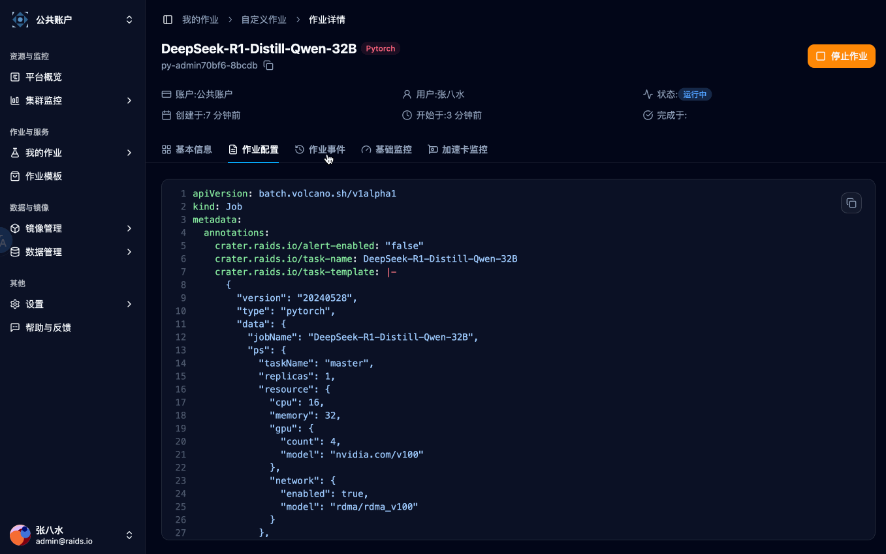
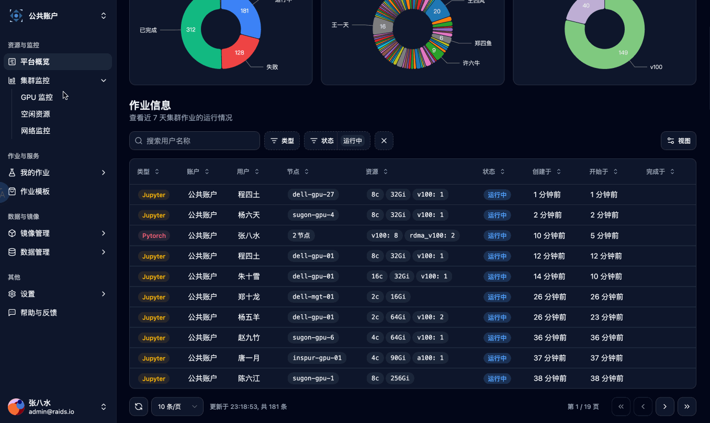
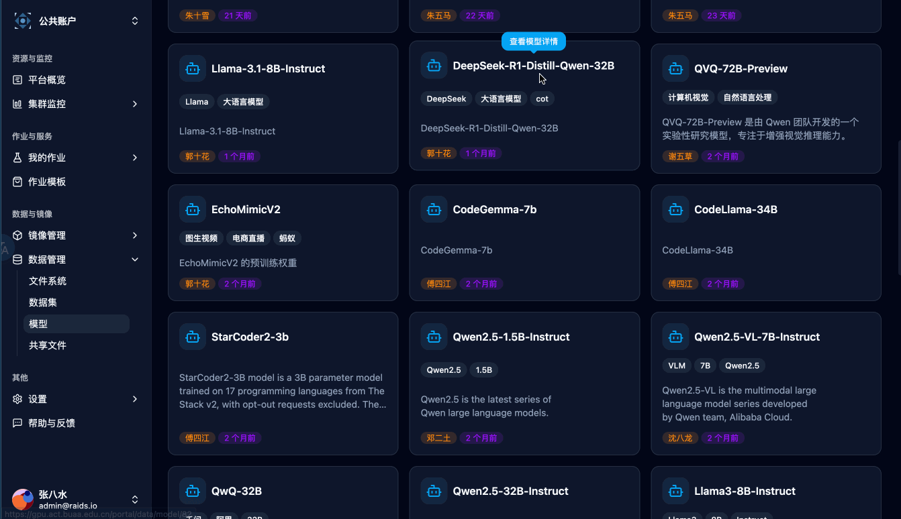

# 🌋 Crater Frontend

Crater is a Kubernetes-based GPU cluster management system providing a comprehensive solution for GPU resource orchestration.

<table>
  <tr>
    <td align="center" width="45%">
      <br>
      <em>Jupyter Lab</em>
    </td>
    <td align="center" width="45%">
      <br>
      <em>Ray Job</em>
    </td>
  </tr>
  <tr>
    <td align="center" width="45%">
      <br>
      <em>Monitor</em>
    </td>
    <td align="center" width="45%">
      <br>
      <em>Models</em>
    </td>
  </tr>
</table>

## 🛠️ Environment Setup

> [!NOTE]
> Install Node.js and Pnpm: [Official Download](https://nodejs.org/en/download)

Ensure you have Node.js and pnpm installed. We recommend using [nvm](https://github.com/nvm-sh/nvm) for Node.js version management.

Verify installations:

```bash
node -v  # Should show v22.x or higher
pnpm -v   # Should show v10.x or higher
```

## 💻 Development Guide

### Project Configuration

For VS Code users:

1. Import `.vscode/React.code-profile` via `Profiles > Import Profile`
2. Install recommended extensions

For other IDEs, manually configure:

- Prettier
- ESLint
- Tailwind CSS IntelliSense

Clone and initialize:

```bash
git clone https://github.com/YOUR_USERNAME/crater.git
cd crater/frontend
pnpm install
```

Start development server:

```bash
make run
```

### Core Technologies 🚀

- **Language**: TypeScript
- **Framework**: React 19
- **State Management**: Jotai
- **Data Fetching**: TanStack Query v5
- **Styling**: Tailwind CSS
- **UI Libraries**:
  - shadcn/ui (headless components)
  - Flowbite (Tailwind templates)
  - TanStack Table (headless tables)

### API Mocking 🧪

Use MSW for API simulation during development:

1. Set `VITE_USE_MSW=true` in `.env.development`
2. Add handlers in `src/mocks/handlers.ts`

**Note:** It is recommended to manage the `.env.development` file through the unified configuration management system in the main repository. For details, please refer to the main repository README.

### Dependency Management 📦

Check updates:

```bash
pnpm outdated
```

Update dependencies:

```bash
pnpm update       # Minor updates
pnpm update --latest  # Major updates (use cautiously)
```

Update shadcn components:

```bash
for file in src/components/ui/*.tsx; do
  pnpm dlx shadcn@latest add -yo $(basename "$file" .tsx)
done
```

## Error Code Usage

Most frontend changes do not need extra error handling code.

```ts
// Default: no extra handling
const query = useQuery({
  queryKey: ['xxx'],
  queryFn: () => apiSomething(),
})
```

```ts
// Example 1: field-level error
onError: (error) => {
  switch ((error as { data?: { code?: number } }).data?.code) {
    case ERROR_INVALID_CREDENTIALS:
    case LEGACY_ERROR_INVALID_CREDENTIALS:
      markApiErrorHandled(error)
      form.setError('password', { type: 'manual', message: 'Invalid credentials' })
      return
  }
}
```

```ts
// Example 2: page-owned toast/dialog
onError: async (error) => {
  const [code] = await getErrorCode(error)
  if (code === ERROR_SERVICE_SSHD_NOT_FOUND || code === LEGACY_ERROR_SERVICE_SSHD_NOT_FOUND) {
    markApiErrorHandled(error)
    toast.error('SSHD service not found')
  }
}
```

```ts
// Example 3: special handling for 409xx conflicts
import { CONFLICT_ERROR_GROUP, ERROR_RESOURCE_STATUS_ERROR } from '@/services/error_code'

const isConflict = (code?: number) => Math.floor((code ?? 0) / 100) === CONFLICT_ERROR_GROUP

onError: (error) => {
  const code = (error as { data?: { code?: number } }).data?.code

  if (code === ERROR_RESOURCE_STATUS_ERROR) {
    markApiErrorHandled(error)
    toast.error('Current state does not allow this action')
    return
  }

  if (isConflict(code)) {
    markApiErrorHandled(error)
    toast.error('Business conflict')
  }
}
```

```bash
cd frontend
make generate-error-code
make lint
```

## 🚀 Deployment

To deploy Crater Project in a production environment, we provide a Helm Chart available at: [Crater Helm Chart](https://github.com/raids-lab/crater).

Please refer to the main documentation for detailed deployment instructions.

## 📁 Project Structure

```
src/
├── components/           # Reusable components
│   ├── custom/           # Custom components
│   ├── layout/           # App layouts
│   └── ui/               # shadcn components
├── hooks/                # Custom hooks
├── lib/                  # Utilities
├── pages/                # Route-based pages
│   ├── Admin/            # Admin interfaces
│   ├── Portal/           # Job management
│   └── ...               # Other sections
├── services/             # API services
├── stores/               # State management
├── types/                # TypeScript types
└── ...
```

## 🐛 Known Issues

1. **Dark Mode Input Styling**: Browser autofill causes white backgrounds in dark mode ([TailwindCSS#8679](https://github.com/tailwindlabs/tailwindcss/discussions/8679))

## 👥 Contribution Guide

We welcome and appreciate contributions from the community! Here's how you can help improve Crater Frontend.

### 🛠️ Development Workflow

1. **Fork** the repository
2. **Clone** your fork locally:
   ```bash
   git clone https://github.com/YOUR_USERNAME/crater-frontend.git
   cd crater-frontend
   ```
3. Create a new **feature branch**:
   ```bash
   git checkout -b feat/your-feature-name
   ```
4. Make your changes and **commit** them (see commit guidelines below)
5. **Push** to your fork:
   ```bash
   git push origin feat/your-feature-name
   ```
6. Open a **Pull Request** to the main repository

### ✍️ Commit Guidelines

Each commit message should follow this format:

```
type(scope): subject
```

**Examples:**

```
feat(portal): add job submission form
fix(admin): resolve user role validation issue
docs(readme): update contribution guidelines
```

Allowed Types:

- `feat`: New feature
- `fix`: Bug fix
- `docs`: Documentation changes
- `style`: Code style/formatting
- `refactor`: Code refactoring
- `test`: Test additions/modifications
- `chore`: Build process or tooling changes

Scope (optional):

- Indicate which part of the application is affected (e.g., `portal`, `admin`, `ui`, `api`)

## 🚨 Reporting Issues

When reporting bugs, please include:

- Steps to reproduce
- Expected vs actual behavior
- Screenshots if applicable
- Browser/OS version information

Thank you for contributing to Crater Frontend! Your help makes this project better for everyone.
