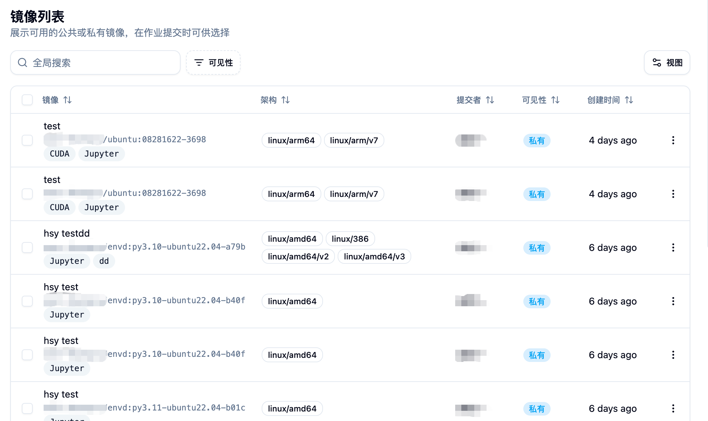
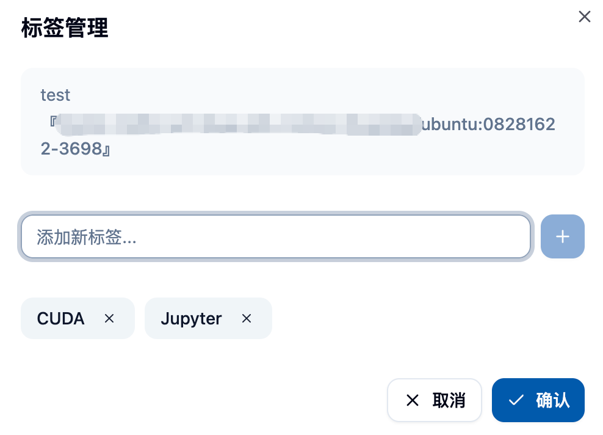
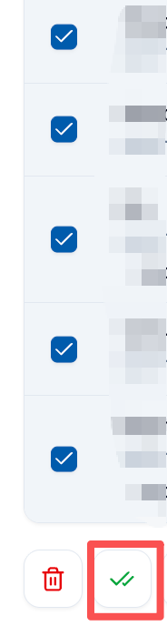

## 기능 개요 📋

관리자 권한 하의 이미지 목록 기능은 플랫폼 관리자가 모든 사용자의 이미지를 포괄적으로 관리하고 모니터링할 수 있도록 해줍니다. 일반 사용자는 자신의 이미지만 관리할 수 있는 반면, 관리자 버전은 다음과 같은 특징을 가지고 있습니다:

- **🌐 전체 플랫폼 시각** : 플랫폼 상의 모든 사용자의 이미지를 확인하고 관리할 수 있습니다.
- **🔐 고급 권한 제어** : 어떤 이미지의 가시성, 설명, 유형 등 속성을 수정할 수 있습니다.
- **📦 배치 관리** : 이미지의 유효성을 검사하고 배치 삭제를 지원합니다.
- **🤝 이미지 공유 관리** : 사용자 간의 이미지 공유 상황을 모니터링하고 관리할 수 있습니다.
- **🏗️ 아키텍처 및 태그 관리** : 이미지의 아키텍처 정보와 태그를 통합적으로 관리할 수 있습니다.

## 🚪 관리자 이미지 목록 페이지 진입

관리자는 사이드바에서 "관리" 카테고리의 "이미지 관리" 메뉴 아래의 "이미지 목록"을 통해 관리자 이미지 목록 페이지로 이동할 수 있습니다.

이 페이지에서는 다음을 확인할 수 있습니다:
- 플랫폼 상의 모든 사용자의 이미지 목록 📋
- 각 이미지의 상세 정보(이름, 아키텍처, 생성자, 가시성 등) 📊
- 이미지 생성 시간 및 상태 정보 📅
- 풍부한 필터 및 검색 기능 🔍

## 📊 이미지 정보 표시

### 📋 이미지 기본 정보
각 이미지 항목은 다음의 주요 정보를 표시합니다:

**🏷️ 이미지 식별자**
- 이미지 설명 및 링크
- 관련된 태그 정보
- 이미지 유형 식별자

**🏗️ 아키텍처 지원**
- 이미지가 지원하는 CPU 아키텍처 표시
- 일반적인 아키텍처: amd64, arm64 등
- 태그 형태로 직관적으로 표시

**👤 사용자 정보**
- 이미지 생성자의 사용자 정보
- 사용자 이름 및 표시 이름 포함
- 이미지의 출처 추적 용이

**👁️ 가시성 상태**
- 공개 (Public) : 모든 사용자에게 보임
- 사적인 (Private) : 생성자만 보임
- 다양한 색상의 태그로 구분

**📅 생성 시간**
- 이미지 생성 시간 표시
- 시간 기준으로 정렬 가능
- 친숙한 상대 시간 형식 사용

## ⚙️ 관리자 전용 기능

### 1. 🔍 전역 검색 및 필터

#### 🔎 검색 기능
- **🌐 전역 검색** : 모든 이미지에서 키워드 검색
- **⚡ 실시간 검색** : 입력 시 즉시 검색 결과 표시
- **🔍 다중 필드 일치** : 이미지 이름, 설명, 태그 등 검색 가능

#### 🎯 고급 필터
**👁️ 가시성 기준 필터**
- 공개 이미지
- 사적인 이미지
- 다양한 권한 수준의 이미지 관리 용이

**👤 생성자 기준 필터**
- 특정 사용자가 생성한 모든 이미지 확인 가능
- 사용자 이미지 사용 상황 분석 용이

### 2. ⚙️ 이미지 속성 관리

플랫폼의 모든 이미지에 대해 관리자는 다음의 관리 작업을 수행할 수 있습니다:

#### 👁️ 가시성 제어
- **🌐 공개로 설정** : 사적인 이미지를 모든 사용자에게 공개
- **🔒 사적으로 설정** : 공개 이미지를 생성자만 보일 수 있도록 설정
- 즉시 적용, 서비스 재시작 없이

#### ✏️ 이미지 설명 수정
- 이미지 설명 정보 수정
- 이미지 명명 표준화에 도움
- 사용자가 이미지 용도를 더 잘 이해하도록 도움

#### 🏷️ 태그 관리
- 태그 추가, 편집, 삭제
- 태그는 이미지 분류 및 검색 용도

#### 🏗️ 아키텍처 설정
- 이미지가 지원하는 CPU 아키텍처 설정
- 포함: amd64, arm64, 386 등
- 이미지가 다른 노드에 할당되는 데 영향

### 3. 📦 배치 작업 기능

#### 🗑️ 이미지 배치 삭제
- 여러 이미지 선택 후 배치 삭제 수행
- 상세한 삭제 확인 정보 표시
- 삭제 후 관련 작업 및 작업 영향

삭제 확인 화면에서는 다음을 표시합니다:
- 삭제 예정 이미지 목록 📋
- 각 이미지의 상세 정보 📊
- 안전 경고 및 작업 위험성 알림 ⚠️

#### ✅ 배치 유효성 검사
- 여러 이미지 선택 후 사용 가능성 검사
- 이미지가 정상적으로 pull 및 사용 가능한지 확인
- 검사 완료 후 무효 이미지를 선택적으로 삭제 가능

검사 기능은 다음과 같습니다:
- 이미지 링크 접근성 테스트 🔗
- 이미지 형식 유효성 검증 ✅
- 이미지 저장소 연결 상태 확인 🌐

### 4. ⚙️ 단일 이미지 작업

각 이미지에 대해 관리자는 오른쪽 작업 메뉴를 통해 다음 작업을 수행할 수 있습니다:

#### 📋 기본 작업
**📋 링크 복사**
- 이미지의 전체 링크를 빠르게 복사
- 다른 곳에서 이미지 사용 용이

**✅ 유효성 검사**
- 이미지의 사용 가능성 단일 검사
- 상세한 검사 결과 표시

#### ⚙️ 고급 관리
**🤝 이미지 공유 관리**
- 이미지의 공유 상태 확인
- 이미지를 어떤 사용자 또는 계정과 공유하는지 관리
- 공유 권한을 취소하거나 추가 가능

**✏️ 이미지 이름 변경**
- 이미지의 설명 이름 수정
- 표준화된 관리 및 조직 용도

**🗑️ 이미지 삭제**
- 단일 이미지 삭제
- 작업 전 상세한 확인 알림 제공

### 5. 👀 이미지 세부 정보 보기

이미지 이름 클릭 시 이미지의 세부 정보 페이지로 이동할 수 있습니다:

**📋 기본 정보**
- 이미지의 전체 메타데이터
- 생성 시간 및 수정 이력
- 관련된 빌드 정보

**🏗️ 빌드 정보**(플랫폼에서 제작된 이미지일 경우)
- 빌드 로그 및 이력
- 빌드 구성 및 매개변수
- Dockerfile 또는 빌드 스크립트

## 🔐 권한 및 보안 관리

### 👥 사용자 간 권한
- 관리자는 어떤 사용자의 이미지 속성을 수정할 수 있음
- 사적인 이미지를 공개로, 또는 반대로 설정 가능
- 사용자 대신 이미지 공유를 관리할 수 있음

### 🔒 보안 제어
- 모든 관리 작업은 로그에 기록됨
- 중요한 작업은 이중 확인 필요
- 권한 감사 및 추적 지원

### 🛡️ 데이터 보호
- 삭제 작업은 되돌릴 수 없으므로 주의 필요
- 중요한 이미지 정기 백업 권장
- 이미지 내보내기 기능 제공

## 📊 모니터링 및 통계

### 💾 저장소 관리
- 각 이미지의 저장 공간 사용량 확인
- 대용량 이미지 식별
- 정리 전략 수립

### 💚 건강 상태 모니터링
- 이미지 유효성 정기 점검
- 이미지 저장소 연결 상태 모니터링
- 문제 이미지 신속한 발견 및 처리

## 💡 최적의 실천

### 📝 이미지 이름 표준화
1. **📋 통일된 이름** : 플랫폼 수준의 이미지 이름 표준화
2. **📝 명확한 설명** : 이미지 설명이 용도를 정확히 반영하도록 보장
3. **🏷️ 태그 관리** : 일관된 태그 분류 시스템 사용
4. **🔢 버전 제어** : 다양한 버전의 이미지에 명확한 식별자 설정

### 🔐 권한 관리 전략
1. **🔒 최소 권한 원칙** : 필요한 이미지 접근 권한만 부여
2. **🔍 정기 검토** : 이미지 공유 및 권한 설정 정기 점검
3. **🔐 민감한 이미지** : 민감 정보를 포함한 이미지에 대한 추가 관리
4. **👥 사용자 교육** : 사용자가 이미지 가시성을 올바르게 설정하도록 지도

### 🛠️ 유지보수 권장 사항
1. **🧹 정기 정리** : 사용하지 않는 만료 이미지 삭제
2. **✅ 유효성 검사** : 정기적으로 배치 유효성 검사 수행
3. **📊 용량 모니터링** : 이미지 저장소 사용 상황 주의
4. **💾 백업 전략** : 중요한 이미지에 백업 메커니즘 구축

## 🔧 문제 해결

### ❓ 일반적인 문제
**🚫 이미지에 접근 불가**
- 이미지 저장소 연결 상태 확인
- 이미지 링크 형식이 올바른지 확인
- 접근 권한 설정 확인

**❌ 배치 작업 실패**
- 네트워크 연결 상태 확인
- 작업 권한 확인
- 시스템 로그에서 상세한 오류 정보 확인

**🤝 공유 기능 오류**
- 대상 사용자 계정 상태 확인
- 공유 권한 설정 확인
- 이미지의 가시성 설정 확인

## ⚠️ 주의사항

<Callout type="warning">
1. 이미지 가시성 변경은 해당 이미지를 사용하는 작업에 영향을 줄 수 있습니다.
2. 배치 삭제 작업은 되돌릴 수 없으므로, 실행 전 확인이 필요합니다.
3. 관리자가 사용자 이미지를 수정하면 사용자 경험에 영향을 줄 수 있으므로, 사전 협의가 좋습니다.
4. 중요한 플랫폼 이미지를 정기적으로 백업하여 실수 삭제를 방지하세요.
5. 이미지 저장소의 저장 용량 쿼터를 모니터링하여 공간 부족을 방지하세요.
</Callout>