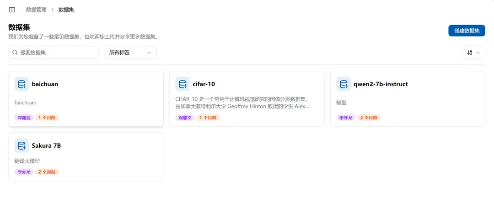
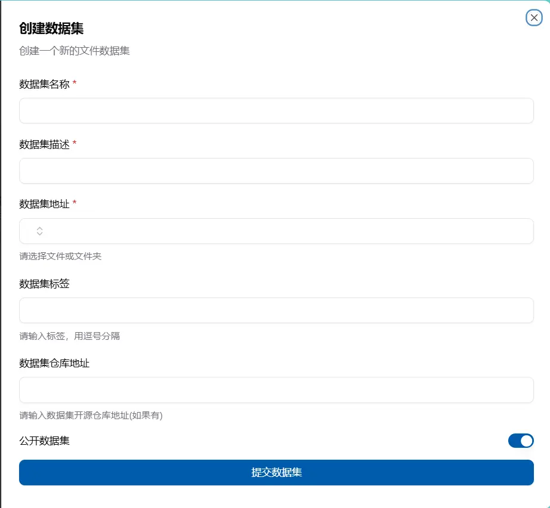

# データセット

## データセットとは

データセットは共有ストレージ上の特定の場所を指す読み取り専用リソースで、マウントや共有に利用できます。Crater は ModelScope または HuggingFace からデータセットを直接ダウンロードでき、ファイルシステムへアップロード済みのディレクトリをデータセットとして登録することもできます。

## データセット/モデルと共有ファイルの違い

データセット/モデルは、読み取り専用のファイルを提供します。今後、データセット/モデルを読み取り専用の共有フォルダに移動させ、それに応じた技術を用いてデータセット/モデルのスピードを向上させ、トレーニング効率を高める予定です。共有ファイルは、個人のファイルを他人に共有し、他人が読み書きできるようにする機能を提供します。公開スペース内のファイルを読み書きする場合は、管理者に連絡してください。

## データセットをどこで確認するか

`データ管理-データセット`でデータセットを確認できます。ここに表示されるデータセットは、ユーザー自身が作成したデータセット、個人に共有されたデータセット、およびアカウントに共有されたデータセットを含みます。



各データセットには基本情報と利用可能な操作が表示されます。データセット詳細の「ファイル」タブでは、実際の保存パスの確認とコピー、ファイルの閲覧ができます。過去のダウンロードではソースとリビジョンを含む長いパスが表示される場合があります。既存ジョブがそのパスを使用している可能性があるため、Crater はそれらのディレクトリを自動移動しません。

## リポジトリからデータセットをダウンロードする

「データセットをダウンロード」を選択し、ソース、リポジトリ ID、リビジョン、必要に応じてアクセストークンを入力します。新規ダウンロードの標準パスは次のとおりです。

```text
public/Datasets/<owner>/<repository>
```

同じリポジトリ ID については 1 つの公開リソースを使用します。Ready、保留中、ダウンロード中、または一時停止中の記録とその実際のパスを再利用し、申請した各ユーザーを 1 回だけ関連付けます。参照数は関連ユーザー数を表します。既存の記録が失敗している場合は、別のソースやリビジョンを要求する前に、その記録を再試行または処理してください。

ダウンロードに失敗した場合、同じ記録の再試行で継続できるよう、部分ファイルは元のディレクトリに残ります。完全に利用可能なのは Ready 状態の記録だけです。ダウンロードタスクを削除しても保存済みファイルは削除されません。失敗ディレクトリを消す場合は、再試行、マウント、利用者から参照されていないことを確認してから、管理者がクリーンアップしてください。

## データセットの作成方法

データセットページの左上隅に「データセットの作成」ボタンがあります。クリックしてから名前、説明を入力し、フォルダの位置を選択して作成します。



作成されたデータセットの名前は重複してはいけません。フォルダを選択するときに、見えるパブリック、個人、現在のアカウントのスペースファイルが自動的に表示され、選択できます。


## データセットの使用方法

新しい作業ページの右側にデータマウント枠があります。データマウントを追加した後、データセットを選択してコンテナにマウントできます。


