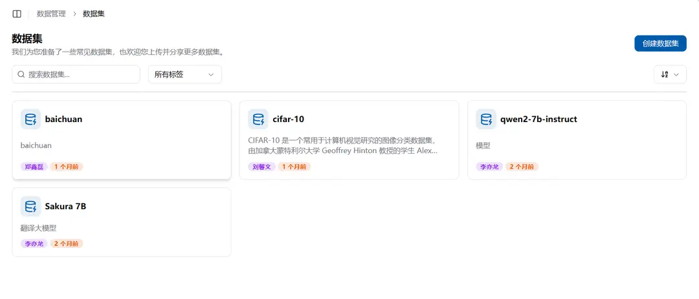
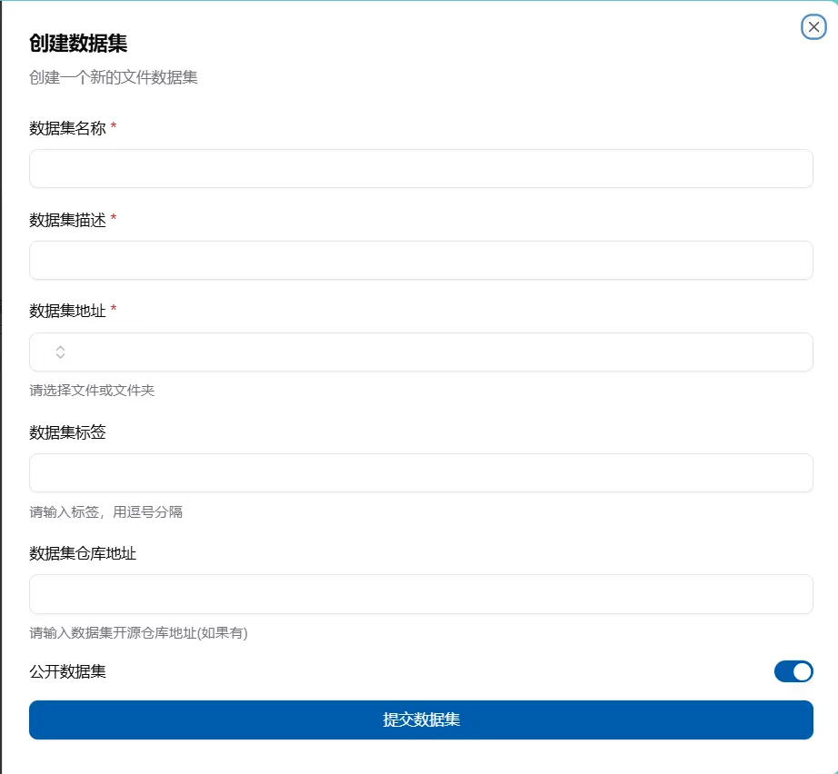

# 数据集

## 数据集是什么

数据集是指向共享存储中特定文件位置的只读资源，便于挂载和分享。平台支持直接从 ModelScope 或 HuggingFace 下载数据集，也可以把已经上传到文件系统的目录登记为数据集。

## 数据集/模型与共享文件的区别

数据集/模型主要是提供一种只读的文件，后续我们将提供将数据集/模型移动到只读的共享文件夹中，并通过相应技术对数据集/模型进行加速，从而提高训练效率。共享文件主要提供将个人文件分享给他人，并允许他人读写的功能。如果需要对公共空间中的文件进行读写，可以联系管理员。

## 在哪查看数据集

在`数据管理-数据集`下，可以查看数据集。这里显示的数据集包括用户自己创建的、个人被分享的和账户被分享的数据。



每个数据集会显示基本信息和可用操作。进入数据集详情的“数据集的文件目录”页签，可以查看并复制作业可挂载的共享存储逻辑路径，也可以直接浏览文件；界面不会暴露集群物理目录前缀。历史下载可能仍显示包含来源和版本的长路径，平台不会自动移动这些目录，以免已有作业中的路径失效。

## 从开源仓库下载数据集

在数据集页面选择“下载数据集”，填写来源、仓库 ID、版本和可选的访问 Token。新下载默认保存到：

```text
public/Datasets/<owner>/<repository>
```

同一仓库 ID 的数据集只保留一份公共资源。平台会复用已有 Ready、等待中、下载中或暂停中的记录及其实际路径，并为每位申请用户建立一次关联；引用数表示关联用户数。若没有有效记录，可以重试失败记录，或在其他来源存在同名资源时重新提交下载。

仓库不存在、版本错误或无权访问等问题由下载 Job 异步发现，任务随后进入 Failed。创建新任务或重试失败任务时，平台会先清理规范公共目录中的不完整文件，避免混合不同来源的内容；暂停后恢复则保留已有进度并继续下载。只有 Ready 状态表示文件完整可用。删除下载任务只删除任务记录，不会自动删除存储文件。

## 怎么创建数据集

在数据集页面左上角有一个创建数据集按钮，点击后填写名称、描述并选择文件夹位置进行创建。



创建的数据集名称不能相同，选择文件夹时会自动跳出你能看见的公共、个人及当前账户的空间文件，然后进行选择


## 怎么使用数据集

在新建作业的页面，右边有个数据挂载框，添加数据挂载后，可以选择数据集，然后将其挂载到容器内。


