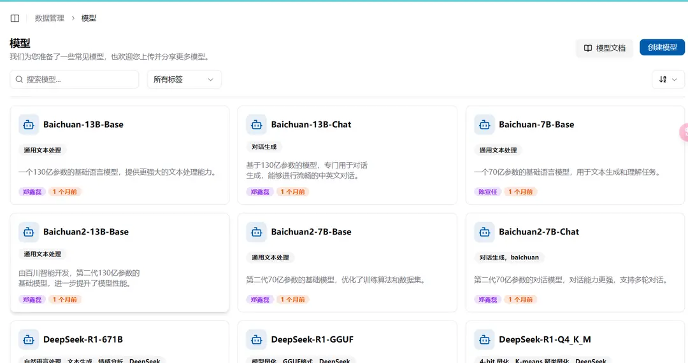
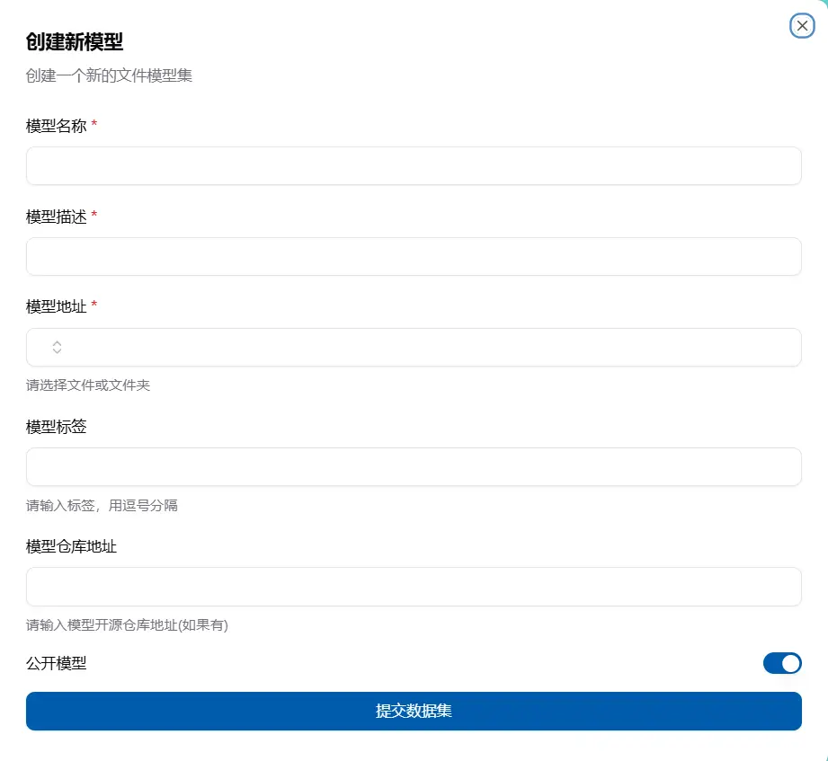
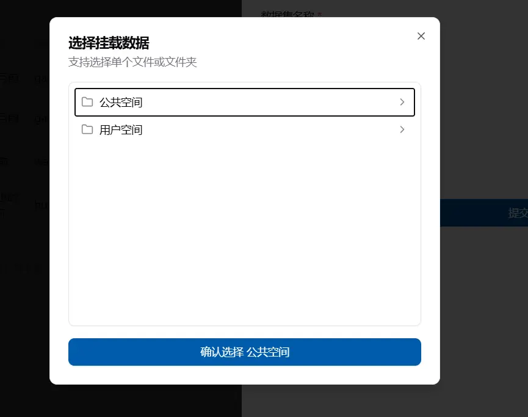
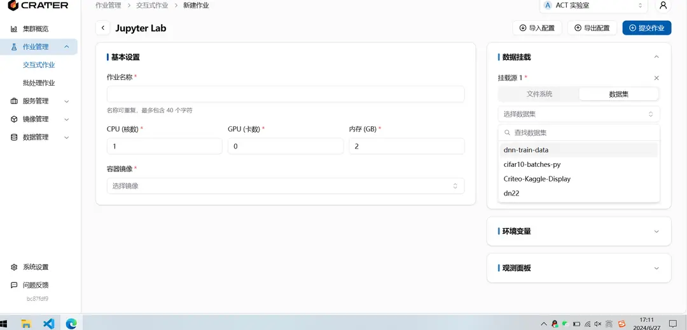

## What is a Model

A model is a read-only resource that points to a location in shared storage, making it easy to mount and share. Crater can download models directly from ModelScope or HuggingFace, or register a directory that has already been uploaded to the file system.

## Where to View Models

You can view models under `Data Management - Models`. The models displayed here include those created by the user, those shared with the individual, and those shared with the account.



Each model shows its metadata and available actions. Open the model's **Files** tab to browse files and copy the logical shared-storage path that jobs can mount; cluster-specific physical directory prefixes are not shown. Historical downloads may still use a longer path containing the source and revision. Crater does not move those directories automatically because existing jobs may depend on them.

## Download a Model from a Repository

Select **Download model**, then enter the source, repository ID (for example, `Qwen/Qwen3-32B`), revision, and an optional access token. New downloads use the canonical path:

```text
public/Models/<owner>/<repository>
```

Crater keeps one public resource for each repository ID. If a Ready, pending, downloading, or paused record already exists, Crater reuses that record and its actual path instead of downloading another copy for a different source, revision, or historical path format. Each requesting user is associated once, and the record's reference count is the number of associated users. If the existing record has failed, retry or resolve it before requesting another source or revision.

After a failed download, partial files remain in the original directory so retrying the same record can continue there. Only a record in Ready state represents a complete, usable model. Deleting a download task removes the task record but does not remove its stored files. Ask an administrator to clean up a failed directory only after confirming that no retry, mount, or user depends on it.

## How to Create a Model

If the model files are already in storage, select **Create model**, enter the model name and description, choose the folder, and optionally add tags and the upstream repository address.



The model name created cannot be the same. When selecting a folder, it will automatically pop up the public, personal, and current account space files that you can see, then you can select one.



## How to Use a Model

On the new job page, there is a data mounting box on the right. After adding a data mount, you can select a model and mount it into the container.


