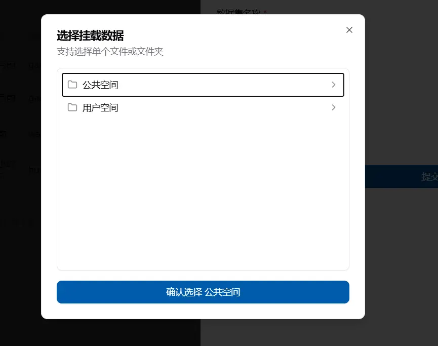

## 模型是什么

模型与数据集类似，其实是一个链接，将模型指向一个特定的文件位置，这样可以更方便的进行挂载和分享。与数据集相同，目前仓库地址功能还不能实现直接从开源社区下载，主要提供一种特定的描述，方便分享。如果需要从开源社区下载，可参考作业模板中的从魔搭社区下载模型和数据集，或者下载到本地后上传到平台，关于大文件上传可参考文件系统部分

## 在哪查看模型

在`数据管理-模型`下，可以查看模型。这里显示的模型包括用户自己创建的、个人被分享的和账户被分享的数据。

每个模型会有一些基本描述，在右边有四个按钮，分别是重命名，个人分享，账户分享和删除。这些操作都需要模型创建者才能使用。

## 怎么创建模型

在模型页面左上角有一个创建数据集按钮，点击后填写模型名称、描述并选择文件夹位置、模型的标签、模型的开源地址，选择是否公开进行创建。

创建的模型名称不能相同，选择文件夹时会自动跳出你能看见的公共、个人及当前账户的空间文件，然后进行选择

## 怎么使用模型

在新建作业的页面，右边有个数据挂载框，添加数据挂载后，可以选择模型，然后将其挂载到容器内。

