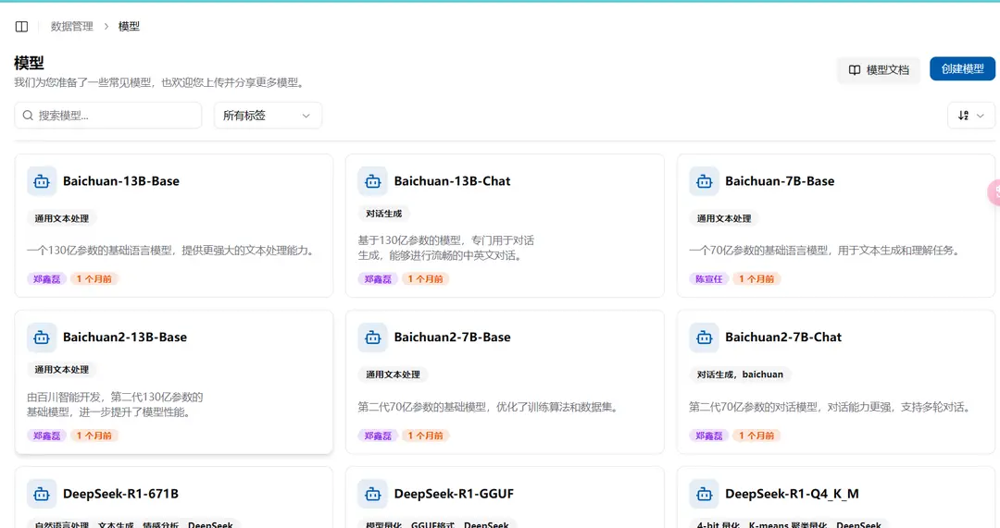
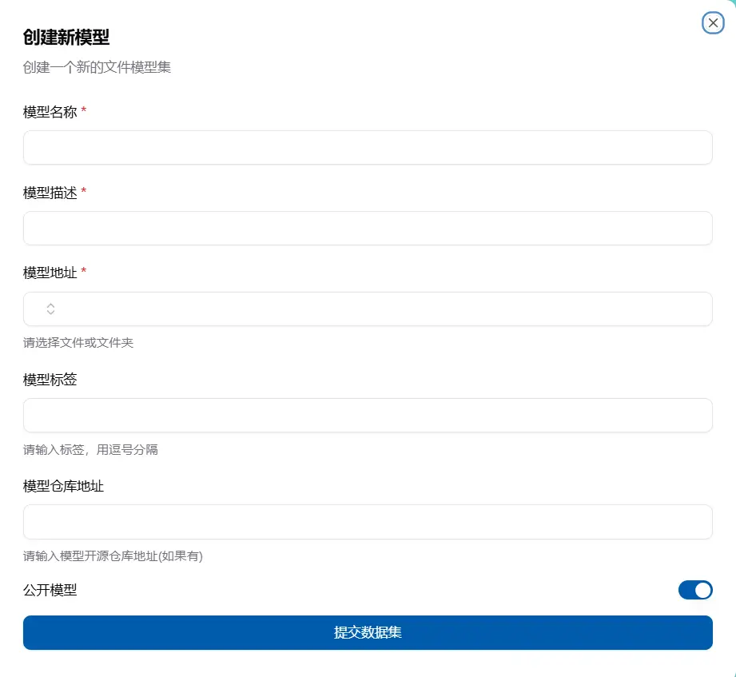
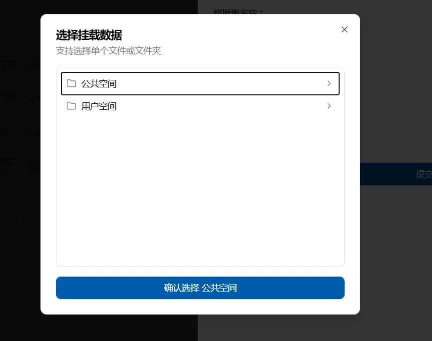
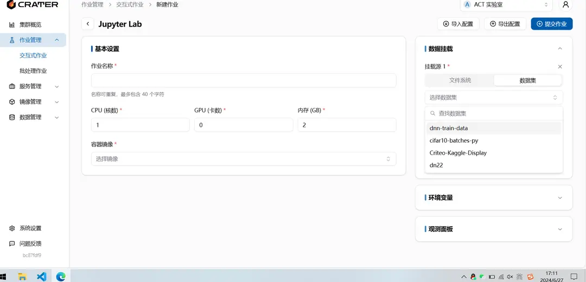

## 模型是什么

模型与数据集类似，是指向共享存储中特定文件位置的只读资源，便于挂载和分享。平台支持直接从 ModelScope 或 HuggingFace 下载模型，也可以把已经上传到文件系统的目录登记为模型。

## 在哪查看模型

在`数据管理-模型`下，可以查看模型。这里显示的模型包括用户自己创建的、个人被分享的和账户被分享的数据。



每个模型会显示基本信息和可用操作。进入模型详情的“模型的文件目录”页签，可以查看并复制作业可挂载的共享存储逻辑路径，也可以直接浏览文件；界面不会暴露集群物理目录前缀。历史下载可能仍显示包含来源和版本的长路径，平台不会自动移动这些目录，以免已有作业中的路径失效。

## 从开源仓库下载模型

在模型页面选择“下载模型”，填写来源、仓库 ID（例如 `Qwen/Qwen3-32B`）、版本和可选的访问 Token。新下载默认保存到：

```text
public/Models/<owner>/<repository>
```

同一仓库 ID 的模型只保留一份公共资源。如果已经存在 Ready、等待中、下载中或暂停中的记录，平台会复用现有记录及其实际路径，不会因为来源、版本或历史长短路径不同而再次下载。每位申请该资源的用户只建立一次关联，下载记录中的引用数表示关联用户数。若没有有效记录，可以重试失败记录，或在其他来源存在同名资源时重新提交下载。

仓库不存在、版本错误或无权访问等问题由下载 Job 异步发现，任务随后进入 Failed。创建新任务或重试失败任务时，平台会先清理规范公共目录中的不完整文件，避免混合不同来源的内容；暂停后恢复则保留已有进度并继续下载。只有 Ready 状态表示文件完整可用。删除下载任务只删除任务记录，不会自动删除存储文件。

## 怎么创建模型

如果模型文件已经在存储中，可以在模型页面选择“创建模型”，填写模型名称、描述，选择文件夹位置并补充标签和开源地址。



创建的模型名称不能相同，选择文件夹时会自动跳出你能看见的公共、个人及当前账户的空间文件，然后进行选择



## 怎么使用模型

在新建作业的页面，右边有个数据挂载框，添加数据挂载后，可以选择模型，然后将其挂载到容器内。


