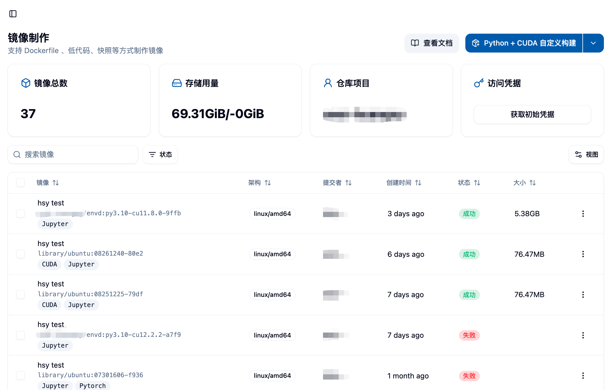
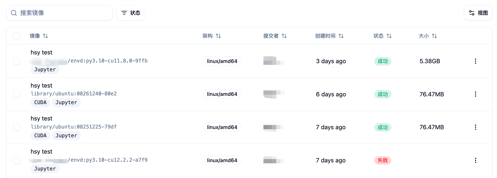
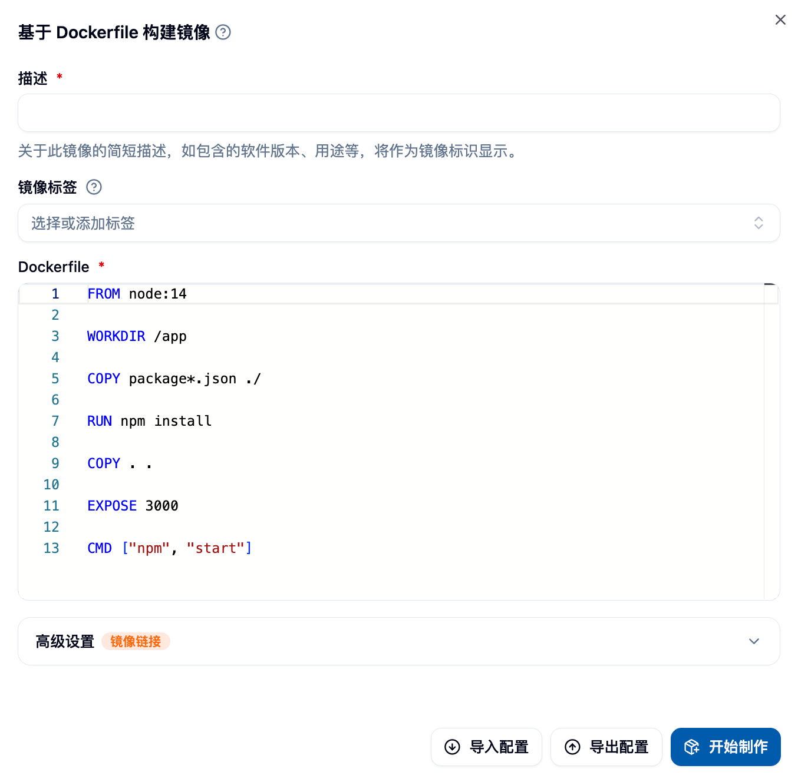
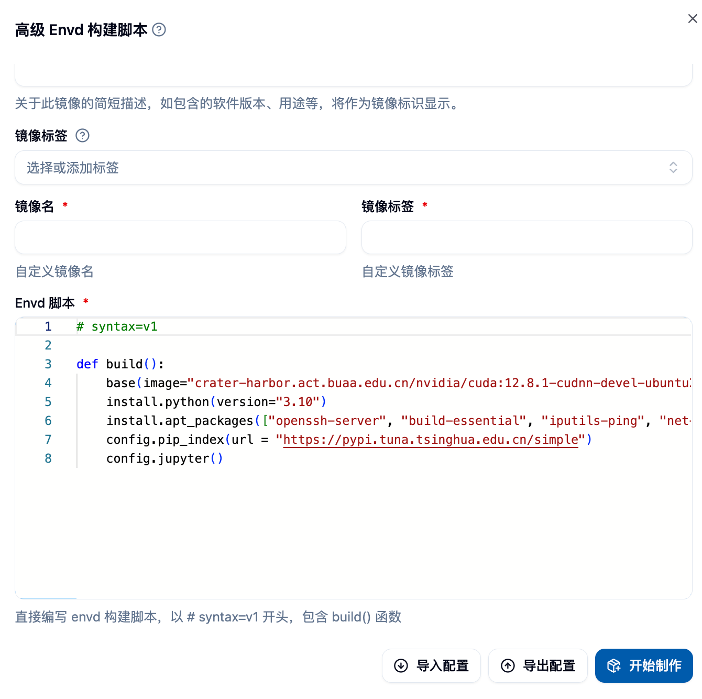
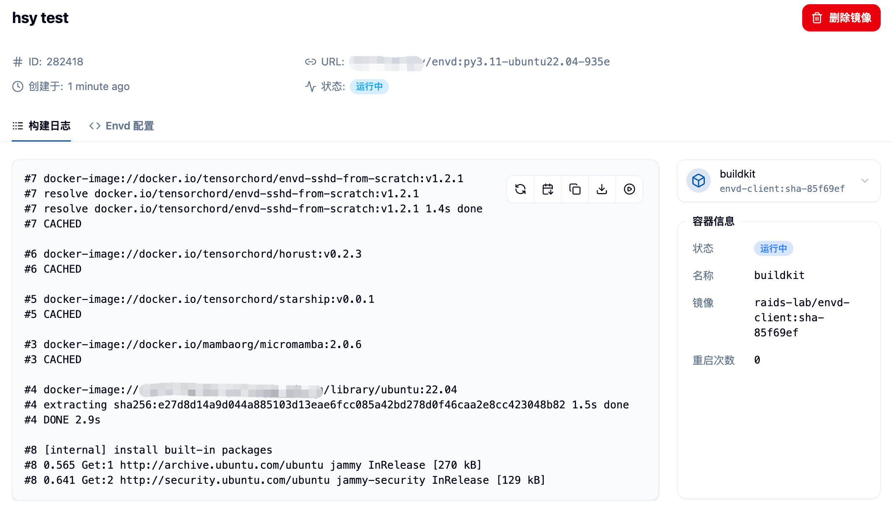
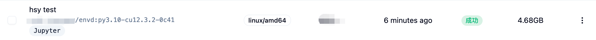

## 이미지 빌드 페이지에 접속하기

사이드바의 "데이터 및 이미지" 카테고리에서 "이미지 관리" 메뉴의 "이미지 빌드"를 클릭하여 이미지 빌드 페이지에 접속할 수 있습니다.



## 페이지 개요

페이지에 접속하면 다음과 같은 항목을 볼 수 있습니다:

### 상단 정보 영역
- **이미지 총 수**: 이미지 빌드 기능을 통해 성공적으로 생성한 이미지의 수
- **저장소 사용량**: Harbor 이미지 저장소에서 사용한 저장 공간## 이미지 보기 👀

"시작 빌드"를 클릭한 후, 페이지 하단의 목록에서 제출한 이미지를 볼 수 있으며, 초기 상태는 "대기 중"이어야 합니다.
- **Harbor 프로젝트 이름**: 사용자의 전용 Harbor 프로젝트이며, 생성된 모든 이미지는 이 프로젝트에 저장됩니다.
- **초기 자격 증명 가져오기 버튼**: Harbor 저장소의 접근 자격 증명을 가져오는 데 사용됩니다.


### Harbor 저장소 접근 자격 증명

"초기 자격 증명 가져오기" 버튼을 클릭하여 Harbor 이미지 저장소의 사용자 이름과 비밀번호를 얻을 수 있으며, 이를 통해 다음과 같은 작업이 가능해집니다:
- Harbor 저장소에 직접 로그인하여 이미지 확인
- 로컬에서 생성한 이미지를 수동으로 업로드
- Docker 명령줄 도구를 이용한 이미지 조작


<Callout type="warning">
**중요 알림**: 비밀번호는 한 번만 표시됩니다. 적절히 저장해주세요. 해당 버튼을 다시 클릭하면 비밀번호가 재설정됩니다.
</Callout>

### 이미지 빌드 작업 목록

페이지 하단에는 사용자의 모든 이미지 빌드 작업이 표시됩니다. 포함된 항목은 다음과 같습니다:
- 이미지 설명 및 링크
- 지원하는 아키텍처 정보
- 생성 시간
- 빌드 상태(대기 중, 빌드 중, 성공, 실패)
- 이미지 크기



## 이미지 빌드 방식 선택 🎯

플랫폼은 **네 가지**의 이미지 빌드 방식을 제공합니다:

1. **Python+CUDA 커스텀 빌드** 🐍 - 딥러닝 및 과학 계산 시나리오에 적합
2. **기존 이미지 기반 빌드** 📦 - 플랫폼에서 제공하는 기본 이미지에서 빠르게 커스터마이징
3. **Dockerfile 기반 빌드** 🐳 - 최대의 유연성과 제어 능력을 제공
4. **Envd 기반 빌드** ⚡ - Python과 유사한 문법의 선언형 빌드

페이지 상단 오른쪽의 빌드 방식 드롭다운 버튼을 클릭하여 원하는 빌드 방식을 선택하고, 버튼을 클릭하여 해당 빌드 폼을 열 수 있습니다.


---

## 이미지 빌드 페이지에 접속하기

사이드바의 "데이터 및 이미지" 카테고리에서 "이미지 관리" 메뉴의 "이미지 빌드"를 클릭하여 이미지 빌드 페이지에 접속할 수 있습니다.


페이지에 접속하면, 페이지 상단에서 이미지 빌드 기능을 통해 생성한 이미지의 총 수, Harbor 이미지 저장소의 사용량 및 제한, 그리고 Harbor 프로젝트 이름을 확인할 수 있습니다. Harbor의 해당 프로젝트에서 생성한 이미지를 확인할 수 있습니다.

이미지 예시에서는 사용자가 로컬에서 생성한 이미지를 직접 업로드하여 "이미지 빌드" 기능을 통해 생성하지 않았기 때문에, 여기서 이미지 총 수가 0이지만, 저장 공간 사용량은 0이 아닙니다. 해당 내용은 "로컬 이미지 업로드" 문서를 참조하십시오.

상단 오른쪽의 "초기 자격 증명 가져오기" 버튼은 Harbor의 사용자 이름과 비밀번호를 가져오는데 사용되어, Harbor 저장소에 직접 로그인하여 이미지를 수동으로 업로드하거나 저장소 내 이미지를 확인하는 데 편리합니다. 다만, 다시 클릭하면 비밀번호가 재설정될 수 있음을 주의하십시오.

## 이미지 빌드 방식 선택

현재 우리는 **네 가지**의 이미지 빌드 방식을 제공합니다.

1. Python+CUDA 커스텀 빌드
2. 기존 이미지 기반 빌드
3. Dockerfile 기반 빌드
4. Envd 기반 빌드

아래 그림과 같이 드롭다운 버튼을 클릭하여 원하는 빌드 방식을 선택한 후, 버튼을 클릭하여 빌드 폼을 열 수 있습니다.


### 1. Python+CUDA 커스텀 빌드 🚀

이 빌드 방식은 딥러닝 및 과학 계산 사용자에게 인기 있으며, 복잡한 설정 없이 필요한 Python 및 CUDA 버전 조합을 쉽게 선택할 수 있습니다.


#### 폼 작성 요약

**기본 설정**
- **Python 버전**: 필요한 Python 버전 선택 (예: 3.8, 3.9, 3.10, 3.11 등)
- **CUDA 버전**: 대응하는 CUDA 버전 선택 (예: 11.8, 12.1, 12.4 등)
- **이미지 설명**: 이미지에 대한 명확한 설명을 제공하여 후속 식별을 용이하게 함

**선택 가능한 소프트웨어 패키지 설정**
- **APT 패키지**: 시스템 레벨 패키지, 여러 패키지는 공백으로 구분
  - 예: `curl tree htop vim git`
  - 일반적인 도구: `wget unzip zip git-lfs`
- **Python 종속 패키지**: requirements.txt 형식 준수
  - 버전 지정 지원: `numpy==1.21.0`
  - 버전 범위 지정 지원: `pandas>=1.3.0,<2.0.0`
  - 주석 행 지원: `# 데이터 처리 관련 패키지`

**빌드 설정**
- **Jupyter 지원 활성화**: 활성화되면 이미지는 Jupyter 인터랙티브 작업에 사용 가능
- **이미지 이름**: 사용자 정의 이미지 이름 (선택 사항, 시스템이 자동 생성)
- **이미지 태그**: 사용자 정의 이미지 태그 (선택 사항, 시스템이 자동 생성)


#### 사용 팁 💡

**버전 선택 권장 사항**
- Python 3.9 + CUDA 11.8: 호환성이 최고로, 대부분의 딥러닝 프레임워크에 적합 ✅
- Python 3.10 + CUDA 12.1: 성능 최적화, 최신 PyTorch 및 TensorFlow에 적합 ⚡
- Python 3.11 + CUDA 12.4: 최신 기능, 최첨단 연구에 적합 🔬

**일반적인 패키지 조합**
```bash
# 데이터 과학 기본 패키지
curl wget git git-lfs vim htop

# 개발 도구 패키지  
build-essential cmake pkg-config
```

**Python 종속성 예시**
```txt
# 딥러닝 프레임워크
torch>=2.0.0
torchvision>=0.15.0
tensorflow>=2.13.0

# 데이터 처리
numpy>=1.21.0
pandas>=1.5.0
scikit-learn>=1.3.0

# 시각화
matplotlib>=3.5.0
seaborn>=0.11.0
```

### 2. 기존 이미지 기반 빌드 📦

사용자가 기존 이미지를 기반으로 새로운 이미지를 빌드할 수 있다는 점을 고려하여, `기존 이미지 기반 빌드` 빌드 방식을 제공합니다.

이 빌드 방식에서는 반드시 기초 이미지를 선택해야 하며, 이미지에 대한 간단한 설명을 제공해야 합니다. 이 설명은 이미지의 식별을 위해 표시됩니다. APT 패키지와 Python 종속성은 비워둘 수 있으며, 패키지를 설치하려면 패키지 이름을 입력하면 됩니다. 여러 패키지는 공백으로 구분합니다. 예를 들어, `curl` 및 `tree`를 설치하려면 `curl tree`를 입력하면 됩니다.


예를 들어, 실행할 프로젝트에 requirements.txt 파일이 포함되어 있다면, 이 파일의 내용을 Python 종속성 영역에 복사하여 설치할 수 있습니다. 다만, pip가 종속성을 파싱하는 과정에서 해결할 수 없는 문제가 발생할 수 있으므로, 먼저 컨테이너 내에서 종속성을 수동으로 설치해보고, 그 결과에 따라 종속성을 입력하는 것이 좋습니다. 위 그림은 폼 작성 예시입니다. 폼 작성 후, 폼의 우하단 "시작 빌드"를 클릭하여 이미지 빌드를 시작할 수 있습니다.

### 3. Dockerfile 기반 빌드 🐳

고도의 커스터마이징이 필요한 사용자에게 최대의 유연성을 제공합니다. 완전한 Dockerfile을 작성하여 이미지 빌드 과정을 정확하게 제어할 수 있습니다.



#### 폼 구성 요소 설명

**Dockerfile 편집기**
- 문법 강조 및 자동 완성 지원
- 실시간 문법 검사
- Dockerfile 내용을 파일로부터 가져올 수 있음

**이미지 설정**
- **이미지 설명**: 필수, 이미지의 용도 및 특징을 설명
- **이미지 설정**: 이름, 태그 및 아키텍처를 사용자 정의

#### Dockerfile 작성 가이드

**기본 구조**
```dockerfile
# 기초 이미지 선택
FROM gpu-harbor.act.buaa.edu.cn/user-base/nvidia-pytorch:24.12-v1.2.1

# root 사용자로 시스템 설정
USER root

# 시스템 패키지 설치
RUN apt-get update && apt-get install -y \
  curl \
  wget \
  vim \
  && rm -rf /var/lib/apt/lists/*

# Python 패키지 설치
RUN pip install --no-cache-dir \
  numpy \
  pandas \
  scikit-learn

# 작업 디렉터리 설정
WORKDIR /workspace

# 일반 사용자로 전환
USER $NB_USER
```

**국내 네트워크 최적화**
```dockerfile
# APT 저장소 변경
RUN sed -i 's/archive.ubuntu.com/mirrors.aliyun.com/g' /etc/apt/sources.list

# pip 저장소 변경
RUN pip config set global.index-url https://pypi.tuna.tsinghua.edu.cn/simple
```

**일반적인 사용 예시**
```dockerfile
# 파일을 이미지에 복사
COPY requirements.txt /tmp/
RUN pip install -r /tmp/requirements.txt

# 환경 변수 설정
ENV PYTHONPATH=/workspace
ENV CUDA_VISIBLE_DEVICES=0

# 디렉터리 생성 및 권한 설정
RUN mkdir -p /workspace/data && \
  chown $NB_USER:$NB_GID /workspace/data
```

### 4. Envd 기반 빌드 ⚡

Envd는 Python과 유사한 문법을 사용하는 이미지 빌드 도구로, 학습 비용이 낮고 빌드 속도가 빠르며, 특히 딥러닝 사용자에게 적합합니다.



 여기에 Envd 빌드 폼의 스크린샷을 붙여넣으세요.

#### Envd 스크립트 작성

**기본 설정 함수**
```python
def build():
  # 기초 이미지 설정
  base(os="ubuntu20.04", language="python3.9")
    
  # 시스템 패키지 설치
  install.apt_packages(["curl", "wget", "vim"])
    
  # Python 패키지 설치  
  install.python_packages([
    "torch>=2.0.0",
    "torchvision",
    "numpy",
    "pandas"
  ])
    
  # CUDA 설정
  install.cuda(version="11.8")
    
  # Jupyter 설정
  config.jupyter(password="")
```

**고급 기능**
```python
def build():
  # 사용자 정의 기초 이미지 사용
  base(image="nvidia/cuda:11.8-devel-ubuntu20.04")
    
  # 파일을 통해 종속성 설치
  install.python_packages(requirements="requirements.txt")
    
  # 환경 변수 설정
  runtime.environ({"PYTHONPATH": "/workspace"})
    
  # 사용자 정의 명령 실행
  run.commands([
    "echo 'Setup complete' > /tmp/setup.log"
  ])
    
  # 로컬 디렉터리 마운트
  runtime.mount("/local/data", "/workspace/data")
```

**참고 자료 링크**
- [Envd 빠른 시작](https://envd.tensorchord.ai/guide/getting-started.html)
- [Envd API 참조](https://envd.tensorchord.ai/api/starlark/v1/config.html)

## 이미지 보기

"시작 빌드"를 클릭한 후, 페이지 하단의 목록에서 제출한 이미지를 볼 수 있으며, 초기 상태는 "대기 중"이어야 합니다.


이미지 설명을 클릭하여 세부 정보를 확인할 수 있으며, 이때 "빌드 로그" 탭에서 이미지 빌드의 세부 로그를 볼 수 있어, 발생할 수 있는 문제를 분석하는 데 도움이 됩니다.



또한, "Dockerfile" 또는 "Envd 설정" 탭으로 전환하여, 시스템이 폼을 통해 생성하거나 사용자가 작성한 Dockerfile 또는 Envd 스크립트를 볼 수 있습니다.


마지막으로, 이미지 빌드가 성공하면 해당 페이지에서 이미지 상태가 "성공"으로 표시되고, 생성된 이미지의 크기를 볼 수 있습니다. 주의할 점은 Docker의 계층형 저장 구조를 사용하기 때문에 실제 저장 공간 사용량이 각 이미지의 크기 총합보다 훨씬 작을 수 있다는 점입니다. 또한, "이미지 목록"에서 "Custom" 유형의 새로 생성한 이미지를 볼 수 있으며, 이를 통해 "배치 작업" 또는 "인터랙티브 작업"을 시작할 수 있습니다.



이미지의 브라우징, 공유, 태깅, 임포트와 같은 작업에 대한 자세한 내용은 《[이미지 목록](./imagelist)》 문서를 참조하십시오.

## 구성 파일의 임포트 및 내보내기 📥📤

빌드 폼을 작성할 때, 폼을 JSON 파일로 내보내어 다음에 필요할 때 파일에서 다시 임포트하여 재사용하거나 추가 수정 등을 할 수 있습니다.