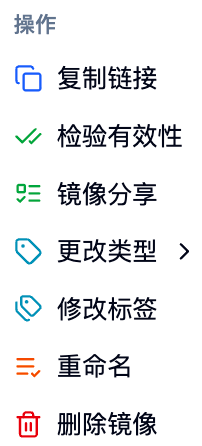

## ミラー一覧ページへのアクセス

サイドバーの「データとミラー > ミラーマネージメント > ミラー一覧」からこのページにアクセスします。

 ここにミラー一覧メインページのスクリーンショットを貼り付けください 

## ページ概要 🎯

ミラー一覧は、利用可能なミラーソースを表示します：
- 自分で作成したミラー（プラットフォームでのビルドまたはインポート）🏭
- 他人が公開しているミラー 🌍
- あなたに共有されたミラー 🤝

デフォルトで表示される列には以下があります：
- ミラーと説明：ミラーのリンク + 簡潔な説明
- アーキテクチャ：サポートされるCPUアーキテクチャ（例: amd64、arm64）
- 提出者：ミラーの作成者/所有者
- 視認性：パブリックまたはプライベート
- 作成日時：生成日時

## 検索とフィルタリング 🔍

### グローバル検索
- トップの検索ボックスにキーワードを入力し、名前、説明、タグなどに基づいてミラーを迅速に検索できます ⚡
- 入力すると即座にフィルタリングされ、リアルタイムで反映されます

### 条件フィルタリング
- 視認性：パブリックのみ / プライベートのみ
- （オプション）他のフィルタ：ページ設定に応じて提供されます

## ミラーの詳細とジャンプ

- プラットフォーム内で作成されたミラーについては、「ミラーと説明」をクリックすると、ビルド詳細ページにジャンプし、ビルドログやDockerfile/Envdなどの情報を確認できます。
- 外部からインポートされたミラーについては、基本情報のみが表示され、ジャンプすることはできません。

## 一般的な操作（1つのミラーについて）⚙️

各行の「操作」メニューから以下を実行できます：

- リンクをコピー：ミラーの完全なアドレスをワンクリックでコピー 📋
- 有効性の確認：ミラーのリンクが有効かどうかを検出し、検出結果を返します（無効な項目を削除することを選択できます）✅
- ミラーの共有：指定されたユーザーまたはアカウントにミラーを共有します（取り消すことも可能です）🤝
- タイプの変更：ミラータスクのタイプを識別する（例: Jupyter、Pytorch、Ray、Customなど）🏷️
- タグの編集：ミラータグを追加または削除し、分類や検索を容易にします 🔖
- アーキテクチャの設定：ミラーがサポートするCPUアーキテクチャを設定します（例: amd64、arm64）🏗️
- 名前の変更：ミラーの説明名を変更します（実際のミラーアドレスは変更されません）✏️
- 削除：このミラーリンクを削除します 🗑️

<Callout type="info">
権限の説明：
- 一般ユーザーは、自分が所有するミラーのみ操作可能です；
- 視認性（パブリック/プライベート）の切り替えは通常管理者に限られます；
- 共有や削除などの敏感な操作には二次確認が必要です。
</Callout>

## バッチ操作 📦

複数のレコードを選択した後、以下を実行できます：

- バッチ削除：複数のミラーリンクを同時に削除 🗑️
- バッチでの有効性確認：一括で検出を行い、無効な項目に対して一括処理が可能です ✅

## ミラーのインポート 📥

右上隅の「ミラーインポート」をクリックして、既存のミラーをプラットフォームに登録します（構築はトリガーされません）。

フォームフィールド：
- ミラーリンク：完全なアドレス（例: `registry.example.com/ns/image:tag`）
- ミラーの説明：リスト表示および識別のために使用されます
- タグ：任意で、分類および検索のために使用されます

<Callout type="warning">
ミラーリンクは標準的な形式（リポジトリ、名前空間、タグを含む）でなければなりません。解析できない場合は、送信することはできません。
</Callout>

## ミラーの共有 🤝

- 指定されたユーザーまたはアカウントグループにミラーを許可します
- いつでも共有対象を確認および取り消すことができます
- 共有後、相手は自分のミラーリストでこのミラーや使用可能になります

## ミラーの使用

- 作業（インタラクティブ/バッチ）を提出するときに、ここに表示されているミラーを直接選択できます
- 常用ミラーには明確な説明とタグを追加することをお勧めします。これにより、迅速な検索が可能になります

## 最適な実践と提案 💡

- 名前の規則：明確に記述し、用途とバージョン情報を含めること 📝
- タグ管理：プロジェクト/フレームワーク/バージョンにタグをつけて、チームでの協力を容易にします 🏷️
- 定期的なチェック：バッチ検出を用いて無効なミラーをクリーンアップする 🔍
- アーキテクチャの一致：ミラーのアーキテクチャとコンピューティングノードが一致していることを確認してください（例: arm64/amd64）⚙️

## よくある質問

- 検出失敗：リポジトリのネットワーク接続やリンクの記述が正しいか確認してください
- 削除できない：ミラーの所有者であるか確認してください。管理者はプラットフォームサポートに連絡してください
- 共有できない：ターゲットのユーザーまたはアカウントが存在し、使用可能であるか確認してください