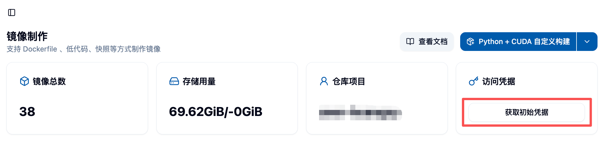

## 🔐 1. 获取 Harbor 访问凭证

### 🚀 1.1 登录平台

首先，登录到您的平台（例如 Kubernetes 集群管理平台、CI/CD 平台等），找到与 Harbor 集成的部分。



### 🔑 1.2 获取访问凭证

在平台的 Harbor 集成页面，您可以找到以下信息：

- **🌐 Harbor URL**: Harbor 仓库的地址，例如 `https://harbor.example.com`。
- **👤 用户名**: 您的 Harbor 用户名。
- **🔒 密码**: 您的 Harbor 密码。

### 🔐 1.3 登录 Harbor

使用获取到的凭证登录 Harbor：

```bash
docker login harbor.example.com -u <用户名> -p <密码>
```

登录成功后，您将看到 `Login Succeeded` 的提示。✅

## 📦 2. 上传本地镜像到 Harbor 仓库

### 🏷️ 2.1 标记本地镜像

在上传之前，您需要将本地镜像标记为符合 Harbor 仓库的命名规范。例如：

```bash
docker tag local-image:tag harbor.example.com/project-name/repository-name:tag
```

- `local-image:tag`: 您本地的镜像名称和标签。
- `harbor.example.com/project-name/repository-name:tag`: Harbor 仓库的完整路径，包括项目名称、仓库名称和标签。

每个用户的 Project Name 是 `user-{ACT 用户名}`。💡

<Callout type="warn" title="关于 Tag 的约定">
不应更新除 `latest` 以外的标签所指的镜像。即若已向 Harbor 推送过 tag 为如 `v1.0.0` 的镜像，即使只有非常小的改动，也应推送到新的 tag。如需快速反复迭代，请直接使用 `latest` 标签。

请务必遵守，否则平台无法保证作业使用的镜像是最新的。
</Callout>

### ⬆️ 2.2 推送镜像到 Harbor

使用 `docker push` 命令将标记好的镜像推送到 Harbor 仓库：

```bash
docker push harbor.example.com/project-name/repository-name:tag
```

推送成功后，您可以在 Harbor 仓库中看到上传的镜像。✨

## ✅ 3. 验证镜像上传

### 🌐 3.1 登录 Harbor Web UI

打开浏览器，访问 Harbor 的 Web UI（例如 `https://harbor.example.com`），并使用您的凭证登录。

### 👀 3.2 查看镜像

导航到相应的项目和仓库，确认您上传的镜像已成功显示在仓库中。

## 📥 4. 导入镜像

将镜像上传到 Harbor 仓库后，您还需要在平台中导入该镜像，才能在作业等场景中使用。请按照 [镜像列表 - 导入镜像](/zh/docs/user/image/imageList/#导入镜像-) 文档的说明，将已上传的镜像导入到平台。

## ⚠️ 5. 常见问题

### ❌ 5.1 登录失败

- 确保用户名和密码正确。
- 检查 Harbor URL 是否正确，并且网络可以访问。

### ❌ 5.2 推送失败

- 确保镜像标记的路径正确。
- 检查您是否有权限将镜像推送到指定的项目和仓库。

## 📚 6. 参考文档

- [Harbor 官方文档](https://goharbor.io/docs/)
- [Docker 官方文档](https://docs.docker.com/)
