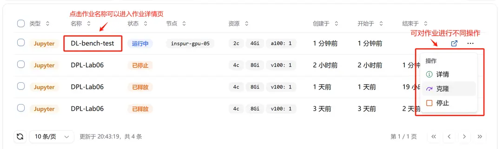
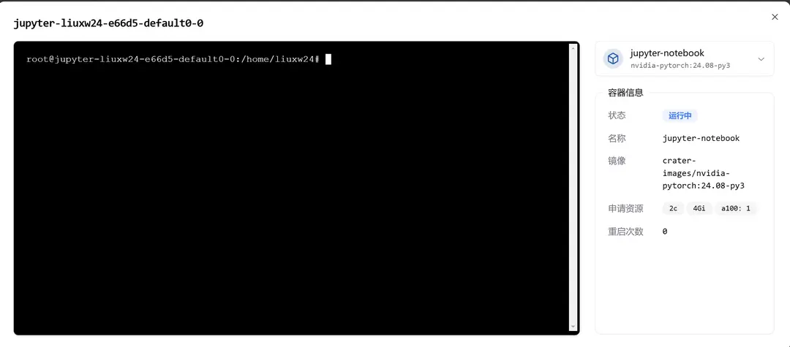

**인터랙티브 작업** 기능은 사용자에게 **즉시 사용 가능한 Jupyter Lab 및 Web IDE**를 제공하며, 본 문서는 인터랙티브 작업의 생성 및 관리 등 관련 내용을 설명합니다.

## 인터랙티브 작업 생성

**"플랫폼 개요"** 페이지 또는 **"내 작업" -> "인터랙티브 작업"** 페이지에서 **"새로운 Jupyter Lab"** 버튼을 클릭하여 Jupyter Lab의 새 작업 페이지로 이동할 수 있습니다.


**"새로운 Jupyter Lab"** 페이지에서는 **인터랙티브 작업에 대한 다양한 설정**을 수행할 수 있습니다:

- 작업 이름
- 작업 자원(예: CPU 코어 수, 메모리 사용량, GPU 사용 여부 및 사용할 GPU 모델 선택)
- 컨테이너 이미지
- 데이터 마운트 디렉토리 설정
- 환경 변수 추가
- 기타 옵션
  - 상태 알림 수신
  - 노드 선택 기능 활성화


인터랙티브 작업의 다양한 설정은 **설정 파일을 가져오기**를 통해 수행할 수 있으며, 이미 설정된 작업은 **설정 파일을 내보내기**를 통해 설정 파일을 내보낼 수 있습니다. 예시는 다음과 같습니다:

```json
{
  "version": "20240528",
  "type": "jupyter",
  "data": {
    "taskname": "DL-bench-test",
    "cpu": 2,
    "gpu": {
      "count": 1,
      "model": "nvidia.com/a100"
    },
    "memory": 4,
    "image": "harbor.act.buaa.edu.cn/crater-images/nvidia-pytorch:24.08-py3",
    "volumeMounts": [
      {
        "type": 1,
        "subPath": "liuxw24",
        "mountPath": "/home/liuxw24"
      }
    ],
    "envs": [],
    "observability": {
      "tbEnable": false
    },
    "nodeSelector": {
      "enable": false
    }
  }
}
```

제출된 작업이 성공적으로 실행되었음을 확인할 수 있습니다.


## 생성된 작업 관리

- 작업 이름을 클릭하면 작업 상세 페이지로 이동합니다.
- 상세 정보: 작업 상세 페이지로 이동
- 복제: 현재 작업 설정을 기반으로 작업을 복제할 수 있습니다 (사용자가 비슷한 설정으로 반복 제출하는 데 편리함)
- 중지: 현재 작업을 중지하고 사용 중인 자원을 해제합니다.



"복제"를 클릭하면 다음과 같은 페이지를 볼 수 있습니다:


복제된 작업과 동일한 설정이 자동으로 생성되었음을 확인할 수 있습니다(자동으로 입력됨). 사용자는 약간 수정 후 제출할 수 있습니다.

## 작업 상세 페이지

작업 상세 페이지는 작업이 속한 계정, 작업 생성자, 작업 상태, 생성 시간, 시작 시간, 완료 시간 등 기본 정보를 포함합니다.

또한 작업에 대한 모니터링 및 관리 방법도 제공합니다.


### 작업 YAML

- 작업 YAML: 작업 YAML 파일을 확인할 수 있습니다.


### 자원 모니터링

- 자원 모니터링: 작업의 Grafana 모니터링 페이지로 이동할 수 있습니다.


### 인터랙티브 페이지

- 인터랙티브 페이지: Jupyter Notebook으로 이동할 수 있습니다.


### 터미널

- 터미널: 작업의 Web 터미널에 접속할 수 있습니다.



### 외부 접근

- 외부 접근: 작업에 대한 외부 접근 규칙을 설정할 수 있습니다. 자세한 내용은 [외부 접근 규칙 설정](../toolbox/external-access/ingress-rule.md)을 참조하십시오.


### 로그 및 진단

- 로그 및 진단: 작업 로그를 확인하여 문제 진단 및 분석이 가능합니다.

