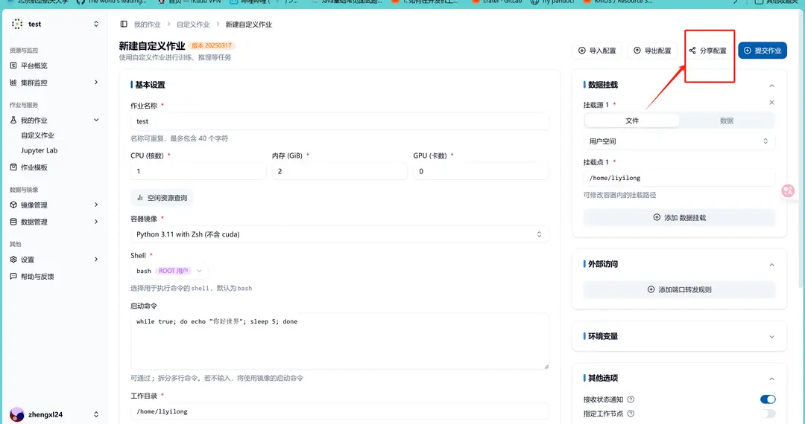
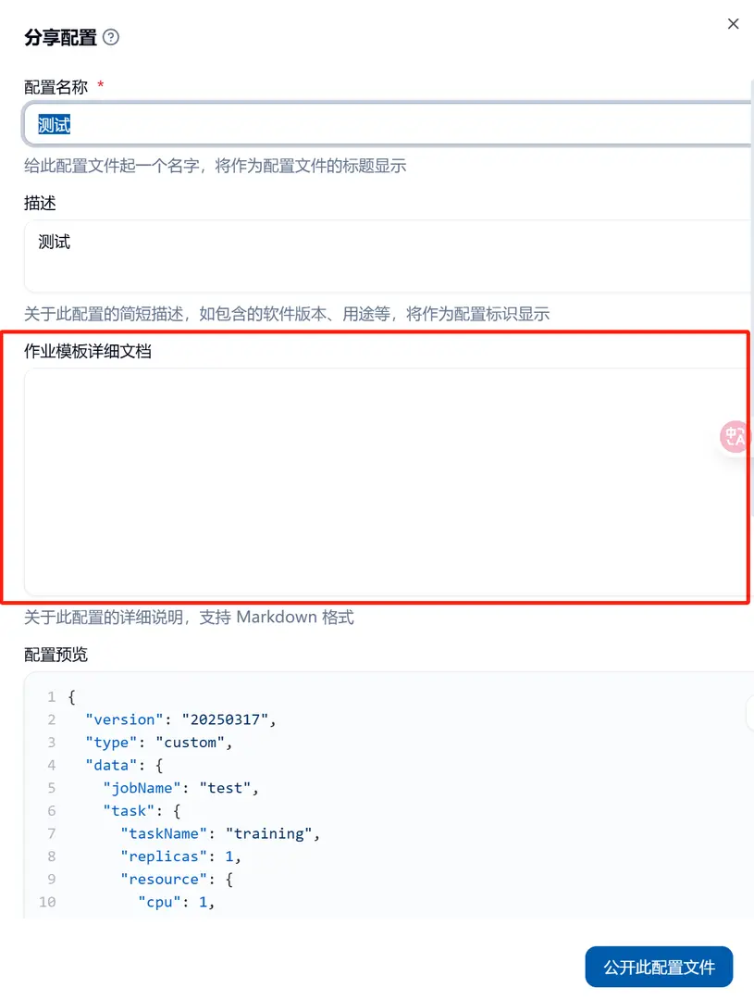

## 숙제 템플릿이란

숙제 템플릿은 사용자가 자신의 숙제 시작 과정을 다른 사람들과 공유하는 방식입니다. 예를 들어, 유사한 배치 작업을 반복적으로 제출하거나 자신의 배치 작업 시작 방식을 다른 사람들과 공유하려면 이 방법을 사용할 수 있습니다. 또한, 사용자는 다른 사용자가 공유한 숙제 템플릿을 통해 특정 기능을 빠르게 재현할 수 있습니다.

## 숙제 템플릿 생성

숙제 생성 창의 우측 상단에 "공유 설정" 버튼이 있으며, 이 버튼을 통해 숙제를 템플릿으로 생성하고 공유할 수 있습니다.

생성 시, 마크다운 문서를 작성하여 숙제 템플릿에 대한 보다 상세한 사용법을 추가할 수 있습니다. 이 사용법은 해당 숙제 템플릿의 좌측 하단에 나타납니다.

## 숙제 템플릿 업데이트 및 삭제

숙제 템플릿은 생성자만이 업데이트하거나 삭제할 수 있습니다. 생성자는 필터 상자에서 자신이 생성한 숙제 템플릿을 선택하여 업데이트하거나 삭제할 수 있습니다.

### 숙제 템플릿 업데이트

숙제 템플릿 페이지에서 업데이트하고자 하는 템플릿을 클릭하여 해당 템플릿의 세부 정보로 이동합니다. 이후 설정을 업데이트하여 숙제 템플릿을 업데이트할 수 있습니다.

### 숙제 템플릿 삭제

숙제 템플릿 페이지에서 삭제하고자 하는 템플릿의 우측 상단에 있는 아이콘을 선택하여 삭제할 수 있습니다.

