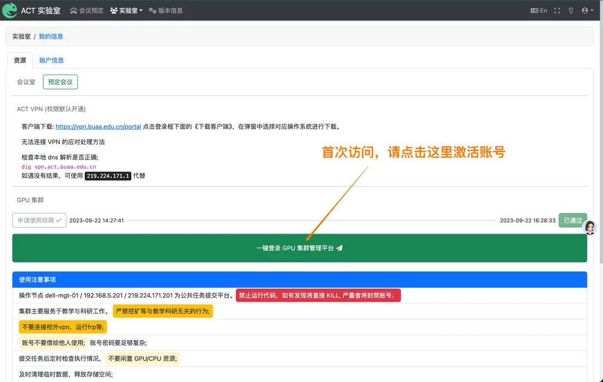

ACT GPU 플랫폼을 사용하려면 ACT 계정이 있어야 합니다. ACT 계정이 아직 없는 경우, 두 영제 교수(북항공우주대학 신주搂 G512)에게 연락하십시오.

## GPU 클러스터 액세스 권한 신청

<Callout>

이전에 Slurm GPU 클러스터 액세스 권한을 신청한 경우, 이 단계를 건너뛸 수 있습니다.

</Callout>

[ACT 실험실 사용자 플랫폼](https://user.act.buaa.edu.cn/)에 로그인하여 회의실 예약, GPU 클러스터 액세스 권한 신청 등이 가능합니다.

먼저 우측 상단의 프로필 박스를 클릭하여 플랫폼에 로그인합니다.

그 후 상단 네비게이션 바의 「실험실」을 클릭하고 「내 정보」를 선택합니다.

GPU 클러스터 액세스 권한이 없는 경우, 다음과 같은 화면을 보실 수 있습니다:


「사용 권한 신청」을 클릭하고 신청 양식을 작성한 후, 관리자(두 영제 교수)의 승인을 기다리십시오.

## Crater GPU 플랫폼 계정 활성화

<Callout>

처음 사용 시 계정을 활성화하려면 이 단계를 따르고, 이후에는 Crater 플랫폼에서 직접 로그인할 수 있습니다.

</Callout>

활성화가 성공적으로 완료되면 「실험실」->「내 정보」에서 새로운 GPU 클러스터 액세스 버튼을 볼 수 있습니다.



플랫폼에 처음 로그인할 때는 이 버튼을 통해 계정을 활성화해야 하며, 활성화 후에는 지도 교수, 연구실 등 정보가 이 플랫폼에 동기화됩니다.

이후에는 ACT 계정을 사용하여 Crater 플랫폼에 직접 로그인할 수 있습니다.

## 일반적인 질문

### 1. 실험실 외부에서 GPU 클러스터에 어떻게 접근할 수 있습니까?

클라이언트 다운로드: https://vpn.buaa.edu.cn/portal,
로그인 창 하단의 《클라이언트 다운로드》를 클릭하고, 팝업 창에서 해당 운영체제를 선택하여 다운로드합니다.

### 2. VPN에 연결할 수 없는 경우의 대처 방법:

로컬 DNS 해석이 올바른지 확인하십시오;

```
dig vpn.act.buaa.edu.cn
```

결과가 없는 경우, `219.224.171.1`을 `vpn.act.buaa.edu.cn` 대신 사용하여 접근할 수 있습니다.