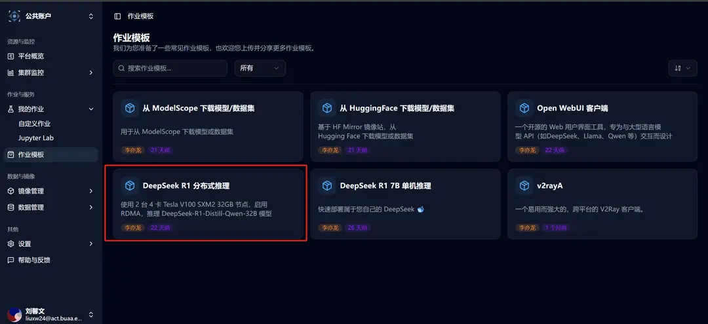
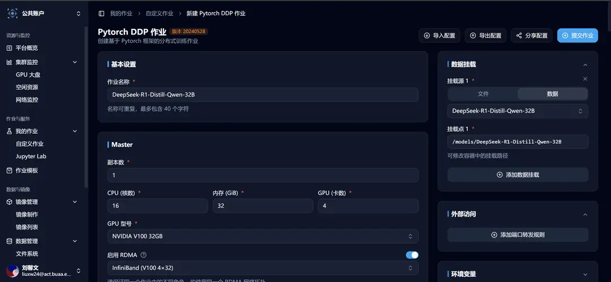
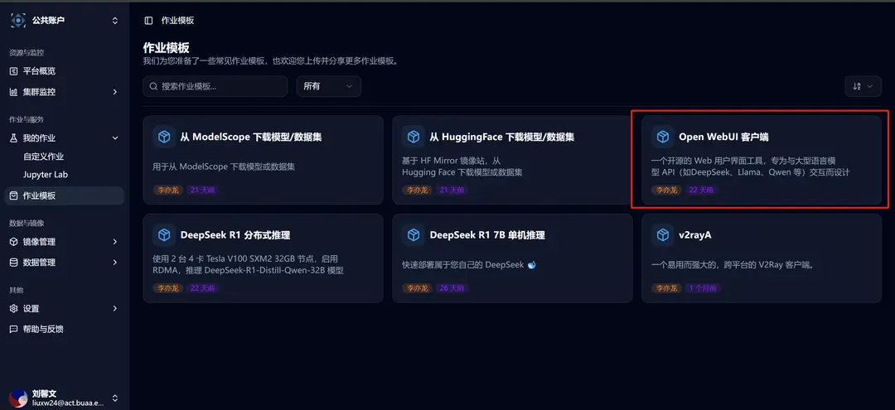

# DeepSeek R1 분산 추론의 빠른 배포

**작업 템플릿** 섹션에서는 **DeepSeek R1 분산 추론** 작업 템플릿을 제공합니다. 이 템플릿을 선택하여 DeepSeek R1 분산 추론을 빠르게 배포할 수 있으며, 웹 UI 인터페이스를 시작하여 대형 모델과 상호작용할 수도 있습니다.

## 템플릿 선택으로 작업 생성

사이드바의 작업 템플릿을 클릭한 후 **DeepSeek R1 분산 추론** 템플릿을 선택합니다.



선택 후 새롭게 커스터마이징된 작업 생성 화면으로 이동하게 되며, 관련 템플릿 파라미터가 이미 채워져 있습니다:



## 시작 명령어 및 일반적인 문제점

### 시작 명령어

템플릿의 시작 명령어는 다음과 같습니다:

```bash
ray start --head --port=6667 --disable-usage-stats;
NCCL_DEBUG=TRACE python3 -m vllm.entrypoints.openai.api_server \
--model=/models/DeepSeek-R1-Distill-Qwen-32B \
--max-model-len 32768 \
--tensor-parallel-size 4 \
--pipeline-parallel-size 2 \
--gpu-memory-utilization 0.90 \
--max-num-seqs 128 \
--trust-remote-code \
--disable-custom-all-reduce \
--port 8000 \
--dtype=half;
```

### 일반적인 문제점

> 문제 1: ValueError: Bfloat16은 최소한 8.0 이상의 컴퓨팅 능력을 갖는 GPU에서만 지원됩니다. 사용 중인 Tesla V100-SXM2-32GB GPU의 컴퓨팅 능력은 7.0입니다. CLI에서 dtype 플래그를 명시적으로 설정하여 float16을 대신 사용할 수 있습니다. 예: --dtype=half.

답변 1: vLLM 시작 파라미터에 --dtype=half를 추가합니다. 이 문제는 많은 가속 연산자들이 V100에서 실행되지 않는다는 불가피한 상황에서 비롯되며, 현재 많은 고성능 연산자들이 특정 하드웨어 제한을 가지고 있습니다.

> 문제 2: 얼마나 많은 컴퓨팅 파워를 신청해야 할까요?

답변 2: 메모리 사용량(최소) >= 모델 파라미터 수 * 배포 비트(bit) / 8. 예를 들어, 인스턴스에서 사용하는 32b 모델을 16bit로 배포한다면 최소 64GB의 메모리가 필요합니다. Crater의 한 장의 V100 메모리 용량은 32GB이므로 실제로 3~4장의 V100이 실행될 수 있으며, 이는 테스트를 위해 다중 머신을 사용하기 위해 8장의 카드를 사용했습니다.

> 문제 3: sglang을 사용할 수 있나요?

답변 3: sglang 프레임워크는 7.0의 그래픽 카드를 사용하여 배포하는 것을 지원하지 않습니다. 또한 vllm은 V100에서 사용하는 것이 제한적입니다(정확히 어떤 기능들이 있는지는 직접 vllm의 문서와 issue 섹션을 참고하시기 바랍니다).

이제부터 DeepSeek R1 32b 모델을 작업 템플릿을 사용하여 빠르게 배포하여 대화를 시작할 수 있습니다! 🥳!

## 웹 UI 인터페이스 시작 및 대형 모델과의 상호작용

**Open WebUI 클라이언트 템플릿**은 모델 배포 유형의 템플릿과 함께 사용하여 대형 모델을 쉽게 시도할 수 있는 친화적인 경험을 제공합니다.

사이드바의 작업 템플릿을 클릭한 후 **Open WebUI 클라이언트** 템플릿을 선택합니다.



선택 후 새롭게 커스터마이징된 작업 생성 화면으로 이동하게 되며, 관련 템플릿 파라미터가 이미 채워져 있습니다:


Crater 플랫폼에서 **DeepSeek R1 분산 추론** 작업 템플릿을 사용하여 대형 모델 추론 서비스를 시작한 후, 환경 변수의 첫 번째 줄을 수정하여 OpenAI 서비스의 주소를 입력해야 합니다:

다중 머신으로 모델을 배포하는 경우, 해당 작업의 「기본 정보」 섹션에서 **Ray Head 노드의 「내부 IP」**를 참조합니다.


Open WebUI가 성공적으로 시작되면, 상세 페이지로 이동하여 「외부 액세스」를 클릭합니다. 우리는 이미 전달을 설정해 놓았으므로 클릭만 하면 액세스할 수 있습니다.


대형 모델 여행을 시작해 보세요! 🥳!