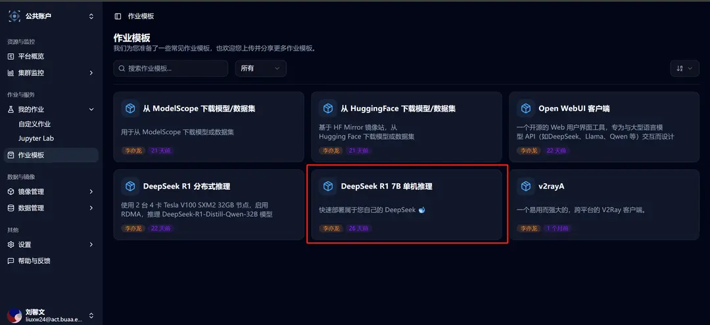

# Quick Deployment of DeepSeek R1 Single-Machine Inference

The **Job Template** section provides the **DeepSeek R1 Single-Machine Inference** task template. You can directly select this template to quickly deploy DeepSeek R1 single-machine inference, or start the Web UI interface to interact with large models.

## Selecting the Template to Create a Job

Click on the job template in the sidebar, and then select the **DeepSeek R1 Single-Machine Inference** template.



After selection, you will be redirected to the new custom job interface, where you can see that the relevant template parameters have already been filled in:


## Explanation of the Launch Command

The launch command in the template is:

```bash
vllm serve ./deepseek-r1-7b --dtype=half --enable-chunked-prefill=False --max-model-len=8192
```

The explanation of each parameter is as follows:

- `./deepseek-r1-7b`

  - Specifies the path to the model to be used. The deepseek-r1-7b folder under the current working directory contains the model's weight files, configuration files, and other necessary information (mounted when starting a Jupyter job, or can be specified as your own model path).

- `--dtype=half`

  - Specifies the data type of the model parameters as half-precision floating point numbers (float16).

- `--enable-chunked-prefill=False`

  - Disables the chunked prefill feature.

- `--max-model-len=8192`

  - Specifies the maximum input length the model can process as 8192 tokens.

> The last three parameters can be **adjusted according to the GPU model you have applied for**. Here, they are set to **ensure normal operation on the V100**, and **certain features of vLLM are disabled**.
> For a complete explanation of parameters that can be specified when using `vllm serve`, refer to [Engine Arguments](https://docs.vllm.ai/en/latest/serving/engine_args.html).

## Job Successfully Running

After submitting the job, wait for it to run. Go to the job details page, and you can view the real-time output in the basic information section, where you can see that the model has successfully run.


You can click on the web terminal and use the curl command to send a request to this service. Here's an example:

```bash
curl http://localhost:8000/v1/chat/completions \
  -H "Content-Type: application/json" \
  -d '{
  "model": "./deepseek-r1-7b",
  "messages": [
    {"role": "user", "content": "What is the difference between deep learning and machine learning in artificial intelligence?"}
  ]
}'
```

At this point, you can already converse with the DeepSeek R1 7b model deployed quickly using the job template! 🥳

## Starting the Web UI Interface and Interacting with the Large Model

The **Open WebUI Client Template** is used in conjunction with model deployment templates to provide a friendly experience for trying out large models.

Click on the job template in the sidebar, and then select the **Open WebUI Client** template.


After selection, you will be redirected to the new custom job interface, where you can see that the relevant template parameters have already been filled in:


After starting the large model inference service on the Crater platform using the **DeepSeek R1 Single-Machine Inference** task template, you need to modify the first environment variable, the address of the OpenAI service:

For the case of a single-machine deployed model, it corresponds to the **「Internal IP」** in the **「Basic Information」** section of the job.


After successfully starting Open WebUI, go to the details page and click on **「External Access」**. We have already set up the forwarding, and you can access it by clicking.


Start enjoying your journey with the large model! 🥳