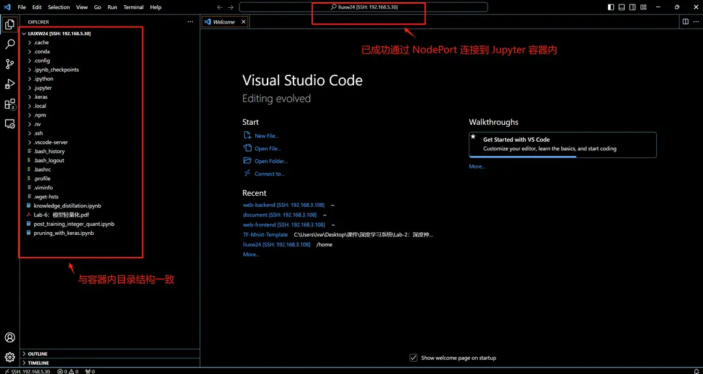

# Connect VSCode to Jupyter Container

This feature allows users to connect directly to the container environment via VSCode after creating a Jupyter job, enabling the use of VSCode's code completion, debugging capabilities, and rich plugin ecosystem to enhance development efficiency and user experience.

## Ensure Public and Private Keys Are Generated on the Local Machine

Before starting, ensure that public and private key files are generated on your local machine. These are typically stored in the `C:\Users\<username>\.ssh` or `~/.ssh` directory, such as:

```bash
C:\Users\<username>\.ssh\id_rsa
C:\Users\<username>\.ssh\id_rsa.pub

~/.ssh/id_rsa
~/.ssh/id_rsa.pub
```

If the keys have not been generated, you can generate them using the following command:

```bash
ssh-keygen -t rsa -b 4096 -C "your_email@example.com"
```

## Create a Jupyter Job

Users can create a Jupyter job. For specific creation methods, please refer to [Interactive Jobs](../quick-start/interactive.md). An example job is shown below:


Click "Interactive Page" to navigate to the Jupyter Notebook:


## Install SSHD in the Container

**SSHD (SSH Daemon)**: SSHD is the daemon process for the SSH service, responsible for listening for SSH connection requests on a specified port and providing the corresponding service. Installing and running SSHD allows the container to be accessed remotely via the SSH protocol.

### **Install OpenSSH Server**

```bash
sudo apt update
sudo apt install -y openssh-server
```

### Verify if the SSH Service Is Running Correctly

You can run the following command to manually check if `sshd` is installed:

```bash
ps -ef | grep sshd
```

You can also use the `service` command to check and manage the running status of SSHD:

**Restart the SSH service using the service command**

```bash
sudo service ssh restart
```

**Check the status**

```bash
sudo service ssh status
```

The reference output is as follows:

```bash
(base) liuxw24@jupyter-liuxw24-6838a-default0-0:~$ sudo service ssh restart
 * Restarting OpenBSD Secure Shell server sshd                       [ OK ]
(base) liuxw24@jupyter-liuxw24-6838a-default0-0:~$ sudo service ssh status
 * sshd is running
```

### Confirm Port 22 Is Listening Correctly

Use the following command to confirm if port `22` is being listened to:

```bash
sudo netstat -tuln | grep 22
```

If everything is working correctly, the `sshd` service will be listening on the designated port and accepting connections.

### Configure Password-less SSH Login

You can use the `authorized_keys` file to configure password-less login. Upload your public key (usually `id_rsa.pub`) to the server (as described in the section "Ensure Public and Private Keys Are Generated on the Local Machine").

- If the `.ssh` folder does not exist, you can create it using the following command and set appropriate permissions:

```bash
mkdir ~/.ssh
chmod 700 ~/.ssh
```

- Add your local public key to the `~/.ssh/authorized_keys` file:

```bash
# Copy the content of your local id_rsa.pub file to ~/.ssh/authorized_keys
vim ~/.ssh/authorized_keys
# Set appropriate permissions for authorized_keys
chmod 600 ~/.ssh/authorized_keys
```

## Configure NodePort Rules

You can expose the service port by setting the **NodePort rule** in the external access rules and use the NodePort port to connect to the Jupyter container within VSCode.

NodePort rules allow users to access through the IP address of a cluster node and a specified port number. If you want to connect to a node in the cluster via SSH, Kubernetes will assign a port for the service, and you can connect externally using this port number.

Create a NodePort rule on the Jupyter job details page. For detailed creation steps, refer to [Setting NodePort Access Rules](../toolbox/external-access/nodeport-rule.md).


**Field Description**:

- **Container Port** (`containerPort`): Select **22** port for SSH service.
- **Cluster Node Address** (`address`): IP address of any cluster node. In this example, it is `192.168.5.30`.
- **Assigned NodePort Port** (`nodePort`): Kubernetes automatically assigns a port number from the range 30000 to 32767 for the service. In this example, it is `32310`.

## VSCode Configuration

### Install the Remote-SSH Extension

Install the Remote-SSH extension in VSCode as follows:


### Configure the **Remote.SSH Config** File

Specify the path to the **Remote.SSH Config** file in the settings:


The config file reference configuration is as follows:

```yaml
Host 192.168.5.30
HostName 192.168.5.30
LogLevel verbose
IdentityFile C:\Users\lxw\.ssh\id_rsa
Port 32310
User liuxw24
```

Explanation of each field:

- `Host`: Host IP, refer to the `Host IP` in the NodePort rule. In this example, it is `192.168.5.30`.
- `IdentityFile`: Specifies the path to the private key file.
- `Port`: The port number to connect to, refer to the `NodePort Port` in the NodePort rule. In this example, it is `32310`.
- `User`: Username.

After configuration, you can successfully connect to the Jupyter container within VSCode through NodePort:

